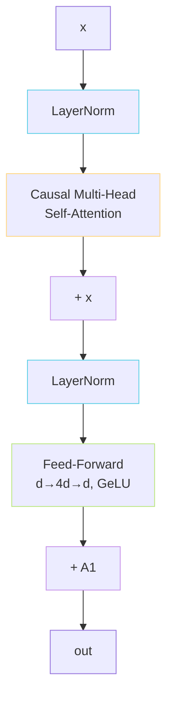

> [📎] 前置知识：Pre-LN vs Post-LN、Multi-Head Self-Attention、Causal Mask、Feed-Forward Network、Residual Connection、GeLU。

> **定位**：拆解 GPT-SoVITS AR 每一层 Transformer Block 内部结构、维度配置（v1/v2 vs v3/v4）、归一化策略、与原版 GPT-2 / VALL-E 的差异。

## 1. 单层结构（Pre-LN）



公式：

$$\begin{aligned}  
h &= x + \text{MHA}(\text{LN}(x), \text{LN}(x), \text{LN}(x); M_{\text{causal}}) \\  
y &= h + \text{FFN}(\text{LN}(h))  
\end{aligned}$$

其中 $M_{\text{causal}}$ 是严格下三角因果 mask（含 phoneme 段也按 causal 建模）。

## 2. 维度配置

|字段|v1 / v2|v3 / v4|
|---|---|---|
|`n_layers`|12|24|
|`d_model`|512|768|
|`n_heads`|16|16|
|`d_head` (=d/H)|32|48|
|`d_ffn`|2048 (4×d)|3072 (4×d)|
|单层参数|~6.3M|~14.2M|
|AR 总参|~80M|~330M|
|Dropout|0.1|0.0|

## 3. Pre-LN 的选择

GPT-SoVITS 用 **Pre-LN**（先归一化再算 attention/FFN），而原版 Transformer 是 Post-LN。

|维度|Pre-LN|Post-LN|
|---|---|---|
|训练稳定性|✅ 强|⚠️ 需 warmup|
|收敛速度|中|快（warm 后）|
|深层退化|不易|易|
|最终性能|略低|略高|

> [💡] **Pre-LN 为何更稳？** Post-LN 的残差 `x + Sublayer(x)` 在反向时梯度需穿过 LN，每层缩放，深层可能爆/消；Pre-LN 的残差为 `x + Sublayer(LN(x))`，残差路径不经过 LN，梯度直传——24 层 v3 网络选 Pre-LN 是稳健性优先。

## 4. FFN：标准 d→4d→d + GeLU

```python
class FFN(nn.Module):
    def __init__(self, d_model, d_ffn, dropout=0.1):
        super().__init__()
        self.linear1 = nn.Linear(d_model, d_ffn)
        self.linear2 = nn.Linear(d_ffn, d_model)
        self.act = nn.GELU()
        self.drop = nn.Dropout(dropout)

    def forward(self, x):
        return self.linear2(self.drop(self.act(self.linear1(x))))
```

> [⚠️] **不是 SwiGLU**：当前 GPT-SoVITS 没切换到 SwiGLU（LLaMA、CosyVoice 2 已用）。SwiGLU 收敛略好但参数多 1.5×。社区有分支尝试，未进主线。

## 5. Causal MHA 实现细节

MHA 在 PyTorch 中标准为 `nn.MultiheadAttention(embed_dim=d, num_heads=H, batch_first=True)`，但 GPT-SoVITS **monkey-patch** 它的 `forward`：

```python
# AR/modules/transformer.py
MultiheadAttention.forward = patched_mha_with_cache
```

两件事：

1. **加 KV Cache**（详见 [[5.1.4 KV Cache（patched_mha_with_cache）|5.1.4 KV Cache（patched_mha_with_cache）]]）；

1. **修复 mask 在 cache 模式下的 shape 兼容性**。

## 6. 与 GPT-2 / VALL-E 对比

|维度|GPT-2|VALL-E AR|GPT-SoVITS v3|
|---|---|---|---|
|n_layers|12 / 48|12|24|
|d_model|768 / 1600|1024|768|
|n_heads|12 / 25|16|16|
|FFN|4× GeLU|4× GeLU|4× GeLU|
|LN 位置|Pre-LN|Pre-LN|Pre-LN|
|Dropout|0.1|0|0|
|位置编码|learned|sine|sine|

## 7. 工程判断

> [🔧] **Block 内部少有人改**：GPT-SoVITS 主线一直锁这套配置，社区改动主要集中在 KV Cache 实现（性能）和 RoPE/SwiGLU 替换实验（推理）。Block 本身已是「最小可工作单元」，不需要在这一层折腾。

## 参考文献

1. Vaswani, A. et al. (2017). _Attention Is All You Need_. NeurIPS.

1. Radford, A. et al. (2019). _Language Models are Unsupervised Multitask Learners_ (GPT-2). OpenAI.

1. Xiong, R. et al. (2020). _On Layer Normalization in the Transformer Architecture_. ICML. (Pre-LN vs Post-LN)

1. Hendrycks, D. & Gimpel, K. (2016). _Gaussian Error Linear Units (GELUs)_. arXiv:1606.08415.

1. GPT-SoVITS: `GPT_SoVITS/AR/modules/transformer.py`.