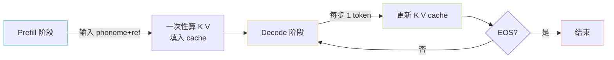

> [📎] 前置知识：Self-Attention 复杂度、Monkey Patch、PyTorch `nn.MultiheadAttention` 源码、`q_proj/k_proj/v_proj/out_proj`、显存与延迟权衡。

> **定位**：把 GPT-SoVITS AR 推理的「灵魂优化」KV Cache 讲透——朴素推理为何 O(T³)、Cache 后为何 O(T²)、`patched_mha_with_cache` 怎么改 PyTorch 原生 MHA、显存预算、与 TRT/ONNX 导出的兼容性。

## 1. 朴素推理的复杂度灾难

第 $t$ 步生成新 token：

$$h_t = \text{softmax}\!\left(\frac{Q_{1:t} K_{1:t}^\top}{\sqrt d}\right) V_{1:t}$$

若每步都从头重算 $Q, K, V in mathbb R^{t times d}$，单步复杂度 $O(t^2 d)$，生成长度 $T$ 累计 $O(T^3 d)$。当 $T=1600$ 时 = $4 \times 10^9 d$ 次乘加，A100 也要数十秒。

## 2. KV Cache 思想

注意到生成第 $t$ 步时：

- $K_{1:t-1}$、$V_{1:t-1}$ 已在历史中算过；

- 只有 $q_t, k_t, v_t$ 是新的。

所以缓存历史 K、V，每步只算：

$$\text{attn}_t = \text{softmax}\!\left(\frac{q_t [K_{1:t-1}; k_t]^\top}{\sqrt d}\right) [V_{1:t-1}; v_t]$$

单步 $O(t d)$，累计 $O(T^2 d)$——降一阶，**1600 步内推理可在亚秒级完成**。

## 3. `patched_mha_with_cache` 实现

```python
# 简化版，AR/modules/transformer.py
def patched_mha_with_cache(self, x, kv_cache=None,
                            attn_mask=None, **kwargs):
    B, T_new, D = x.shape
    qkv = F.linear(x, self.in_proj_weight, self.in_proj_bias)
    q, k, v = qkv.chunk(3, dim=-1)                  # [B, T_new, D]
    q = q.view(B, T_new, self.num_heads, -1).transpose(1, 2)
    k = k.view(B, T_new, self.num_heads, -1).transpose(1, 2)
    v = v.view(B, T_new, self.num_heads, -1).transpose(1, 2)

    if kv_cache is not None:
        k_prev, v_prev = kv_cache
        k = torch.cat([k_prev, k], dim=2)           # 沿 T 拼
        v = torch.cat([v_prev, v], dim=2)
    new_cache = (k, v)

    attn = (q @ k.transpose(-2, -1)) * (1.0 / math.sqrt(self.head_dim))
    if attn_mask is not None: attn = attn + attn_mask
    attn = F.softmax(attn, dim=-1)
    out = (attn @ v).transpose(1, 2).reshape(B, T_new, D)
    return F.linear(out, self.out_proj.weight, self.out_proj.bias), new_cache
```

Monkey-patch 替换：

```python
import torch.nn as nn
nn.MultiheadAttention.forward = patched_mha_with_cache
```

> [⚠️] **副作用**：替换是**全局**的，导入这个模块后所有 `nn.MultiheadAttention` 都会变成带 cache 的版本——若同进程里跑别的不带 cache 的模型，cache 参数没传会出错。GPT-SoVITS 单纯只推理 AR 一个模型，影响可控。

## 4. 显存预算

KV Cache 大小：

$$M_{KV} = 2 \cdot L \cdot H \cdot d_h \cdot T \cdot b \cdot s$$

其中 $L$=层数、$H$=头数、$d_h$=每头维度、$T$=序列长度、$b$=batch、$s$=2 (bf16) 或 4 (fp32)。

**v3 推理**（L=24, H=16, d_h=48, T=2048, b=1, bf16=2）：

$$2 \times 24 \times 16 \times 48 \times 2048 \times 1 \times 2 \approx 150\ \text{MB}$$

**v1 推理**（L=12, H=16, d_h=32, T=1024, b=1, bf16=2）：

$$2 \times 12 \times 16 \times 32 \times 1024 \times 1 \times 2 \approx 25\ \text{MB}$$

> [💡] **batch 推理的显存爆炸**：若 b=8、T=2048，v3 KV Cache 飙到 1.2 GB——这是 batched inference 的主要显存瓶颈，而非权重本身。GPT-SoVITS 推理 WebUI 默认 b=1。

## 5. Prefill vs Decode 两阶段

AR 推理实际上有两阶段：



- **Prefill**：处理 phoneme + ref 段（~150+250=400 token），一次性 O(T²) 计算并填入 cache。这一步是**首包延迟**的主要来源。

- **Decode**：逐 token 生成 tgt，每步 O(T)。token 间延迟 ~20ms（A100 v3）。

## 6. 训练 vs 推理的分支

```python
if self.training:
    out = full_attention(q, k, v, causal_mask)        # O(T²d)
else:
    out, kv = patched_mha_with_cache(x, kv_cache)     # O(td) per step
```

> [⚠️] **不能在训练里启用 cache**：训练是 teacher forcing，全序列一次性算 loss，没有「逐步」概念。若把训练数据用 cache 模式跑一遍——结果数值会**因 chunk 切分边界微小漂移**（mask 与 norm 顺序），导致 grad 不一致。

## 7. 导出 ONNX / TRT 的兼容性

KV Cache 是 ONNX 导出的难点：

|方案|兼容性|代价|
|---|---|---|
|Monkey patch + ONNX|❌ 失败|patch 是 Python 行为，ONNX trace 不到|
|手写带 cache 的 `nn.Module`|✅|重构网络，cache 作为额外 input/output|
|不导 cache，每步全重算|✅|慢 100×|
|TensorRT 自带的 KV Cache plugin|✅|限版本|

> [🔧] **生产部署建议**：①若要 TRT/ONNX 加速，**重写网络**让 cache 显式化（社区有 `gpt_sovits_export.py` 分支）；②若只在 PyTorch eager 跑，monkey patch 完全够用。

## 8. 与 PagedAttention / FlashAttention 的关系

- **PagedAttention**（vLLM）：把 KV Cache 分页存放，解决大 batch 内存碎片，与 GPT-SoVITS 单流推理无关。

- **FlashAttention**：优化 Prefill 阶段的 O(T²) 部分，Decode 阶段每步只算一个 q，加速有限。GPT-SoVITS 主线未集成，但用 PyTorch 2.x `F.scaled_dot_product_attention` 会自动调用 flash 内核。

## 参考文献

1. Shoeybi, M. et al. (2019). _Megatron-LM_. arXiv:1909.08053. (KV Cache 标准化)

1. Dao, T. (2023). _FlashAttention-2_. arXiv:2307.08691.

1. Kwon, W. et al. (2023). _Efficient Memory Management for Large Language Model Serving with PagedAttention_. SOSP.

1. GPT-SoVITS source: `GPT_SoVITS/AR/modules/transformer.py::patched_mha_with_cache`.