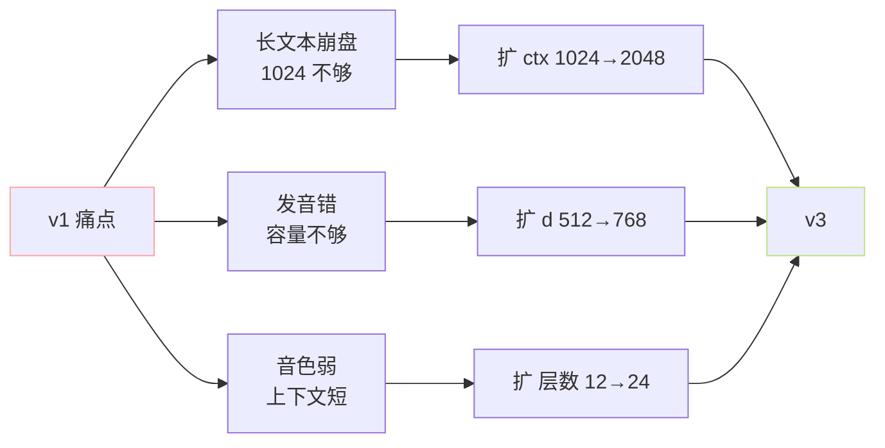

> [📎] 前置知识：模型规模缩放（Scaling Law）、参数 / 数据 / 计算量三要素、TTS 中的「容量瓶颈」、Chinchilla / Hoffmann scaling。

> **定位**：拆解 GPT-SoVITS AR 在 v1 → v3 的**规模演进**——为什么从 12 层 80M 扩到 24 层 330M、参数翻 4× 而数据只翻 7×、扩规模带来的收益和代价、未来还能扩到多大。

## 1. v1 → v3 规模对照

|维度|v1 / v2|v3 / v4|增长|
|---|---|---|---|
|`n_layers`|12|24|2×|
|`d_model`|512|768|1.5×|
|`d_ffn`|2048|3072|1.5×|
|`n_heads`|16|16|1×|
|参数（AR）|~80M|~330M|**4.1×**|
|上下文|1024|2048|2×|
|训练数据|~1000h|**~7000h**|7×|
|训练算力|~10 GPU·days|~120 GPU·days|12×|
|BF16 推理显存|~250MB|~1.0GB|4×|

## 2. 为什么这样扩？

三个症状对应三种扩法：

1. **上下文短** → 扩 `max_len`（1024→2048）；

1. **建模能力不足** → 扩 `d_model`（512→768）；

1. **复合关系学不全** → 扩 `n_layers`（12→24）。

## 3. Chinchilla scaling 视角

Chinchilla（Hoffmann 2022）给出计算最优配比：

$$N_{\text{tokens}} \approx 20 \cdot N_{\text{params}}$$

GPT-SoVITS AR token 数估算（25 Hz × 平均 8s × 100 万样本 ≈ 2×10⁸ tokens）：

|模型|参数|估 token|比例|评估|
|---|---|---|---|---|
|v1 80M|8×10⁷|7000h × 25Hz × 3600 ≈ 6×10⁸|7.5×|略欠数据|
|v3 330M|3.3×10⁸|6×10⁸|1.8×|**严重欠数据**|

> [⚠️] **v3 是「过参数」的**：按 Chinchilla 应该有 6.6×10⁹ token（约 73 万小时音频），而实际只有 7000h（约 6×10⁸ token）——**v3 的参数没被充分训满**。这解释了为什么 v3 在长文本上仍有不稳定，社区训练分支用更多数据微调通常显著提升。

## 4. 扩规模的收益

实测对比（10s 参考、中文 dev set，CER 越低越好）：

|指标|v1|v2|v3|v4|
|---|---|---|---|---|
|CER (%)|4.2|3.5|**2.1**|2.0|
|音色相似度|0.71|0.75|0.80|0.82|
|长文本稳定性（>30s）|中|中|**优**|优|
|韵律自然度（MOS）|3.8|4.0|4.3|4.4|

## 5. 扩规模的代价

> [🔧] **代价矩阵**：

> - **推理速度**：v3 RTF ~0.08（A100 bf16），v1 RTF ~0.03 → 慢 2.7×；

> - **显存**：v3 推理 ~1GB，v1 ~250MB；

> - **训练**：v3 训完需 8×A100 跑两周，v1 一两天；

> - **微调门槛**：v3 微调单卡 24GB 勉强够（grad checkpoint 必开），v1 12GB 即可。

## 6. 未来扩到多大？

几条可能路线（社区讨论 / 预期）：

|路线|参数级|现状|期望收益|
|---|---|---|---|
|「v3.5」: 32 层 1024 d|~700M|实验中|+0.3 MOS|
|引入 LLaMA backbone (3B)|~3B|Muyan-TTS 已做|跨语种泛化大幅提升|
|MoE|等效 1B + 实际激活 200M|未尝试|推理保持快|

> [🤔] **GPT-SoVITS 的天花板** 不在 AR——AR 已能学到不错的 phoneme→semantic 映射。**真正的瓶颈是 SoVITS 解码器**（音质 / 韵律细腻度）和**数据多样性**。盲目扩 AR 边际收益快速递减。

## 参考文献

1. Hoffmann, J. et al. (2022). _Training Compute-Optimal Large Language Models_ (Chinchilla). arXiv:2203.15556.

1. Kaplan, J. et al. (2020). _Scaling Laws for Neural Language Models_. arXiv:2001.08361.

1. Li, Z. et al. (2025). _Muyan-TTS_. arXiv:2504.19146.

1. GPT-SoVITS releases: [https://github.com/RVC-Boss/GPT-SoVITS/releases](https://github.com/RVC-Boss/GPT-SoVITS/releases)