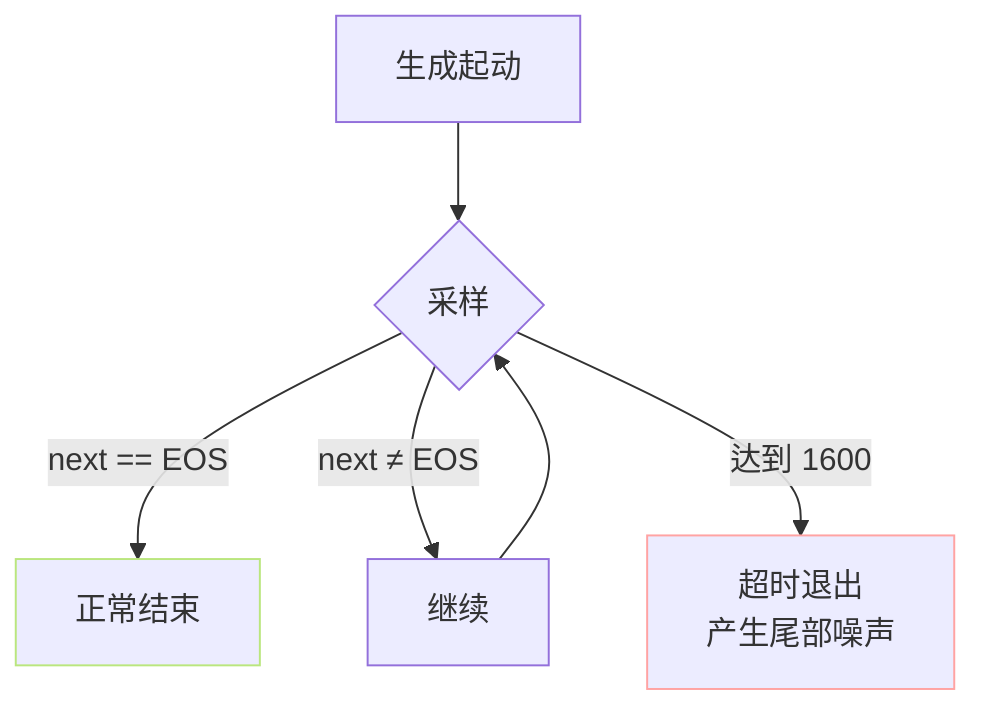

> [📎] 前置知识：EOS Token、Autoregressive 生成终止条件、Beam Search vs Sampling、Inference Loop、Max Length。

> **定位**：AR 生成何时停？靠 EOS？靠长度上限？本节拆如何在 codebook 中加进 EOS、训练时怎么让模型学会在正确位置预测 EOS、`early_stop_num=1600` 为什么是这个数、EOS 未命中的崩盘场景。

## 1. EOS 在 codebook 中的位置

AR codebook 原设计是 $V = 1024$（VQ 量化的语义码）。GPT-SoVITS 额外叠一位 EOS，实际 vocab 变为 $V + 1 = 1025$：

```python
self.ar_audio_embedding = nn.Embedding(
    num_embeddings=config['vocab_size'] + 1,   # 1024 + 1 EOS
    embedding_dim=config['embedding_dim'],
)
self.EOS_TOKEN = config['vocab_size']           # = 1024
```

> [💡] **为什么放末尾而不是 0？** 0 是 VQ 码本的正常值，冲突会让训练中「静音」也被误读为 EOS。放到末尾（1024）是安全留出的「独立频道」。

## 2. 训练：在 target 末尾追加 EOS

```python
# Dataset.__getitem__
tgt_sem = list(tgt_semantics_ids[idx])
tgt_sem.append(EOS_TOKEN)                       # 全 1024
return ph, ref, tgt_sem
```

这样训练中 EOS 总出现在「说完该说的」那一刻。模型随文本+参考+已生成量逐步学会：「上下文说明该结束了 → 预测 1024」。

## 3. 推理：两重停机机制

```python
for step in range(early_stop_num):
    logits = model.decode_step(...)
    next_token = sample(logits, top_k, top_p, T, rep)
    if next_token == EOS_TOKEN:
        break                                   # 机制 A：EOS 命中
    tokens.append(next_token)
else:
    pass                                        # 机制 B：长度上限退出
```

## 4. `early_stop_num=1600` 怎么来的

|考量|数值|
|---|---|
|cnhubert 帧率|50 Hz|
|VQ 下采样|2× → 25 Hz|
|预期最长音频|64 s|
|计算 25 × 64|1600|

> [🤔] **为什么是 64s？** ①训练数据 95% 在 20s 内，60s 是长尾极限；② v1 上下文 1024 只能装 phoneme~150 + ref~250 + tgt~600，64s tgt 必举超；③ v3 上下文 2048 可装 1600 tgt，刚好透支。

## 5. EOS 未命中的场景



EOS 未命中的常见原因：

|原因|表现|出路|
|---|---|---|
|参考音频末尾有气声但无静音|EOS 训练不够|参考音频末留 0.3s 静音|
|采样温度过高|EOS logit 被压低|T 从 0.85 降到 0.7|
|repetition_penalty 过大|EOS 被重复惩罚|rep 从 1.5 降到 1.35|
|输入文本太长|生成未完就被纪|手动切句 cut1/2/3|

> [⚠️] **EOS 未命中的听感**：生成到 1600 后强制截断，末尾会出现「哎哦」「嗡」类似碎音——这是社区报告「生成不停」/「尾部装饰音」的根因。

## 6. 工程判断

> [🔧] **推理侧优化 EOS 命中率**：①在采样后检查 `recent_5_tokens` 是否重复，如是则强制插入 EOS；②在接近 early_stop_num 上限时递增 EOS bias（社区分支）；③服务化部署记录 EOS 未命中率超过 5% 需检查数据 / 参数。

## 参考文献

1. Sutskever, I. et al. (2014). _Sequence to Sequence Learning with Neural Networks_. NeurIPS. (EOS 传统设计)

1. Radford, A. et al. (2019). GPT-2. (语言模型生成终止)

1. GPT-SoVITS: `GPT_SoVITS/AR/models/t2s_model.py::infer_panel_naive`.