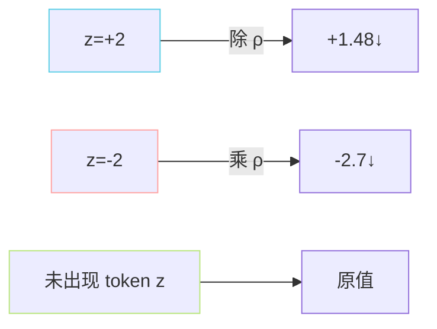

> [📎] 前置知识：CTRL 变振（Keskar 2019）、复读问题、Logits 正负 / 正零零正负间颓、重复 token 集合 $S_{text{prev}}$。

> **定位**：重复惩罚（repetition penalty）是 GPT-SoVITS 防复读的领魔门。本节给出公式、正负不同向调整原理、默认 1.35 的来源、与 EOS 未命中问题的耦合。

## 1. 公式（Keskar 2019 / CTRL）

记已生成 token 集合 $S_{text{prev}}$、惩罚系数 $rho ge 1$（默认 1.35）。对原 logit $z_i$：

$$\tilde z_i = \begin{cases}  
z_i / \rho, & z_i > 0\ \text{and}\ i \in S_{\text{prev}} \\  
z_i \cdot \rho, & z_i \le 0\ \text{and}\ i \in S_{\text{prev}} \\  
z_i, & \text{otherwise}  
\end{cases}$$

## 2. 为什么「正除、负乘」？



不管原 logit 是正是负，都「向更负」推——减少重取。若一律「除 ρ」，正 logit 变小（好）但负 logit 会变「不那么负」（逆效）。两号不同向是 CTRL 论文的关键设计。

> [⚠️] **常见错误**：社区代码里偶见「全部除 ρ」版本——表面能跑但复读进不去。检查方法：打印一个负 logit 位在惩罚前后的变化，应当变更负。

## 3. PyTorch 实现

```python
def apply_repetition_penalty(logits, prev_tokens, penalty=1.35):
    # prev_tokens: [T_prev], logits: [V]
    score = torch.gather(logits, -1, prev_tokens)
    score = torch.where(score < 0, score * penalty, score / penalty)
    logits = logits.scatter(-1, prev_tokens, score)
    return logits
```

## 4. 默认 1.35 的来源

|系统|rep_penalty|场景|
|---|---|---|
|CTRL 原论文|1.2|文本生成|
|GPT-2 社区|1.1–1.3|文本|
|**GPT-SoVITS**|**1.35**|**TTS 语义 token 复取频发**|
|VALL-E|无|论文不用|

> [💡] **为什么 TTS 要更高 ρ？** 语义 codebook 只有 1024，静音 / 代表载波 / 哼哼这类「默认 token」在训练集中频率高，logit 高，极易被重复采样。需要更重的惩罚。

## 5. 与 EOS 的冲突

问题场景：生成到后期 EOS logit 上升，但 EOS 未被采中；下一步采了别的 token 后，EOS 进入 prev_tokens？**不会**——EOS 未被采就不会进「已生成 token」集合。但是：生成后期重复了某个静音 token 多次 → 那个静音 token 被 penalty 调低 → 他能采到的选项变少 → 被迫选 EOS，这是 penalty 间接促进 EOS 命中的机制。

## 6. 调参指南

|现象|rep_penalty 调整|
|---|---|
|复读同个片段（「啊啊啊」）|1.35 → 1.5–1.7|
|吞字|1.35 → 1.2（太强导致跳 token）|
|尾部装饰音|**1.35** 不动，调 T 与 early_stop|
|韵律平坦|1.35 → 1.2 + T 上调|

## 7. 工程判断

> [🔧] **不要超过 2.0**：$rho > 2$ 后任何 token 只要采了一次就被重到几乎不可能再采，生成会变成「跳跃式」，听感零碎。**推荐范围 1.2–1.5**。

## 参考文献

1. Keskar, N. et al. (2019). _CTRL: A Conditional Transformer Language Model for Controllable Generation_. arXiv:1909.05858.

1. GPT-SoVITS: `GPT_SoVITS/AR/models/utils.py::repetition_penalty`.