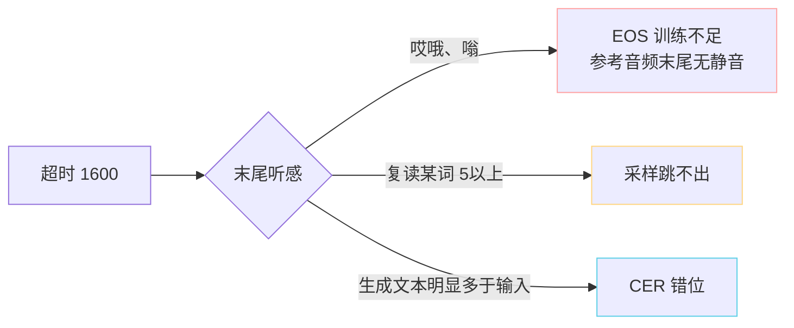

> [📎] 前置知识：25Hz 帧率、Autoregressive 上下文上限、Inference Loop、GPU 显存上限。

> **定位**：拆解 `early_stop_num=1600` 这个「生成何时提前退出」参数——数值来源、与上下文长度的关系、默认值调整场景、超时退出的背后可观测信号。

## 1. 数值推导

|考量|数值|
|---|---|
|cnhubert 输出帧率|50 Hz|
|VQ Encoder 下采样|2×|
|Semantic token 帧率|**25 Hz**|
|预期最长生成音频|64 s|
|计算|25 × 64 = **1600**|

## 2. 与上下文的决策压力

GPT-SoVITS 上下文上限：

|版本|max_len|ph + ref 估|tgt 额度|
|---|---|---|---|
|v1 / v2|1024|~400|~600 (24s)|
|v3 / v4|2048|~400|**~1600 (64s)**|

> [💡] **1600 是 v3 量身定制**——上下文额度刚好透支。v1 时代默认为 600，后来随 v3 提升。若在 v1 强调 1600 会出错。

## 3. 默认值调整场景

|场景|推荐|原因|
|---|---|---|
|最长期望 20s 句子|600|防 EOS 未命中后生成 64s 噪声|
|通用 (默认)|**1600**|v3 上限|
|长有声书拼接|1200 + 切句|切句后单段 ≤ 48s 足够|
|v1 老模型|600|上下文上限|

## 4. 超时退出的背后信号

超时代表 EOS 未命中。不同原因产生不同听感：



> [⚠️] **不要盲目上调 early_stop_num**：怎么怎么都不能避免 1600 后还要生成 → 问题在文本过长 / 参数问题，调 2400 会出现。调 v3 上限越过 2048 上下文会报错。

## 5. 超时检测代码

```python
for step in range(early_stop_num):
    next_token = sample(...)
    if next_token == EOS:
        break
    generated.append(next_token)
else:
    logger.warning(f'EOS not hit, stopped at {early_stop_num}')
    # 决策 1：返回部分结果（默认）
    # 决策 2：丢弃，报上层
```

## 6. 工程判断

> [🔧] **服务化 SLO**：推理 API 需记录 EOS 未命中率。高质量部署应 < 1%，5%+ 表示数据 / 参数出问题。项目应该「超时后返回部分 + 附「不完整」标志 + 服务端重试一次（T 降 0.05）」三阶段集成保护。

## 参考文献

1. GPT-SoVITS: `GPT_SoVITS/AR/models/t2s_model.py::infer_panel_naive`.

1. RVC-Boss/GPT-SoVITS issue tracker: 「生成不停」/「尾部噪声」相关 issues.