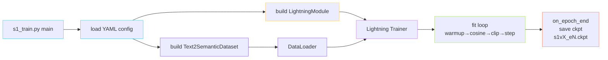

> [📎] 前置知识：PyTorch Lightning `LightningModule`、`Trainer`、学习率调度（Warmup / Cosine）、梯度裁剪、Checkpoint 命名约定。

> **定位**：AR 模型的训练入口是 `s1_train.py`，外层用 PyTorch Lightning。本节梳理「非网络结构」的工程配置：LR、grad clip、ckpt、版本检测——这些是复现训练的 **隐形契约**。

## 1. 训练入口与配置

```bash
python s1_train.py --config_file GPT_SoVITS/configs/s1longer-v2.yaml
```

YAML 关键字段（v2 示例）：

|字段|典型值|含义|
|---|---|---|
|`optimizer.lr`|1e-4|峰值 LR|
|`optimizer.lr_init`|1e-5|warmup 起点|
|`optimizer.lr_end`|1e-5|cosine 终点|
|`optimizer.warmup_steps`|200|warmup 步数|
|`optimizer.decay_steps`|40000|cosine 衰减步数|
|`train.batch_size`|8（卡）|per-device|
|`train.max_epochs`|15|总训练 epoch|
|`train.gradient_clip`|1.0|grad clip 阈|
|`train.precision`|bf16-mixed|混合精度|

## 2. 学习率：Warmup + Cosine Decay

$$\eta(t) = \begin{cases}  
\eta_{\text{init}} + (\eta_{\max} - \eta_{\text{init}}) \cdot \tfrac{t}{T_w}, & t \le T_w \\[4pt]  
\eta_{\text{end}} + \tfrac{1}{2}(\eta_{\max} - \eta_{\text{end}})\left[1 + \cos\!\big(\pi \tfrac{t - T_w}{T_d}\big)\right], & T_w < t \le T_w + T_d \\[4pt]  
\eta_{\text{end}}, & t > T_w + T_d  
\end{cases}$$

> [💡] **为什么 warmup 必要？** AR 模型初始化时 logits 接近均匀分布，Adam 二阶动量 $v_t$ 尚未稳定，直接用 1e-4 学习率会让早期 step 在错误方向上做大步长更新，常导致 NaN。Warmup 给二阶动量「暖机」时间。200 步是经验值，对小批量略短也可。

## 3. 梯度裁剪

`torch.nn.utils.clip_grad_norm_(params, max_norm=1.0)`。Lightning 通过 `trainer.gradient_clip_val=1.0` 透传。

> [⚠️] **bf16 与 grad clip 的坑**：bf16 动态范围大、精度低，偶尔出现 NaN 梯度。Lightning 在 clip 前会扫描 inf / NaN，若全为 NaN 直接跳过这一步 update。但 **部分 NaN** 会把 norm 算崩、误触发巨大 clip，监控曲线上表现为「训练 loss 平稳但偶发尖刺」。建议每千步检查 `grad_norm` 直方图。

## 4. Checkpoint 命名与版本检测

GPT-SoVITS 的 ckpt 命名约定：

|文件|内容|作用|
|---|---|---|
|`s1v1.ckpt`|v1 AR 权重|早期实验|
|`s1v2.ckpt`|v2 AR 权重|主线|
|`s1v3.ckpt`|v3 AR 权重（24 层）|当前主推|
|`s1bert*.ckpt`|含 BERT linear 适配层|与 chinese-roberta 绑定|

推理时 `load_state_dict` 前会先 `torch.load(...)['weight']` 拿到字典，再检查 key 是否含 `model.h.0.attn.in_proj_weight` 等关键字段——若缺失则报错「版本不匹配」，避免 v3 ckpt 灌进 v1 网络（层数不同必崩）。

```python
def detect_version(ckpt):
    sd = torch.load(ckpt, map_location='cpu')['weight']
    n_layers = sum(1 for k in sd if k.endswith('attn.in_proj_weight'))
    if n_layers == 12:  return 'v1/v2'
    if n_layers == 24:  return 'v3/v4'
    raise ValueError(f"Unknown layer count: {n_layers}")
```

## 5. Lightning 训练壳整体框架



> [🔧] **复现训练的最小清单**：①固定 random seed；②确认 bf16-mixed 支持（Ampere 以上）；③batch 8 × 8 卡 ≈ 实际 batch 64，与论文一致；④15 epoch ≈ 40k step，与 cosine 终点对齐；⑤val loss 在 epoch 10 后基本不降，可早停。

## 6. 子页面导航

[[5.4.1 学习率 Warmup + Cosine Decay]]

## 参考文献

1. Loshchilov, I. & Hutter, F. (2017). _SGDR: Stochastic Gradient Descent with Warm Restarts_. ICLR. (Cosine schedule)

1. Goyal, P. et al. (2017). _Accurate, Large Minibatch SGD: Training ImageNet in 1 Hour_. (Warmup)

1. Pascanu, R. et al. (2013). _On the difficulty of training recurrent neural networks_. ICML. (Gradient clipping)

1. PyTorch Lightning docs. [https://lightning.ai/docs/pytorch/stable/](https://lightning.ai/docs/pytorch/stable/)

[[5.4.2 Gradient Clipping]]

1. GPT-SoVITS: `s1_train.py`, `GPT_SoVITS/AR/models/t2s_lightning_module.py`.

[[5.4.3 Checkpoint 命名与版本检测]]