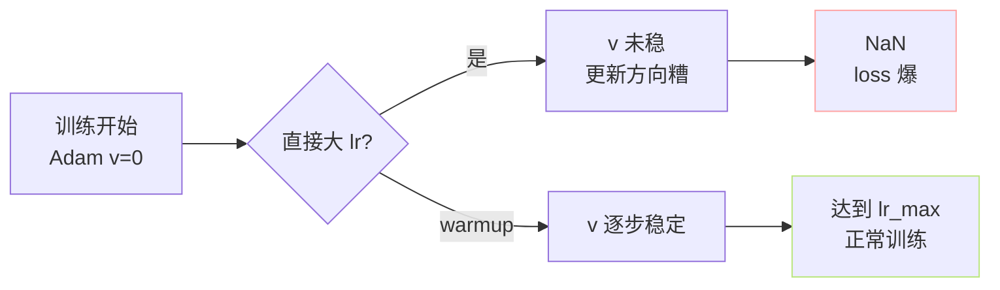

> [📎] 前置知识：LR Schedule、Warmup、Cosine Decay、AdamW 二阶动量、NaN 防护。

> **定位**：完整介绍 `s1_train.py` 中 Warmup + Cosine Decay 的 LR schedule——公式、代码、YAML 参数、与 Adam 二阶动量的耦合、不 warmup 的后果、Cosine vs Linear vs Step 选型。

## 1. 公式

$$\eta(t) = \begin{cases}  
\eta_{\text{init}} + (\eta_{\max} - \eta_{\text{init}}) \cdot \frac{t}{T_w}, & 0 \le t \le T_w \\  
\eta_{\text{end}} + \tfrac{1}{2}(\eta_{\max} - \eta_{\text{end}})\left[1 + \cos\!\left(\pi \frac{t - T_w}{T_d}\right)\right], & T_w < t \le T_w + T_d \\  
\eta_{\text{end}}, & t > T_w + T_d  
\end{cases}$$

三段：线性 warmup → cosine decay → 恒定下限。

## 2. 默认参数

|参数|默认|含义|
|---|---|---|
|`lr_init`|1e-5|warmup 起点|
|`lr_max` (即 `lr`)|1e-4|峰值|
|`lr_end`|1e-5|cosine 终点 / 恒定下限|
|`warmup_steps`|200|$T_w$|
|`decay_steps`|40000|$T_d$|

## 3. 代码实现

Lightning 中通过 `configure_optimizers` 返回 scheduler：

```python
def configure_optimizers(self):
    optimizer = torch.optim.AdamW(self.parameters(), lr=self.lr_max,
                                   betas=(0.9, 0.95), weight_decay=0.0)
    def lr_lambda(step):
        if step < self.warmup_steps:
            return self.lr_init / self.lr_max + \
                   (1 - self.lr_init / self.lr_max) * step / self.warmup_steps
        progress = (step - self.warmup_steps) / self.decay_steps
        progress = min(progress, 1.0)
        cos = 0.5 * (1 + math.cos(math.pi * progress))
        return self.lr_end / self.lr_max + \
               (1 - self.lr_end / self.lr_max) * cos
    scheduler = torch.optim.lr_scheduler.LambdaLR(optimizer, lr_lambda)
    return {'optimizer': optimizer,
            'lr_scheduler': {'scheduler': scheduler, 'interval': 'step'}}
```

## 4. Warmup 的必要性



Adam 二阶动量 $v_t$ 是梯度平方的指数退滅均值：

$$v_t = \beta_2 v_{t-1} + (1 - \beta_2) g_t^2,\quad \hat v_t = v_t / (1 - \beta_2^t)$$

初期仅几步时 $\hat v_t$ 估计不准，step size 会偏起，严重时导致 NaN。Warmup 让 $v$ 「预热」。

> [💡] **200 步经验值**：GPT-SoVITS v3 有 330M 参数，冷启动 200 step 足够让 v 稳定。混合精度 + 小 batch 的训练有时需要 500–1000。

## 5. Cosine vs Linear vs Step

|调度|表达式|存在问题|
|---|---|---|
|Linear|$\eta(t) = \eta_{\max}(1 - t/T)$|后期下降过快|
|Step|阶梯下降|跳变点不稳|
|**Cosine**|余弦平滑下降|**GPT-SoVITS 选用**|
|Inverse Square Root|$\eta \propto 1/\sqrt{t}$|Transformer 原论文选|

> [🤔] **为何 Cosine？** 后期下降慢 → 在局部最优付近「精调」多走几步。Linear / Step 的后期过快下降会透露过拟合。

## 6. lr_end 不为 0 的原因

> [⚠️] **lr_end=1e-5 保底**：训练后期若 lr 降到 0，梯度 noise / quantization 会让参数随机游走，val loss 反反复复。保一个小的下限让优化器仍能「轻踏」。

## 7. 工程判断

> [🔧] **复训调参 checklist**：① batch 变大 → lr 同比例上（linear scaling rule）；② warmup_steps 越多越安全但训练浪费；③ decay_steps 应 = total_steps × (90%–100%)，太短后期推 lr_end 走。

## 参考文献

1. Loshchilov, I. & Hutter, F. (2017). _SGDR: Stochastic Gradient Descent with Warm Restarts_. ICLR.

1. Goyal, P. et al. (2017). _Accurate, Large Minibatch SGD: Training ImageNet in 1 Hour_. arXiv:1706.02677.

1. Loshchilov, I. & Hutter, F. (2019). _Decoupled Weight Decay Regularization_ (AdamW). ICLR.

1. GPT-SoVITS: `GPT_SoVITS/AR/models/t2s_lightning_module.py::configure_optimizers`.