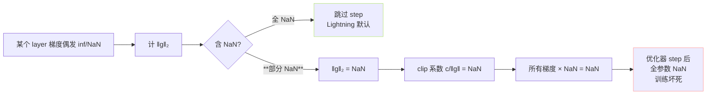

> [📎] 前置知识：梯度裁剪（clip by norm vs clip by value）、Exploding Gradient、bf16 动态范围、Lightning `gradient_clip_val`。

> **定位**：拆解 GPT-SoVITS AR 训练中梯度裁剪的机制——clip_grad_norm 公式、为何选 1.0、bf16 与 clip 的耦合 NaN 坚、与 Lightning Trainer 的集成点。

## 1. 公式

全局 L2 norm 裁剪：

$$g \leftarrow g \cdot \min\!\left(1,\ \frac{c}{\|g\|_2}\right)$$

其中 $c$ 为 `max_norm`，默认 $c = 1.0$。

## 2. PyTorch 实现与 Lightning 集成

原生：

```python
for group in optimizer.param_groups:
    torch.nn.utils.clip_grad_norm_(group['params'], max_norm=1.0)
optimizer.step()
```

Lightning 一项调参：

```yaml
trainer:
  gradient_clip_val: 1.0
  gradient_clip_algorithm: norm
```

Lightning 在 `on_before_optimizer_step` 会自动调用 clip。

## 3. 为何选 1.0

|场景|推荐 max_norm|
|---|---|
|较小 Transformer|0.5–1.0|
|**GPT-SoVITS v1 / v3**|**1.0**|
|大尺度 LLM|1.0–2.0|
|训练不稳时临时加强|0.3–0.5|

> [💡] **1.0 是 sweet spot**：在 256-batch 上，梯度 norm 高峰期不超过 2–3。则 c=1 能裁到 30–50% 的 step，既护住原发极端梯度又不会却下太多信息。

## 4. bf16 的隐藏险坑

bf16 动态范围 ±3.4e38，但精度仅 7位二进制 mantissa（fp16 精度高却范围小）。这会造成：



> [⚠️] **这是 bf16 训练最隐蔽的险坑**。Lightning 在梯度 partial-NaN 下还会让 optimizer.step。后果是训练 step 照跑但参数全为 NaN，后续 loss 会是 NaN。

**防护措施**：在 clip 之前检查并 zero out：

```python
for p in self.parameters():
    if p.grad is not None and torch.isnan(p.grad).any():
        p.grad.nan_to_num_(0.0)
```

Lightning 可通过 `detect_anomaly=True` 趋发警告，但会加是广告。

## 5. 与 LR Schedule 的作用顺序

```jsx
backward() → 梯度计算完成
↓
clip_grad_norm_(max_norm=1.0)
↓
optimizer.step()  ← 使用裁剪后的梯度
↓
scheduler.step() ← 更新 lr
```

## 6. 监控与调优

|指标|正常范围|异常信号|
|---|---|---|
|grad_norm 均值|0.5–1.5|低于 0.05 表示梯度消失|
|grad_norm 最大|< 5|频发 >10 要检查数据|
|clip 触发率|30–60%|>80% 需调小 c 或 lr|
|NaN step 频率|< 0.1%|>1% 须重检 bf16|

## 7. 工程判断

> [🔧] **「训练 loss 偏稳但偶发尖刺」** 是 part-NaN 、bf16 + clip 耦合的典型表现。解决方法：① 升 fp32 训练（代价显存 +50%）；② 保留 bf16 但人手 zero out NaN gradients；③ Lightning detect_anomaly + nan_check.

## 参考文献

1. Pascanu, R. et al. (2013). _On the difficulty of training recurrent neural networks_. ICML. (Gradient clipping)

1. Mickle, A. et al. (2018). _Mixed Precision Training_. ICLR.

1. Kalamkar, D. et al. (2019). _A Study of BFLOAT16 for Deep Learning Training_. arXiv:1905.12322.

1. PyTorch Lightning docs: `gradient_clip_val`. [https://lightning.ai/docs/pytorch/stable/](https://lightning.ai/docs/pytorch/stable/)