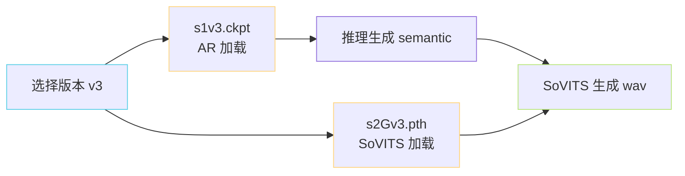

> [📎] 前置知识：PyTorch `state_dict`、Lightning Checkpoint Callback、向后兼容性、重复识别。

> **定位**：GPT-SoVITS ckpt 的命名约定、什么 key 能交叉验证是 v1/v2/v3/v4 哪个版本、跨版本导入会怎么报错、与 SoVITS 侧 ckpt 的联动。

## 1. 命名约定

|文件名|含义|架构|
|---|---|---|
|`s1v1.ckpt`|v1 AR|12 层 / 512 d|
|`s1v2.ckpt`|v2 AR|12 层 / 512 d (同 v1 但 BERT proj 嵌入)|
|`s1v3.ckpt`|v3 AR|**24 层 / 768 d**|
|`s1bert*.ckpt`|含 BERT linear 适配|v2+ 主线|
|`s1longer*.ckpt`|长上下文训练 ckpt|2048 ctx|
|`s2Gv1.pth`|v1 SoVITS Generator|VITS|
|`s2Dv1.pth`|v1 SoVITS Discriminator|MPD+MSD|
|`s2Gv3.pth`|v3 SoVITS Generator|CFM|
|`s2Gv4.pth`|v4 SoVITS Generator|CFM 48k|
|`s2Gv2Pro.pth`|V2Pro SoVITS|VITS + ERes2NetV2|

## 2. 版本检测代码

```python
def detect_version(ckpt_path):
    sd = torch.load(ckpt_path, map_location='cpu')
    if 'weight' in sd: sd = sd['weight']            # Lightning 外壳
    n_layers = sum(1 for k in sd if k.endswith('attn.in_proj_weight'))
    has_bert = any('bert_proj' in k for k in sd)
    if n_layers == 12 and not has_bert: return 'v1'
    if n_layers == 12 and has_bert:     return 'v2'
    if n_layers == 24:                  return 'v3/v4'
    raise ValueError(f"Unknown ckpt: n_layers={n_layers}, has_bert={has_bert}")
```

## 3. 跨版本加载的错误

尝试把 v3 ckpt 加到 v1 网络：

```python
model = build_v1_t2s_decoder()    # 12 层 / 512 d
sd = torch.load('s1v3.ckpt')['weight']
model.load_state_dict(sd)         # 报错：
# RuntimeError: Missing keys: model.h.12.attn.in_proj_weight, ...
#               Unexpected keys: model.h.12..., model.h.13..., ...
```

> [⚠️] **不要** `**strict=False**` **掩盖**：踩坐 strict=False 能加载 12 层，剩下 12 层保持随机初始化——走不动。正确做法是以 detect_version 验证后报错终止。

## 4. ckpt 存储格式

Lightning 保存的 ckpt 是多层字典：

```python
{
    'epoch': 14,
    'global_step': 38500,
    'pytorch-lightning_version': '2.0.0',
    'state_dict': {'model.h.0.attn.in_proj_weight': tensor(...), ...},
    'optimizer_states': [...],         # AdamW m, v
    'lr_schedulers': [...],            # cosine state
}
```

GPT-SoVITS 为了减体积，发布 ckpt 只保留 `state_dict` + `config` 重命名为 `weight`：

```python
# tools/util.py 类似逻辑
torch.save({'weight': model.state_dict(), 'config': hp},
            f'pretrained_models/s1v3.ckpt')
```

最终公布的 ckpt 大小：

|版本|FP32|BF16|
|---|---|---|
|v1 (80M)|320 MB|160 MB|
|v3 (330M)|1.3 GB|**660 MB**|

## 5. 与 SoVITS 侧的联动



> [⚠️] **AR 与 SoVITS 版本必须匹配**：s1v3 出的 semantic id 与 s2Gv3 期望的 codebook 是同一个（VQ 码本在 SoVITS 训练欺决定，所以明创 s2 后 s1 才能训）。混用 v1 AR + v3 SoVITS 会输出噪声。

## 6. 微调 ckpt 的命名建议

```jsx
MyVoice_e15_s5000.ckpt   # 姓名_epoch15_step5000
```

GPT-SoVITS Lightning callback 会自动拼接为：

```jsx
{config.exp_name}_e{epoch}_s{global_step}.ckpt
```

填 config.yaml 中 `exp_name: MyVoice` 即可。

## 7. 工程判断

> [🔧] **生产环境 ckpt 管理**：① ckpt 仅保 `weight` 不保 optimizer state（体积减半）；② 加 `config` 字段记录 arch，避免可拼跳加载；③ 中间 ckpt 可在后续合并到一个（取最佳 N 个 平均）提高鲁棒性。

## 参考文献

1. PyTorch Lightning Checkpoint docs. [https://lightning.ai/docs/pytorch/stable/common/checkpointing.html](https://lightning.ai/docs/pytorch/stable/common/checkpointing.html)

1. GPT-SoVITS: `tools/util.py`, `GPT_SoVITS/inference_webui.py::get_first` (version detect).