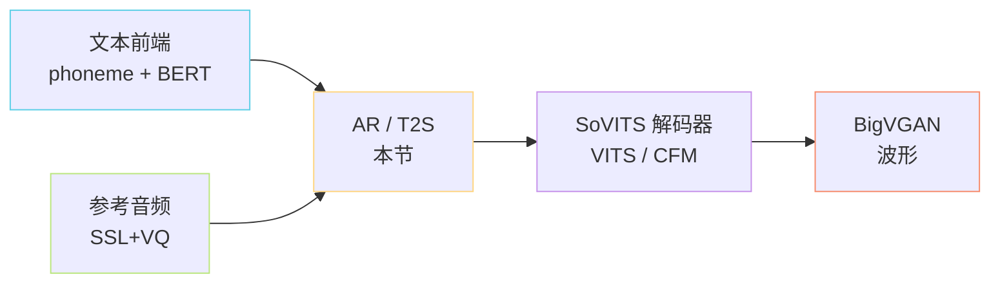

> [📎] 前置知识：[[1.2 VALL-E 类范式（GPT-SoVITS 的“GPT”血统）|1.2 VALL-E 类范式（GPT-SoVITS 的“GPT”血统）]]（GPT 血统的概念基础）、[[1.3 自监督语音表征（SSL Features）|1.3 自监督语音表征（SSL Features）]]（输入语义来源）、[[1.4 向量量化（VQ）与离散语义 Token|1.4 向量量化（VQ）与离散语义 Token]]（离散化）、Decoder-only Transformer、KV Cache、Top-k/Top-p sampling。

> **定位**：AR / T2S（Auto-Regressive Text-to-Semantic）是 GPT-SoVITS 的「**GPT 侧**」，也是整套系统的「**语义解码器**」——输入 `文本 + BERT + 参考语义 token`，自回归生成「目标语义 token 序列」，把『**说什么**』翻译成『**怎么发音**』的中间码。

## 1. 在全栈中的位置

## 2. 核心思想（一句话）

把 TTS 的端到端建模 **切成两段**：第一段（本节）只学「语义 token 序列」，第二段（SoVITS）只学「声学波形」。语义阶段用 **Decoder-only GPT** 做 next-token prediction，与 LLM 完全同构。

> [💡] **为什么切两段？** 端到端 TTS（VITS / Tacotron）需要在小规模 paired data 上同时学「语义」和「声学」，瓶颈在数据量。两段式让语义阶段可以吃 **任意 SSL feature**（大量未标注音频自监督预训练得来），声学阶段只在 paired data 上做「semantic→waveform」映射，**解耦了表征学习与生成学习**。

## 3. 同期 AR-TTS 横向对比

|系统|语义码本来源|AR 阶段|NAR / 声学阶段|帧率|备注|
|---|---|---|---|---|---|
|**VALL-E** (Microsoft)|EnCodec 第 1 层|1 层 AR|6 层 NAR|75 Hz|8 层 RVQ|
|**CosyVoice / 2**|$\text{S}^3$ tokenizer（语音→token）|LLM|Conditional Flow Matching|25 Hz|单 VQ，与 GPT-SoVITS 范式最近|
|**GPT-SoVITS** v1/v2|cnhubert + VQ|1 层 AR（12 层 Transformer）|VITS 解码器|25 Hz|单流，无 NAR|
|**GPT-SoVITS** v3/v4|同上|24 层 Transformer|CFM + BigVGAN|25 Hz|单流 + 扩散范式声学|
|**XTTS v2** (Coqui)|DVAE|GPT-2|HiFi-GAN|—|闭源数据，社区版|
|**Tortoise**|VQ-VAE|autoregressive|Diffusion + UnivNet|—|慢，离线为主|

## 4. L3 模块切分

|子节|关注点|关键产物|
|---|---|---|
|**5.1** Text2SemanticDecoder 总结构|序列拼接 / 位置编码 / Block 内部 / KV Cache|一张完整的 forward 数据流图|
|**5.2** 训练损失与目标|CE + ignore_index、EOS、数据封装|训练目标函数 + dataset 设计|
|**5.3** 推理采样策略|top_k / top_p / temperature / repetition penalty / early stop|推理超参表 + 影响|
|**5.4** PyTorch Lightning 训练壳|LR schedule / grad clip / ckpt|复现训练所需的工程细节|

## 5. 工程判断

> [🔧] **为什么必须有 KV Cache？** AR 推理是 $O(T^2)$ 复杂度，无 KV Cache 时每生成一个 token 要重算 1600 步内所有历史 attention；启用后，每步只算 $1 \times T$ 的 cross-attention，整体回到 $O(T)$。对于 $T=1600$（早停上限），这是 **数十倍** 的加速差距，无 KV Cache 几乎无法实时推理。

> [🔧] **为什么帧率是 25 Hz？** SSL（cnhubert）原生 50 Hz，经过下采样到 25 Hz 后：①每秒 25 token，10 秒音频仅 250 token，远小于 LLM 上下文限制；②token 序列与 phoneme 序列长度相近（中文一字约 1 phoneme 对 5–7 token），可以共享同一个 Transformer 上下文；③下采样减少冗余但保留了音素层级的语音信息（实验：50 Hz 与 25 Hz 在 BLEU / CER 上几乎一致）。

> [🤔] **为什么 GPT-SoVITS 用「单流」而 VALL-E 用「分层」？** VALL-E 的 8 层 RVQ 重建质量上限高，但 AR 只能预测第 1 层，剩 7 层靠 NAR 补，**训练 / 推理都更重**。GPT-SoVITS 干脆把「细节」全部丢给声学侧（VITS / CFM），让 AR 只关心 **语义层最关键的 1 层 codebook**——参数量从 VALL-E 总计 ~400M 降到 v1 的 ~167M，且无需 NAR，**单流单 pass** 出语义。代价是 zero-shot 音色相似度略低，这就是 V2Pro / Plus 引入 SV embedding 的动机。

## 6. 子页面导航

[[5.1 Text2SemanticDecoder 总结构|5.1 Text2SemanticDecoder 总结构]]

[[5.2 训练损失与目标|5.2 训练损失与目标]]

[[5.3 推理采样策略|5.3 推理采样策略]]

[[5.4 PyTorch Lightning 训练壳|5.4 PyTorch Lightning 训练壳]]

## 参考文献

1. Wang, C. et al. (2023). _Neural Codec Language Models are Zero-Shot Text to Speech Synthesizers_ (VALL-E). arXiv:2301.02111.

1. Du, Z. et al. (2024). _CosyVoice 2: Scalable Streaming Speech Synthesis with Large Language Models_. arXiv:2412.10117.

1. Radford, A. et al. (2019). _Language Models are Unsupervised Multitask Learners_ (GPT-2 架构基础).

1. GPT-SoVITS Source: `GPT_SoVITS/AR/models/t2s_model.py`. [https://github.com/RVC-Boss/GPT-SoVITS](https://github.com/RVC-Boss/GPT-SoVITS)

1. GPT-SoVITS Wiki: Architecture overview. [https://github.com/RVC-Boss/GPT-SoVITS/wiki](https://github.com/RVC-Boss/GPT-SoVITS/wiki)