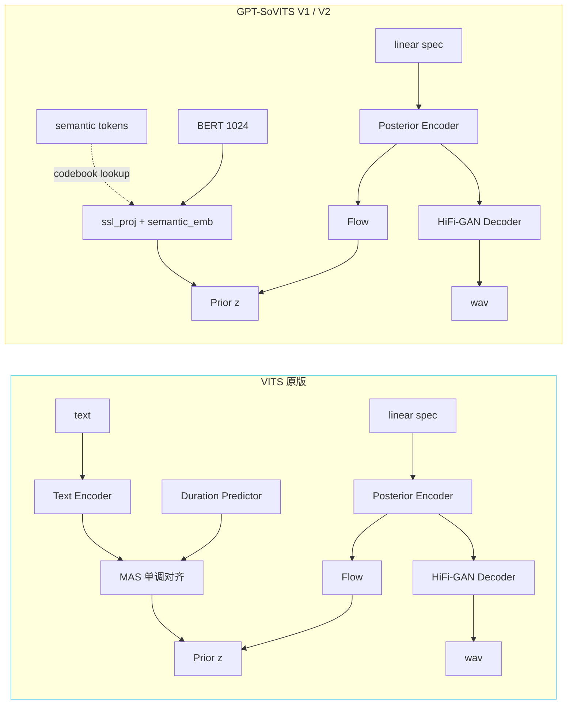
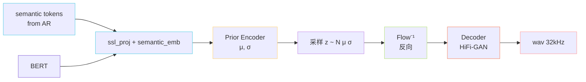

> [📎] 前置知识：[[1.1 VITS 原理（SoVITS 的“S”血统）|1.1 VITS 原理（SoVITS 的“S”血统）]]、Posterior / Prior 概念、Normalizing Flow、HiFi-GAN、MPD / MSD、对抗损失、Feature Matching Loss、KL 散度。

> **定位**：V1 / V2 SoVITS 是 VITS 的「剥皮改造版」——去掉原 VITS 的文本端，把先验改为「AR 语义 token 序列」，保留 VITS 的「Posterior Encoder + Flow + HiFi-GAN Decoder」三件套与对抗训练。是「语义→波形」的端到端解码器。

## 1. 与原版 VITS 的差异（一图）

**关键删改**：

|组件|原 VITS|GPT-SoVITS V1 / V2|
|---|---|---|
|文本输入|phoneme + duration|**被语义 token 替换**|
|Duration Predictor|必须（控制 phoneme→frame 对齐）|**去掉**（AR 已隐式确定时长）|
|MAS 对齐|训练时必算|**不再使用**|
|Prior 来源|text encoder 输出|**semantic embed + BERT**|
|Posterior|linear spec → μ, σ|同|
|Flow|residual coupling|同|
|Decoder|HiFi-GAN|同|

## 2. 五大组件（对应 L4 子节）

### 2.1 Prior Encoder

$$p(z \mid c) = \mathcal N(z; \mu_\theta(c), \sigma_\theta(c)^2), \quad c = [\text{ssl\_proj}(s), \text{bert\_proj}(b)]$$

输出 $\mu, \sigma$ 作为先验，**注意此处** $c$ **不再是 phoneme**。

### 2.2 Posterior Encoder

$$q(z \mid x) = \mathcal N(z; \mu_\phi(x), \sigma_\phi(x)^2), \quad x = \text{linear-spec}(\text{wav})$$

仅训练用，推理不需要。

### 2.3 Flow $f_\eta$

可逆映射，让 $z' = f_\eta(z)$ 在更高表达力的分布上对齐 prior 和 posterior。

### 2.4 Duration Predictor（保留壳但不用）

代码里仍有 `DurationPredictor` 类，但 forward 路径绕过——保留是为了 **和 VITS 原版权重兼容**。

### 2.5 Decoder（HiFi-GAN 风格）

1D 反卷积 + MRF 残差块，把 latent $z$ 上采样到波形。

### 2.6 多周期 / 多尺度判别器

MPD（5 个 prime period：2 / 3 / 5 / 7 / 11）+ MSD（3 个降采样尺度），对抗训练用。

## 3. 损失函数总览

$$\mathcal L_{\text{SoVITS}}^{V1/V2} = \underbrace{\mathcal L_{\text{recon}}^{\text{mel}}}_{\text{L1 mel 重建}} + \underbrace{\mathcal L_{\text{KL}}(q\|p)}_{\text{先验 / 后验对齐}} + \underbrace{\lambda_{\text{adv}}\mathcal L_{\text{adv}}}_{\text{GAN}} + \underbrace{\lambda_{\text{fm}}\mathcal L_{\text{fm}}}_{\text{特征匹配}}$$

|损失|形式|权重|
|---|---|---|
|**Mel recon**|$\\|\text{mel}(\hat x) - \text{mel}(x)\\|_1$|45|
|**KL**|$\mathrm{KL}(q(z\|x) \\| p(z\|c))$|1.0|
|**Adv (G)**|$\mathbb E[(D(\hat x)-1)^2]$|1.0|
|**FM**|$\sum_l \\|D_l(x) - D_l(\hat x)\\|_1$|2.0|
|**Disc**|$\mathbb E[(D(x)-1)^2] + \mathbb E[D(\hat x)^2]$|1.0|

> [💡] **为什么 mel L1 权重 45？** 这是 VITS 原论文经验值——L1 量级小（每元素 ~0.1），不放大权重会被 KL / Adv 淹没，导致 mel 重建质量崩盘。改成 45 后三者均衡。

## 4. 推理流程

> [⚠️] **推理 noise scale**：`infer_panel` 中可调 `noise_scale`（先验采样温度），默认 0.667。过低 → 声音机械；过高 → 失稳、出怪音。这是 VITS 沿袭设计，是 V1 / V2 的 **音色多样性旋钮**。

## 5. 子页面导航

1. Kingma, D. & Dhariwal, P. (2018). _Glow: Generative Flow with Invertible 1x1 Convolutions_. NeurIPS.

[[6.1.1 Prior Encoder（文本+BERT→先验分布）|6.1.1 Prior Encoder（文本+BERT→先验分布）]]

1. GPT-SoVITS source: `GPT_SoVITS/module/models.py`, `module/mrte_model.py`.

[[6.1.2 Posterior Encoder（线性谱→后验分布）|6.1.2 Posterior Encoder（线性谱→后验分布）]]

[[6.1.3 Flow 模块|6.1.3 Flow 模块]]

[[6.1.7 损失函数总览（mel - KL - adv - fm）|6.1.7 损失函数总览（mel - KL - adv - fm）]]

## 参考文献

1. Kim, J., Kong, J., & Son, J. (2021). VITS. ICML.

1. Kong, J., Kim, J., & Bae, J. (2020). _HiFi-GAN: Generative Adversarial Networks for Efficient and High Fidelity Speech Synthesis_. NeurIPS.

[[6.1.4 Duration Predictor 的取舍|6.1.4 Duration Predictor 的取舍]]

[[6.1.5 Decoder（HiFi-GAN 风格生成器）|6.1.5 Decoder（HiFi-GAN 风格生成器）]]

[[6.1.6 多周期 - 多尺度判别器|6.1.6 多周期 - 多尺度判别器]]