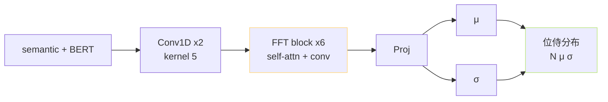

> [📎] 前置知识：VITS Prior Encoder、Gaussian 参数化、Conditional Latent、语义嵌入 + BERT 融合。

> **定位**：V1 / V2 SoVITS 的 Prior Encoder 是「从语义 token 生成位侍分布」的架构核心。本节讲清输入拼接、输出 $\mu, \sigma$ 的计算、内部网络结构（mrte / textual_block）、与原版 VITS Text Encoder 的代代关系。

## 1. 输入拼接

```python
# GPT_SoVITS/module/models.py::SynthesizerTrn::forward
x = self.ssl_proj(semantic_emb)           # [B, T_s, d]
b = self.bert_proj(bert_feature)          # [B, T_p, d]
# align b → T_s位（文本端 phoneme 位置拉伸到 semantic 帧位置）
b = repeat_to_length(b, T_s)
x = x + b                                  # 同位 add
```

## 2. Prior Encoder 内部



主要由 6 层 FFT block 构成，每层类似 Transformer 但带 1D conv 的 FFN。输出通过 1×1 conv 投影出 $mu, sigma$。

## 3. 公式

$$p(z \mid c) = \mathcal N(z; \mu_\theta(c), \sigma_\theta(c)^2 I), \quad c = [\text{ssl\_proj}(s) + \text{bert\_proj}(b)]$$

推理时采样：

$$z \sim \mathcal N(\mu, \sigma^2), \quad z = \mu + \sigma \odot \epsilon \cdot \tau, \quad \epsilon \sim \mathcal N(0, I)$$

其中 $\tau$ = `noise_scale` （0.667 默认），是采样温度旋钮。

## 4. ssl_proj + bert_proj 细节

|模块|输入 dim|输出 dim|作用|
|---|---|---|---|
|`ssl_proj`|192 (后 VQ)|192|1×1 conv 映射|
|`bert_proj`|1024|192|1×1 conv 降维|

> [💡] **VQ 后的 192 维**： SoVITS 语义嵌入维度 设为 192（ 与原版 VITS 一致），推理后 Prior latent z 也是 192维。

## 5. 与原版 VITS Text Encoder 的差异

|维度|VITS Text Encoder|SoVITS Prior Encoder|
|---|---|---|
|输入|phoneme|semantic + BERT|
|Embedding|phoneme_embed|ssl_proj + bert_proj|
|Duration|**依赖**|**不需**（AR 已决时长）|
|Alignment|MAS|**去掉**|
|输出|μ、σ|同|

> [🤔] **为什么能去 MAS？** 语义 token 本身跟音频是「同帧对应」的（ 25Hz 与帧率一致），不需「拉伸」。原 VITS 的 MAS 是为了把 phoneme 对到帧位置。这是 SoVITS 能变「便宜」的关键原因。

## 6. 训练时的 KL 项

$$\mathcal L_{\text{KL}} = D_{\text{KL}}(q(z \mid x) \| p(z \mid c))$$

与 Posterior 联动（见下一节），让 Prior 学到 Posterior 近似分布。KL 权重 $lambda_{text{KL}} = 1.0$。

## 7. 工程判断

> [🔧] **Prior Encoder 少有人改**：这是从 VITS 原版几乎没动的结构（只换了输入），社区改动主要在 V2Pro 加 SV embedding、V3/V4 换成 CFM 。本体的 FFT block + μ/σ 可靠。

## 参考文献

1. Kim, J., Kong, J., & Son, J. (2021). _VITS: Conditional Variational Autoencoder with Adversarial Learning_. ICML.

1. Ren, Y. et al. (2021). _FastSpeech 2_. ICLR. (FFT block 原型)

1. GPT-SoVITS: `GPT_SoVITS/module/models.py::TextEncoder` (实体名仍叫 TextEncoder 但接受 semantic).