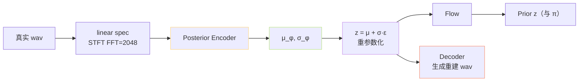

> [📎] 前置知识：Posterior Encoder（VITS）、线性谱（linear spectrogram）、训练仅模块、重参数化采样。

> **定位**：Posterior Encoder 只在训练期起作用，从「真实波形」中提取后验分布 $q(z|x)$。本节拆结构、输入选取、与 Prior / Flow 的联动、推理为何丢弃。

## 1. 作用位置



Posterior 从「真实详细谱」中抽后验，随后经 Flow 与 Prior 对齐（KL）、同时经 Decoder 重构出 wav。

## 2. 输入 / 输出

|维度|值|
|---|---|
|输入谱|linear spec，FFT=2048、hop=480（ 32kHz，~67Hz 帧率）|
|输入 dim|1025|
|中间 hidden|192|
|输出|$\mu, \sigma$ each 192-d|

## 3. 内部结构

```python
class PosteriorEncoder(nn.Module):
    def __init__(self, in_channels, out_channels, hidden=192, kernel=5, n_layers=16, gin_channels=0):
        super().__init__()
        self.pre = nn.Conv1d(in_channels, hidden, 1)
        self.enc = WaveNet(hidden, kernel, n_layers, gin_channels)
        self.proj = nn.Conv1d(hidden, out_channels * 2, 1)

    def forward(self, x, x_mask, g=None):
        x = self.pre(x) * x_mask
        x = self.enc(x, x_mask, g=g)
        stats = self.proj(x) * x_mask
        mu, logs = torch.split(stats, stats.size(1) // 2, dim=1)
        z = (mu + torch.randn_like(mu) * torch.exp(logs)) * x_mask
        return z, mu, logs
```

中间用了 **WaveNet 风格的 1D 卷积 + gated activation**（原 VITS 设计），与 Decoder 几乎同构。

## 4. 重参数化

$$z = \mu + \exp(\log\sigma) \odot \epsilon, \quad \epsilon \sim \mathcal N(0, I)$$

使梯度能通过 $z$ 反向传到 $mu, sigma$。这是 VAE 技术标准动作。

## 5. KL 项公式

两个高斯阶 KL（闭式）：

$$D_{\text{KL}}(q\|p) = \sum_t \left[ \log \sigma_p - \log \sigma_q + \frac{\sigma_q^2 + (\mu_q - \mu_p)^2}{2 \sigma_p^2} - \frac{1}{2} \right]$$

实现上 $\sigma$ 使用 $\log\sigma$ 参数化 (使指数运算稳定)。

## 6. Flow 的介入

为让 Prior 与 Posterior 分布能「多样」，VITS 加了 normalizing flow：

$$z' = f_\eta(z), \quad q(z'|x) = q(z|x) |\det \partial f/\partial z|^{-1}$$

Flow 是可逆的 affine coupling，输出同维度。KL 实际上是 $text{KL}(f(z) | pi)$，提高表达能力，详见 [[6.1.3 Flow 模块]]。

## 7. 推理时为何丢弃 Posterior

推理时没有「真实 wav」，应从 Prior 采样：

$$z \sim \mathcal N(\mu_\theta(c), \sigma_\theta(c)^2)$$

然后经 Flow 逆 → Decoder 生成 wav。Posterior 只是训练阶段的「助教」。

> [💡] **什么是「助教」角色？** Posterior 抽出「真正的详细信息」传给 Decoder 让其重构 wav（ 依赖 mel L1 损失）；KL 项同时追使 Prior 靠近 Posterior，使推理时仅有 Prior 也能生成似真水准。

## 8. 与 Mel-spec 的区别

VITS / SoVITS 选择 **linear spec** 而非 mel-spec 作为 Posterior 输入：

|谱型|优|劣|
|---|---|---|
|Mel|听觉友好、维度低|**捯失信息「听不到但存在」**|
|**Linear**|信息完整|高维（1025）|

> [⚠️] **不要把 Posterior 换成 mel**：Posterior 是「领怎」代表，需保留“听不到但必须生成」的信息（高频细节、相位）。Mel 损失信息 → Decoder 重构得不够保真。

## 9. 工程判断

> [🔧] **Posterior 训练响応**：Posterior 质量决定上限。若谱提取不准（采样率 / FFT 不匹配） → Posterior 乱 → Decoder 重构崩盘。保证 STFT 与原版一致 （FFT=2048, hop=480, win=2048，32kHz）。

## 参考文献

1. Kim, J., Kong, J., & Son, J. (2021). _VITS_. ICML.

1. Kingma, D. & Welling, M. (2013). _Auto-Encoding Variational Bayes_. ICLR.

1. van den Oord, A. et al. (2016). _WaveNet_. arXiv:1609.03499. (Posterior 内部结构原型)

1. GPT-SoVITS: `GPT_SoVITS/module/models.py::PosteriorEncoder`.