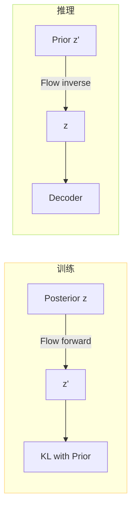

> [📎] 前置知识：Normalizing Flow、Affine Coupling Layer、雅可比行列式、Glow、可逆变换。

> **定位**：Flow 是 VITS / SoVITS 中连接 Prior 与 Posterior 的「可逆桥」。本节讲 affine coupling 公式、代码、 训练 / 推理双向走、不同于原 VITS 的细微调整。

## 1. 什么是 Normalizing Flow

设 $z sim p(z)$，可逆变换 $f$ 下：

$$z' = f(z),\quad p(z') = p(z) \left| \det \frac{\partial f}{\partial z} \right|^{-1}$$

Flow 叠多层、每层 $f_i$ 为简单结构但可逆。Affine coupling 是 Glow / Real-NVP 中经典选型。

## 2. Affine Coupling 公式

设 $z = (z_1, z_2)$ 拆为两半。前向：

$$\begin{aligned}  
z'_1 &= z_1 \\  
z'_2 &= z_2 \odot \exp(s(z_1)) + t(z_1)  
\end{aligned}$$

逆向：

$$\begin{aligned}  
z_1 &= z'_1 \\  
z_2 &= (z'_2 - t(z'_1)) \odot \exp(-s(z'_1))  
\end{aligned}$$

雅可比行列式 $\det = \exp(\sum s(z_1))$ 计算平平。

## 3. SoVITS 中的 Flow

GPT-SoVITS 套用原 VITS 的 ResidualCouplingBlock：4 层 affine coupling + 1×1 conv 反转。每层内部是 WaveNet 风格的计算 $s, t$。

```python
class ResidualCouplingBlock(nn.Module):
    def __init__(self, channels, hidden, kernel, dilation_rate,
                  n_layers=4, n_flows=4, gin_channels=0):
        super().__init__()
        self.flows = nn.ModuleList()
        for _ in range(n_flows):
            self.flows.append(
                ResidualCouplingLayer(channels, hidden, kernel, dilation_rate, n_layers,
                                       gin_channels=gin_channels, mean_only=True))
            self.flows.append(Flip())          # 交换两半顺序
```

## 4. 训练 / 推理双向



- **训练**：Posterior 采出 $z$ → forward Flow → 与 Prior 在 $z'$ 上算 KL。

- **推理**：Prior 采出 $z'$ → inverse Flow → 起 Decoder。

> [💡] **为什么加 Flow？** Prior 是全局各向同性高斯，表达力有限。Flow 让 Prior「看上去简单」但「穿过 Flow 后能凑出复杂多峰分布」。代价是训练 + 推理多一个网络。

## 5. mean_only=True

SoVITS 默认 `mean_only=True`，意思是 只预测 $t$ 不预测 $s$（设 $s=0$）：

$$z'_2 = z_2 + t(z_1)$$

> [⚠️] **mean_only 的利弊**：✅计算 50% 加速，计算量到 0；❌表达力略差。VITS 论文默认 mean_only=False，GPT-SoVITS 为推理速度选 True 以换微表达力。社区实验表明 MOS 差别不明显。

## 6. Flip 层

```python
class Flip(nn.Module):
    def forward(self, x, *args, reverse=False, **kwargs):
        x = torch.flip(x, [1])
        return (x, 0) if not reverse else x
```

交换 channel 顺序，让下一层 coupling 能同时变换原本「不动」的那一半。这是 Real-NVP / Glow 经典设计。

## 7. Flow 的推理开销

|项|计算|
|---|---|
|n_flows|4|
|单层 WaveNet|n_layers=4, kernel=5|
|推理 FLOPs / 帧|~10M|
|总推理耗时（A100）|< 1ms / 1s wav|

## 8. 与 V3/V4 的差异

V3/V4 SoVITS 采用 CFM 后，**不再用 Flow**。CFM 本身是「带时间变量的 ODE」，隐含了多样性，不需要 Flow 额外拉伸。

## 9. 工程判断

> [🔧] **Flow 可以裁减**：社区有分支尝试 n_flows=2 / 1 / 0，发现：n_flows=0 后 MOS 下降 0.2–0.3，KL 象难以对齐； n_flows=2 与 4 听感几乎不可辨。调后可节约 ~50% 推理耗时。

## 参考文献

1. Dinh, L. et al. (2017). _Density Estimation using Real NVP_. ICLR.

1. Kingma, D. & Dhariwal, P. (2018). _Glow: Generative Flow with Invertible 1×1 Convolutions_. NeurIPS.

1. Kim, J., Kong, J., & Son, J. (2021). _VITS_. ICML.

1. GPT-SoVITS: `GPT_SoVITS/module/models.py::ResidualCouplingBlock`.