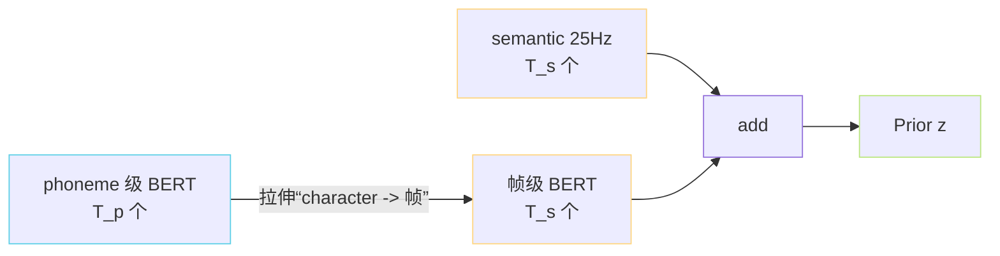

> [📎] 前置知识：Duration Predictor（VITS）、MAS（Monotonic Alignment Search）、Phoneme-Frame 对齐、“mrte”、5fcd1de2 合并快照。

> **定位**：原版 VITS 靠 Duration Predictor + MAS 才能「phoneme → 帧位置」。GPT-SoVITS 中 **AR 阶段已隐式决定了帧长**，Duration Predictor 被跳过但代码保留了。本节拆为何保留、何时会启动、与 MAS 去除带来的工程简化。

## 1. 原 VITS 中的作用

输入 phoneme 与 BERT 后要预测每个 phoneme 该倍上个帧：

$$d_i = f_\theta(\text{phoneme}_i, \text{context}) \in \mathbb R^+$$

随后拉伸 phoneme embedding 到 $\sum d_i$ 帧。训练时用 MAS 的硬对齐作为伪 target。

## 2. GPT-SoVITS 中被「架空」

```python
# GPT_SoVITS/module/models.py::SynthesizerTrn
# self.duration_predictor = StochasticDurationPredictor(...)   ← 创建但不调用
z_p = self.flow(z, ...)
# 不再经过 duration_predictor.expand
```

为什么保留？

1. **兼容原 VITS ckpt**：能从 VITS 预训练 ckpt 热起 SoVITS；

1. **代码路径不变**：OOP 子类继承原 VITS 的 SynthesizerTrn，裁掉会需重写；

1. **未来重开 hot-swap**：后续若想实验「手动控制语速」可重启。

## 3. MAS 去除后的际接机制

GPT-SoVITS 的 phoneme 与 semantic 在拉伸上是「重复拉伸」：

```python
# semantic token 是 25Hz，phoneme 是句级，拉伸逻辑由 ssl_proj 后同位 add bert_proj
# bert_proj 输入是「phoneme 位置拉伸到帧位」后的 BERT 特征
# 这个拉伸在 [3.3.2 BERT特征对齐](https://www.notion.so/ac391067d1d242e9a992220318ea0e51) 中完成
```



> [💡] **本质上：**「多长 time」这个问题被 AR 决定了。AR 生成 N 个 semantic token → 就是 N/25 秒。Duration Predictor 不再必要。

## 4. 去掉 MAS 的工程收益

|环节|原 VITS|SoVITS|
|---|---|---|
|训练 MAS 部分|需 cython 编译|**去除**|
|训练额外 loss|duration L2|去除|
|推理语速控|可调节 dur|**是不可调**«·|
|代码复杂度|高|**低**|

> [⚠️] **代价**：语速不能靠 SoVITS 调控，只能靠后期处理（乘重采样 / FFmpeg `atempo`）。GPT-SoVITS 推理 WebUI 提供 `speed` 控件就是后处理。

## 5. 重开 Duration Predictor 的 hack 路线

社区某些实验分支在推理时人手重复 / 删除 semantic tokens 以调控局部语速：

```python
# 人为拉伸：某个语义 token 重复两次
#  semantic = [a, b, c, d] → [a, a, b, c, c, d]   # "拉长"
semantic_modified = stretch_specific_tokens(semantic, factor=1.3)
# 填回 SoVITS
wav = sovits(semantic_modified, ref)
```

但这是个 hack，未并主线。Duration Predictor 重启 会需要训一套额外训练代码。

## 6. 与 CosyVoice / Fish-Speech 的对比

|系统|Duration 控制|
|---|---|
|**GPT-SoVITS**|无（AR 决定）|
|VITS|有 Duration Predictor|
|FastSpeech2|有明确 duration|
|CosyVoice 2|无，LLM 隐式|
|Fish-Speech|无|

> [🤔] **为什么趋势都丢？** AR 语言模型隆主要 能隐式学会 duration，不需显式预测。Duration Predictor 在 FastSpeech2 时代是刚需，在 「AR + 语义 token」这种范式变为了 redundant。

## 7. 工程判断

> [🔧] **如果要语速可控**：不要在 SoVITS 动，而在 **AR 采样完后拉伸 semantic seq**（重复 / 删除）或后处理重采样 wav。后者正是现有 [webui.py](http://webui.py) 的选择。

## 参考文献

1. Kim, J., Kong, J., & Son, J. (2021). _VITS_ (Duration Predictor + MAS). ICML.

1. Ren, Y. et al. (2021). _FastSpeech 2_. ICLR.

1. GPT-SoVITS: `GPT_SoVITS/module/models.py::SynthesizerTrn`.