> [📎] 前置知识：HiFi-GAN（Kong 2020）、转置卷积上采样、MRF（Multi-Receptive Field Fusion）、Leaky ReLU、商业级 vocoder 设计。

> **定位**：V1/V2 SoVITS 的 Decoder 是 HiFi-GAN 架构的调整版。本节讲上采样倍数、MRF 结构、kernel、输出采样率、与 Posterior z 的接口、与原版 HiFi-GAN 的调整。

## 1. 总体架构

```mermaid
flowchart LR
    Z[Posterior z<br/>192 d, 67Hz] --> C1[Conv1D pre]
    C1 --> U1[Upsample x8<br/>kernel 16, stride 8]
    U1 --> M1[MRF]
    M1 --> U2[Upsample x8<br/>kernel 16, stride 8]
    U2 --> M2[MRF]
    M2 --> U3[Upsample x2<br/>kernel 4, stride 2]
    U3 --> M3[MRF]
    M3 --> U4[Upsample x2<br/>kernel 4, stride 2]
    U4 --> M4[MRF]
    M4 --> O[Conv1D post + tanh<br/>wav 32kHz]
    style Z fill:\#1d2433,stroke:#5CCFE6,color:\#5CCFE6
    style O fill:\#1d2433,stroke:#BAE67E,color:\#BAE67E
    style M1 fill:\#1d2433,stroke:#FFD580,color:\#FFD580
    style M2 fill:\#1d2433,stroke:#FFD580,color:\#FFD580
    style M3 fill:\#1d2433,stroke:#FFD580,color:\#FFD580
    style M4 fill:\#1d2433,stroke:#FFD580,color:\#FFD580
```



## 2. 上采样率计算

|阶段|率|帧率 (Hz)|采样率估 (Hz)|
|---|---|---|---|
|输入 z|—|67|67|
|• ×8|×8|536|536|
|• ×8|×8|4288|4288|
|• ×2|×2|8576|8576|
|• ×2|×2|17152|→ 组拼 32000|

> [💡] **总上采样率 = 8×8×2×2 = 256×**，从 67Hz 到 32000Hz / 67Hz ≈ 478。由于 Posterior 是结 hop=480 算的，该倍数能对齐输出 wav 长度。

## 3. MRF（Multi-Receptive Field Fusion）

每个 MRF 包含三个并行 residual block，kernel 分别为 3/7/11，多 dilation 叠加：

```python
for j in range(3):                       # kernels [3, 7, 11]
    for d in [1, 3, 5]:                  # dilations
        x = x + ResBlock(kernel=k[j], dilation=d)(x)
```

这是 HiFi-GAN 原论文的创新点——同时抱多尺度原于重叠频。

## 4. 与原版 HiFi-GAN 的调整

|项|HiFi-GAN V1|SoVITS V1/V2|
|---|---|---|
|输入|mel 80|Posterior z 192|
|输出 SR|22050|**32000**|
|上采样率|8/8/2/2 (=256)|**同**|
|MRF kernels|3/7/11|**同**|
|hidden|512|512|
|g_in (说话人)|无|• gin_channels|

> [🤔] **为什么不用 80-d mel 作输入？** 几个关键：① SoVITS 在 VAE 架构下，z 是「隐含相位」的 192-d 表征，信息量高于 mel；② 训练时 KL 项使其与 Prior 联动，不需 mel 作中间产物。

## 5. Speaker Conditioning

GPT-SoVITS 中说话人信息以 `g` 变量注入（下文调条件）：

```python
x = self.conv_pre(z) + self.g_proj(g)
# 每个 residual block 中也能附 g
```

V2Pro 中 `g` 从 SV embedding（ERes2NetV2）抽出： [[6.3.2 SV Embedding 注入位置|6.3.2 SV Embedding 注入位置]]。

## 6. 输出后处理

```python
x = torch.tanh(self.conv_post(x))   # [-1, 1]
wav = x.squeeze(1)                   # [B, T_w]
```

tanh 限制 ±1 避免裁剪。微變（聋听感）会被后期重采样抽去。

## 7. 工程判断

> [🔧] **HiFi-GAN 类 Decoder 是社区额外拍头点**：不要容易动。改成他 vocoder 需重训。社区快逤试用 BigVGAN 替代 HiFi-GAN 作为 V3/V4 的 Decoder——但体积、推理费 +30%。

## 参考文献

1. Kong, J., Kim, J., & Bae, J. (2020). _HiFi-GAN: Generative Adversarial Networks for Efficient and High Fidelity Speech Synthesis_. NeurIPS.

1. Kim, J., Kong, J., & Son, J. (2021). _VITS_. ICML.

1. GPT-SoVITS: `GPT_SoVITS/module/models.py::Generator`.