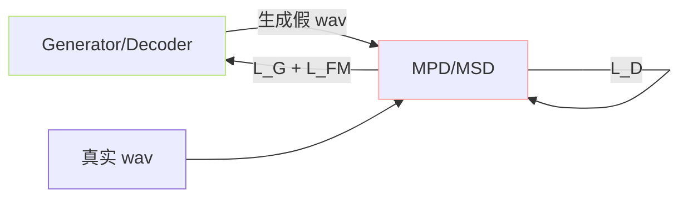

> [📎] 前置知识：GAN 判别器、Periodicity（周期性）、Feature Matching Loss、Spectral Norm、MPD/MSD（HiFi-GAN）。

> **定位**：V1/V2 SoVITS 采用 HiFi-GAN 同样的 MPD（Multi-Period Discriminator）+ MSD（Multi-Scale Discriminator）双打。本节拆原理、结构、与 Decoder 动态、Feature Matching Loss 公式。

## 1. 为何需要多个判别器

语音信号由多个周期叠加（基频 + 谐波 + 噪声）。单个判别器难以同时考量多尺度、多周期。HiFi-GAN 提出「多周期 + 多尺度」：

|判别器|视角|抓取东西|
|---|---|---|
|**MPD**|周期 reshape|不同基频、稳定谐波|
|**MSD**|多采样率|频谱高低频、噪声|

## 2. MPD 原理

取五个质数 period $p in {2, 3, 5, 7, 11}$，将 1D wav reshape 为 2D：

$$x \in \mathbb R^{T} \to x_p \in \mathbb R^{T/p \times p}$$

随后用 2D 卷积表达「周期上下邻」的差异。五个质数产生五个独立判别器。

```python
class DiscriminatorP(nn.Module):
    def __init__(self, period):
        self.period = period
        # 2D conv stack with kernels (5, 1)
        ...
    def forward(self, x):
        b, c, t = x.shape
        pad = self.period - t % self.period
        x = F.pad(x, (0, pad), mode='reflect')
        x = x.view(b, c, (t + pad) // self.period, self.period)
        # 2D conv stack
        ...
```

> [💡] **为什么选质数？** 避免不同 period 互为倍数（如 4 与 8）造成检查冲突。质数提供「互质」覆盖频谱。

## 3. MSD 原理

三个不同采样率 / 平均池化后的 1D 卷积判别器：

```jsx
x (raw) → D_0
AvgPool1d(4) → D_1
AvgPool1d(4) → D_2
```

D_0 看原始 wav，D_1 D_2 看降采样后。主要抓「频谱不同层次错误」。

## 4. 损失函数

HiFi-GAN 使用 **LSGAN** 损失（mean squared error）代替交叉熵：

$$\mathcal L_D = \mathbb E_{x \sim p_{\text{data}}}[(D(x) - 1)^2] + \mathbb E_{z}[D(G(z))^2]$$

$$\mathcal L_G^{\text{GAN}} = \mathbb E_{z}[(D(G(z)) - 1)^2]$$

### Feature Matching Loss

$$\mathcal L_{\text{FM}} = \sum_l \frac{1}{N_l} \|\phi_l(x) - \phi_l(\hat x)\|_1$$

$\phi_l$ 是判别器第 $l$ 层特征图，$N_l$ 是那层元素数。这个损失量身在训练中权重为 2。2。

## 5. 与 Decoder 的动态



每步先训 D 后训 G。Lightning 中为 2 个 optimizer + manual optimization。

## 6. 训练技巧

|问题|原因|解决|
|---|---|---|
|D loss 趋 0、G loss 发散|D 过强|加 G lr 或减 D lr（0.8×）|
|G 生成重复静音|D 未学会静音 vs 语音|FM weight 提高|
|金属音|HiFi-GAN 通病|**V4 换 BigVGAN**上|

> [⚠️] **D 过强是训练不稳的主因**：初期如果看 D loss 快速降到 0.05 下，G 不能学。训练初期可「预热」 G——先 5 epoch 仅 mel L1 不启动 GAN loss。

## 7. 工程判断

> [🔧] **部署时丢掉判别器**：部署仅需 Generator (Decoder)，D 可丢。发布 ckpt 中包含 `s2Dv1.pth`（D）仅为后续微调增量训练。如不计划微调 GAN 部分，可不下载 D。

## 参考文献

1. Kong, J., Kim, J., & Bae, J. (2020). _HiFi-GAN_. NeurIPS.

1. Mao, X. et al. (2017). _Least Squares Generative Adversarial Networks_. ICCV.

1. Larsen, A. B. L. et al. (2016). _Autoencoding beyond pixels using a learned similarity metric_. ICML. (Feature Matching)

1. GPT-SoVITS: `GPT_SoVITS/module/discriminator.py::MultiPeriodDiscriminator`, `MultiScaleDiscriminator`.