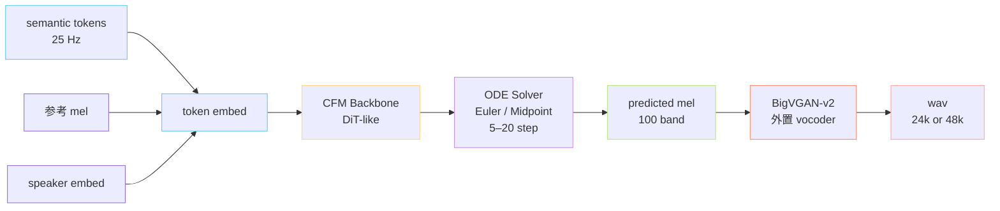

> [📎] 前置知识：[[1.5 Flow Matching - CFM（v3-v4 的核心范式）]]、[[1.6 BigVGAN]]、Mel-spectrogram、Classifier-Free Guidance、ODE Solver（Euler / RK4）。

> **定位**：V3 / V4 SoVITS 把 V1 / V2 的 VITS 范式整体换成 **CFM + BigVGAN** 两段式——CFM 学「semantic → mel」的概率流，BigVGAN 学「mel → 波形」。这是 GPT-SoVITS 在 2024 年的范式跃迁。

## 1. V1 / V2 → V3 / V4 的范式切换

|维度|V1 / V2（VITS-based）|V3 / V4（CFM + BigVGAN）|
|---|---|---|
|生成目标|latent $z$ → waveform 一步|**mel** → waveform 两步|
|概率范式|CVAE + Flow + GAN|**Conditional Flow Matching**|
|训练目标|ELBO + adv|**velocity regression**|
|推理步数|1 步|**5–20 步 ODE**|
|声码器|内置 HiFi-GAN|**外置 BigVGAN-v2**|
|采样率|32k|24k (V3) / **48k (V4)**|
|训练数据|~1000h|**~7000h**|

## 2. 推理数据流

## 3. CFM Backbone 形态

V3 / V4 沿用 DiT 风格的 Transformer Backbone，输入是「加噪 mel + 时间 embedding + 条件」：

$$v_\theta(x_t, t, c) \approx \frac{dx_t}{dt}, \quad x_t = (1-t)\,\epsilon + t\,x_1,\;\; \epsilon \sim \mathcal N(0, I)$$

训练目标：

$$\mathcal L_{\text{CFM}} = \mathbb E_{t \sim U[0,1],\, x_1,\, \epsilon} \big\| v_\theta(x_t, t, c) - (x_1 - \epsilon) \big\|_2^2$$

其中条件 $c$ = `[semantic_emb, ref_mel_emb, spk_emb]` 沿时间轴 concat 后做 cross-attention。

> [💡] **OT-CFM 优势**：相比 score-based diffusion（DDPM）需要 50–100 步 NFE，OT-CFM 直线化的概率路径让 5–10 步 Euler 就能达到接近上限的质量，是 V3 / V4 推理可控的关键。

## 4. 条件输入设计

GPT-SoVITS V3 / V4 的条件由三部分拼接：

|条件|来源|维度|作用|
|---|---|---|---|
|`semantic_emb`|AR 输出 → codebook lookup|$T_s \times d$|内容（说什么）|
|`ref_mel_emb`|参考音频 mel → conv 编码|$T_r \times d$|音色 + 韵律风格|
|`spk_emb`|全局池化|$1 \times d$|全局音色锚点|

> [🔧] **参考 mel 的「切片对齐」**：训练时随机切一段参考 + 一段目标（**非重叠**）的 mel 作为 in-context 示例；推理时把整段参考 mel 作为条件。与 VALL-E 的「prompt + target」思路一致，让模型学会「看着 ref 风格生成 tgt」。

## 5. V3 vs V4 关键差异

|维度|V3|V4|
|---|---|---|
|采样率|24 kHz|**48 kHz**|
|Mel band|100|100|
|BigVGAN 配置|24khz-100band-256x|**48khz-100band-512x**|
|上采样倍率|256|512|
|已知瑕疵|**高频金属音**|**修复**|
|推理速度（A100）|~0.15 RTF|~0.20 RTF|
|何时选|兼容旧项目|**新项目首选**|

> [⚠️] **V3 金属音根因**：BigVGAN-v2 在 24kHz / 100band 上的上采样网络在 8–12kHz 高频段有谱失真，听感像金属敲击。V4 通过提升采样率到 48kHz + 512× 上采样 + 增加 FM Loss 中高频权重缓解。**这是版本迭代的核心动机**。

## 6. 推理超参（CFG + 步数）

|参数|默认|含义|
|---|---|---|
|`inference_steps`|8（V3） / 10（V4）|ODE Euler 步数|
|`cfg_strength`|2.0|Classifier-Free Guidance 强度|
|`noise_scale`|0.667|起始噪声温度|

CFG 公式：

$$\tilde v_\theta(x_t, t, c) = v_\theta(x_t, t, \emptyset) + w \cdot \big(v_\theta(x_t, t, c) - v_\theta(x_t, t, \emptyset)\big)$$

> [🤔] **为什么 CFG 在 CFM 也有用？** 虽然 CFM 不是 score-based，但条件梯度的方向性放大在向量场上同样有效——把 unconditional 的 baseline 减去后增强 conditional 信号。$w = 2$ 是音色 / 内容贴合度的甜区，$>3$ 易过饱和、出怪音。

## 7. 子页面导航

[[6.2.1 CFM Backbone（Conditional Flow Matching）]]

[[6.2.2 条件输入设计（semantic + ref mel + 说话人）]]

[[6.2.3 V3 vs V4（24k vs 48k - 上采样修复）]]

[[6.2.4 推理超参（CFG - 采样步数）]]

## 参考文献

1. Lipman, Y. et al. (2023). _Flow Matching for Generative Modeling_. ICLR.

1. Tong, A. et al. (2023). _Improving and Generalizing Flow-Based Generative Models with Minibatch Optimal Transport_. arXiv:2302.00482.

1. Ho, J. & Salimans, T. (2022). _Classifier-Free Diffusion Guidance_. NeurIPS Workshop.

1. Lee, S. et al. (2023). _BigVGAN-v2_. [https://github.com/NVIDIA/BigVGAN](https://github.com/NVIDIA/BigVGAN)

1. Peebles, W. & Xie, S. (2023). _DiT: Scalable Diffusion Models with Transformers_. ICCV.

1. GPT-SoVITS: `GPT_SoVITS/module/cfm.py`, `BigVGAN/`.