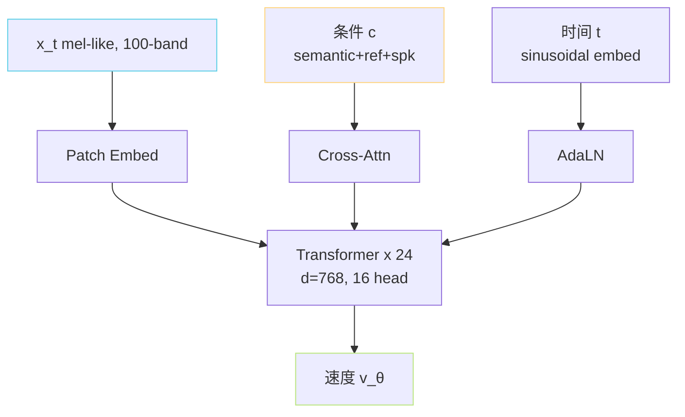

> [📎] 前置知识：Flow Matching（FM）、Conditional Flow Matching（CFM）、ODE 推理、OT-CFM、与 Diffusion 的联系。

> **定位**：V3/V4 SoVITS 的 Decoder 年 CFM 取代 VITS。本节拆 CFM 的原理、训练损失、网络 backbone（DiT-like）、与 diffusion 的区别、推理多步 ODE。

## 1. Flow Matching 简要

定义「变量路线」 $psi_t(x_0)$，在 $t \in [0,1]$ 上从初始分布 $p_0$ 迁移到目标分布 $p_1$。Flow Matching 学习一个速度场 $v_\theta(x, t)$ 使：

$$\frac{d x}{d t} = v_\theta(x, t)$$

最简文 OT-FM 选 $psi_t(x_0) = (1 - t) x_0 + t x_1$，则「真实速度」 $u_t = x_1 - x_0$。

## 2. 训练目标

CFM 损失：

$$\mathcal L_{\text{CFM}} = \mathbb E_{t, x_0, x_1} \| v_\theta(\psi_t(x_0, x_1), t \mid c) - (x_1 - x_0) \|_2^2$$

其中 $x_0 sim mathcal N(0, I)$，$x_1$ = 真实 mel，$c$ = 语义 + 参考 + 说话人。

> [💡] **与 diffusion 差别**：diffusion 预测 $\epsilon$ 或 $x_0$，CFM 预测「从 $x_0$ 到 $x_1$ 的速度差」。 OT-CFM 路线是「直线」，推理需的 step 几乎只 5–10 步。Diffusion 需 50–100 step。

## 3. 网络 backbone

GPT-SoVITS V3/V4 采用类 DiT 架构（Diffusion Transformer）：



- 24 层 Transformer，d=768，与 AR 主体同身材（可理解为「mel 版 AR」）。

- 条件 c 通过 cross-attention 注入。

- 时间 t 通过 AdaLN（adaptive LN）调制 LayerNorm 参数。

## 4. 训练伪代码

```python
for batch in dataloader:
    x1 = batch['mel']           # 真实 mel
    c  = build_condition(batch) # semantic + ref + spk
    x0 = torch.randn_like(x1)
    t  = torch.rand(B, 1, 1)    # uniform [0,1]
    xt = (1 - t) * x0 + t * x1
    target = x1 - x0
    v = model(xt, t, c)
    loss = F.mse_loss(v, target)
    loss.backward()
```

## 5. 推理多步 ODE

```python
# Euler ODE solver
x = torch.randn(B, n_mels, T)
for i in range(steps):
    t  = i / steps
    dt = 1 / steps
    v = model(x, t, c)
    # CFG调制
    if cfg > 1.0:
        v_uncond = model(x, t, None)
        v = v_uncond + cfg * (v - v_uncond)
    x = x + v * dt
# x 是 mel。BigVGAN 上采样 → wav
wav = bigvgan(x)
```

## 6. 采样 step 数

|steps|听感|推理费|
|---|---|---|
|3|劲起 / 轻肇|3× AR 一次推理|
|5|准可接受|5×|
|**8 (默认)**|**佳**|8×|
|10|炶获|10×|
|20|不可辨|20×——不推荐|

## 7. CFG 推理增强

Classifier-Free Guidance：

$$v_{\text{cfg}} = v(x, t, \emptyset) + \alpha (v(x, t, c) - v(x, t, \emptyset))$$

$\alpha = 2.0$ 默认。训练时随机 10% 丢 c 换为 $\emptyset$ (隐 token)。

> [🤔] **调 cfg 体验**：$alpha in [1.5, 3.0]$ 越高听感越「金属明亮」但会起伪作。默认 2.0 是社区调过的佳点。

## 8. CFM vs VITS 代价表

|项|VITS (V1/V2)|CFM (V3/V4)|
|---|---|---|
|重构质|佳|**更佳，丢弃金属音**|
|训练稳定|GAN 不稳|**纯 L2，稳**|
|推理速度|**1 step**|8–1 0 step|
|听感丰富|佳|**更佳**|
|上下文起动|快|慢（8×）|

## 9. 工程判断

> [🔧] **选型决策**：要极限低延迟 API → V1/V2; 要质量 → V3/V4 + 加 chunk-stream。 V3 V4 CFG=2.0 + steps=8 是部署调调。未来 Consistency Models 可减到 1–2 step。

## 参考文献

1. Lipman, Y. et al. (2023). _Flow Matching for Generative Modeling_. ICLR.

1. Tong, A. et al. (2023). _Improving and Generalizing Flow-Based Generative Models with Minibatch Optimal Transport_. arXiv:2302.00482.

1. Peebles, W. & Xie, S. (2023). _Scalable Diffusion Models with Transformers_ (DiT). ICCV.

1. Ho, J. & Salimans, T. (2022). _Classifier-Free Diffusion Guidance_. NeurIPS Workshop.

1. GPT-SoVITS: `GPT_SoVITS/module/cfm.py`.