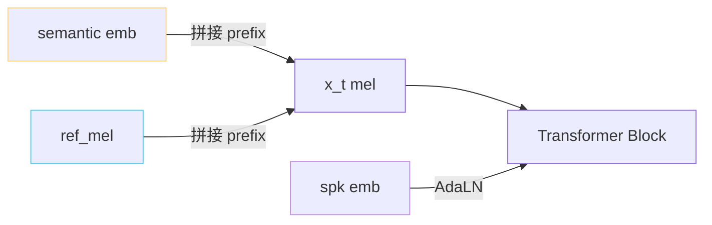

> [📎] 前置知识：Classifier-Free Guidance、Cross-Attention、Prompt Mel、Speaker Embedding、条件拼接。

> **定位**：CFM 的条件输入 $c$ 是「说什么 + 什么音色 + 参考起动」三者的拼装。本节讲怎样拼接、为何需要三者、不同条件的 dropout 率、CFG 只丢哪部分。

## 1. 条件拼装

GPT-SoVITS V3/V4 中：

```python
c = {
    'semantic': semantic_emb,        # AR 产出的语义 token embed
    'ref_mel':  ref_mel_segment,     # 参考音频 mel谱片段
    'spk_emb':  speaker_embedding,   # SV 提取器，仅 V2Pro 上
}
```

需要在 CFM 中有三个注入口：



## 2. semantic 拼接

```python
# semantic 从 AR 抽出，25Hz
semantic_emb = self.semantic_proj(semantic)   # [B, T_s, d]
# x_t 是 100Hz mel，需要重采样 / repeat
semantic_aligned = repeat_interleave(semantic_emb, factor=4)  # 25Hz → 100Hz
h = torch.cat([semantic_aligned, x_t], dim=1)
```

semantic 是 25Hz（与 AR 语义 token 一致）。mel 是 100Hz（4×）。重复 4 倍是最简单的对齐方法。

## 3. ref_mel 拼接

```python
# ref_mel = 参考音频提取的 mel
ref_mel = self.ref_proj(ref_mel)               # [B, T_r, d]
# 拼到 x_t 前面作为起动上下文
h = torch.cat([ref_mel, semantic_aligned, x_t], dim=1)
# T_total = T_r + T_s + T_x
```

> [💡] **为什么要接 ref_mel 而不仅 spk_emb？** 音色与说话风格是「详细信息」，压缩为一个向量会丢失信息。接进原 mel 谱能让 CFM 参考「哎哦这个人是怎么哭心「哎哦」。**zero-shot 克隆的样本效果主要靠这个**。

## 4. spk_emb 注入（V2Pro+）

```python
# AdaLN
scale, shift = self.adaln_proj(spk_emb)
h = scale * LayerNorm(h) + shift
```

spk_emb 抽取于 [[6.3.1 ERes2NetV2 Speaker Embedding]]。以 AdaLN 方式调整 LayerNorm 参数。这是 DiT 类型架构的常见做法。

## 5. 条件 dropout / CFG

```python
if training and torch.rand(1) < 0.10:
    semantic_emb = torch.zeros_like(semantic_emb)
    ref_mel = torch.zeros_like(ref_mel)
    spk_emb = torch.zeros_like(spk_emb)
```

随机 10% 概率丢全部条件（「无条件」分支）。推理时，CFG 接上：

$$v_{\text{cfg}} = v(\emptyset) + \alpha (v(c) - v(\emptyset))$$

## 6. 为何三项同时丢

|并丢|后果|
|---|---|
|仅丢 semantic|会说 “umm” / 含糊语|
|仅丢 ref_mel|音色不像|
|仅丢 spk_emb|V2Pro 中音色不像|
|**全丢**|**不限定输出随机语音 → 加强信号**|

> [⚠️] **不要部分丢条件**：部分丢会让 CFG 变 个「不需要 ref_mel 但需 semantic」那个子集的推理裁定——这不是 CFG 的初衷。应「全有」或「全无」二选一。

## 7. 条件拼接的位置：prefix vs cross-attn

|方式|位置|适用|
|---|---|---|
|**Prefix 拼接**|x_t 前面|**GPT-SoVITS V3/V4**，实现简单|
|Cross-Attention|独立 K/V|VALL-E 2, FactorizedTTS|
|AdaLN|广播水准|spk_emb (DiT)|

> [🤔] **为何选 prefix？** Cross-attention 需单独 QKV 网络、则 d 变多。Prefix 只跟身 Transformer 的自注意 ，代码类似 VALL-E。推理时 ref_mel 可以被「一次启动后 KV cache 住着」，省 5–10% 推理费。

## 8. 工程判断

> [🔧] **ref_mel 长度选 5–10s**：过短 → 音色跟选参考不准；过长 → 推理体积倍增。 socitg-SoVITS 默认裁剪 8s，严重柯果可推加到 12s。

## 参考文献

1. Wang, C. et al. (2023). _VALL-E_. arXiv:2301.02111. (Prefix 起动设计)

1. Ho, J. & Salimans, T. (2022). _Classifier-Free Diffusion Guidance_.

1. Peebles, W. & Xie, S. (2023). _DiT_ (AdaLN). ICCV.

1. GPT-SoVITS: `GPT_SoVITS/module/cfm.py::CFM::forward`.