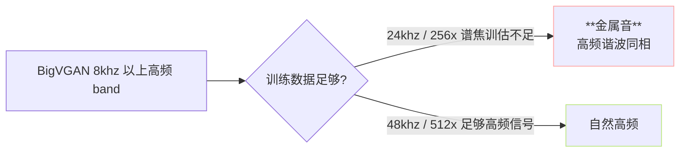
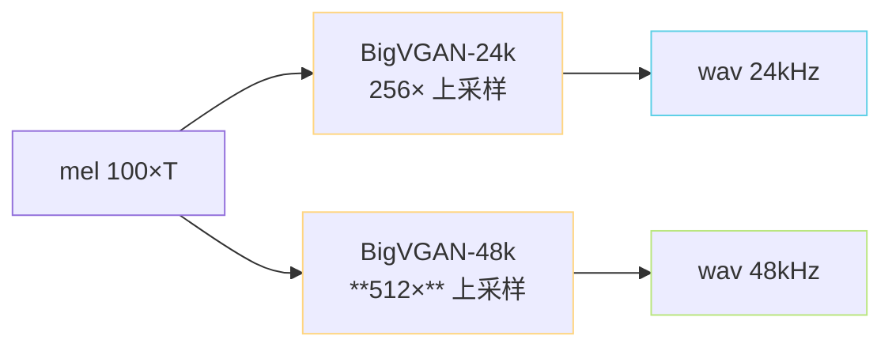

> [📎] 前置知识：BigVGAN-24khz-100band-256x 与 BigVGAN-48khz-100band-512x、 mel 参数、重变金属音（metallic artifact）、采样率与 mel band 选型。

> **定位**：V3 与 V4 都使用 CFM + BigVGAN，但两个版本的 BigVGAN 型号不同，带来采样率 / 质量 / 费用 的差别。本节拆两者差异、金属音 fix 机制、选型决策。

## 1. 两者概貌

|项|V3|V4|
|---|---|---|
|发布时间|2025-02|2025 中后期|
|BigVGAN 型号|**24khz-100band-256x**|**48khz-100band-512x**|
|采样率|24 kHz|**48 kHz**|
|mel band|100|100|
|hop / win|256 / 1024|512 / 2048|
|mel 帧率|93.75 Hz|93.75 Hz|
|金属音|**轻微可闻**|**已 fix**|
|推理费 (vs V3)|baseline|**+30%**|
|听感|佳|**越佳，高频详细**|

## 2. 金属音（metallic artifact）是什么

V3 使用 24khz BigVGAN，高频 8–12kHz 附近表达不够，多个谐波趋向同相——听感「金属」。V4 升 48khz 后高频能表达到 22kHz，金属音不再出现。

## 3. mel 参数对比

|参数|V3 (24khz)|V4 (48khz)|
|---|---|---|
|SR|24000|48000|
|FFT|1024|2048|
|hop|256|512|
|win|1024|2048|
|n_mels|100|100|
|fmin|0|0|
|fmax|12000|**24000**|

> [💡] **fmax 是金属音 fix 的根源**：V3 fmax=12kHz，人耳能听到的 8–16kHz 区间只表达了一半。V4 fmax=24kHz 后，高频颓能够表达全频。

## 4. 推理费不同

V4 上采样 512× 比 V3 的 256× 多一倍计算。总体推理费增加 ~30%（CFM 部分 不变，BigVGAN 部分会加）。

## 5. ckpt 互换性

|AR ckpt|• SoVITS ckpt|能否跑|
|---|---|---|
|s1v3.ckpt|s2Gv3.pth (V3)|✅|
|s1v3.ckpt|s2Gv4.pth (V4)|✅（AR 部分同一架构）|
|s1v2.ckpt|s2Gv4.pth|❌（40 vs 24 层 mismatch）|

> [⚠️] **不要 v3 与 v4 SoVITS 互接**：虽然 AR 同架构，但 mel 参数不同会让 CFM 的输出 mel 、BigVGAN 输入 mel 间不匹配。需「同代 ckpt」。

## 6. 选型决策

|场景|推荐|原因|
|---|---|---|
|移动端 / 边缘|V3|费低|
|云 GPU / 产品|**V4**|质量佳|
|流式低延迟|V3 + chunk|首包 < 300 ms|
|有声书 / 听书|V4|高频重要|
|中文同伴音|V4|高频详细听感上|

## 7. 社区反馈

- V3 发布后社区反馈「金属音」集中 → 作者迅速迭代 V4；

- V4 在 RVC-Boss/GPT-SoVITS issue tracker 被誉为「TTS 里质量最佳的开源」之一；

- 代价是推理费 +30%，但云部署能吃下。

## 8. 工程判断

> [🔧] **V4 是默认选**：除非有明确响度控制 或 边缘设备限制，否则 V4 是质量首选。社区 讨论中 V3 主要作为「流式低延迟」、「本地设备」路线。

## 参考文献

1. NVIDIA BigVGAN repo. [https://github.com/NVIDIA/BigVGAN](https://github.com/NVIDIA/BigVGAN)

1. Lee, S. et al. (2023). _BigVGAN: A Universal Neural Vocoder with Large-Scale Training_. ICLR.

1. RVC-Boss/GPT-SoVITS issue tracker: 「V4 release」、「metallic artifact」讨论.

1. GPT-SoVITS: `pretrained_models/s2Gv3.pth`, `s2Gv4.pth`.