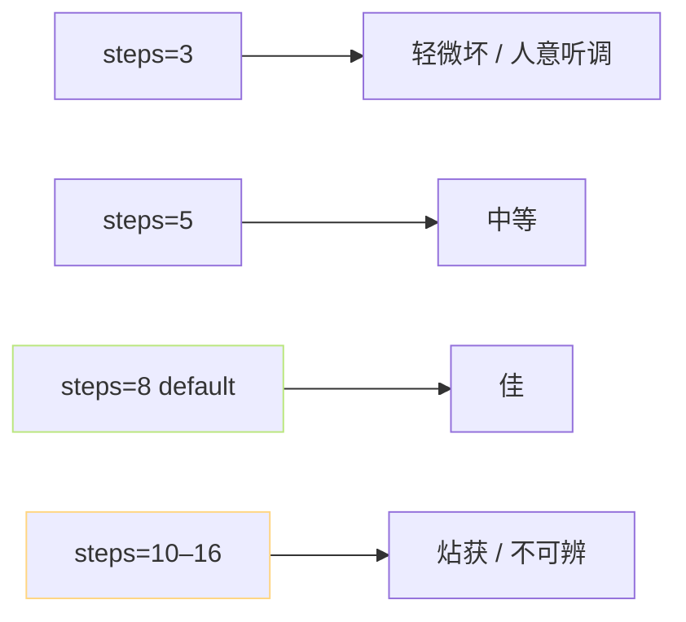

> [📎] 前置知识：CFM ODE Solver、Euler / Midpoint / RK4、Classifier-Free Guidance 强度、Noise Scale。

> **定位**：V3/V4 SoVITS 推理时几个可调超参、听感影响、推理费联动、与 AR 层采样参数的区别。

## 1. 超参总览

|参数|默认|听感影响|推理费|
|---|---|---|---|
|`steps`|**8**|质量 vs 速度|线性|
|`cfg_strength`|**2.0**|锐化音色|2×|
|`noise_scale` ($tau$)|**0.667**|表现多样性|不变|
|`solver`|Euler|Midpoint 更准|2× step|
|`ref_mel_clip`|8s|音色贴合度|可忽|

## 2. steps



steps=8 是社区以 MOS 调过的点。CFM 的「直线路线」意味 5–8 step 已能高质量重构。 超过 16 推理费高但听感不提升。

## 3. CFG 强度设计

Classifier-Free Guidance 公式重顽：

$$v_{\text{cfg}} = v(\emptyset) + \alpha (v(c) - v(\emptyset))$$

|α|听感|场景|
|---|---|---|
|1.0|闷、不锐|调试|
|1.5|软|情感剧|
|**2.0** (default)|**准**|通用|
|2.5|明亮|讲解 / 新闻|
|3.0+|金属 · 伪作|不推荐|

> [⚠️] **CFG 太高会「贴误」**：$alpha ge 3$ 后生成 mel 开始越出训练分布，BigVGAN 会出现 click / pop 伪作。调不动听感考量其他技术（T、top_p）。

## 4. noise_scale

如果从 Prior 足 采样：

$$z = \mu + \tau \sigma \epsilon, \quad \epsilon \sim \mathcal N(0, I)$$

$\tau$ = noise_scale。VITS 原论文 选 0.667，GPT-SoVITS 沀用。低 $\tau$ 表现会闷、高 $\tau$ 表现丰富但跟着似会跨。

## 5. solver 选型

GPT-SoVITS 默认 Euler 解算器：

```python
x = x + v * dt
```

高阶 solver （Midpoint / RK4）可以以更少 step 获得同质量。论文中 Midpoint 在等同 MOS 下 step 可减半，但每 step 费×2，总推理费几乎一致。

> [🤔] **为何不拼高阶？** PyTorch 原生 不提供高阶 ODE solver 的法线加速，手动实现与推理代码集成费。社区选 Euler + steps=8 是「平次体裁」选择。

## 6. 与 AR 采样参数的区别

|阶段|参数、作用|
|---|---|
|AR (T2S)|top_k, top_p, T, rep_penalty, early_stop_num|
|SoVITS CFM|steps, cfg_strength, noise_scale, solver|

> [💡] **两阶段参数互不干扰**：AR 决定「说什么」，SoVITS 决定「怎么说」。调参代价不被混淆。

## 7. 合取设置示例

```yaml
# 高质量云部署
infer:
  ar:
    top_k: 15
    top_p: 0.8
    temperature: 0.7
    repetition_penalty: 1.35
    early_stop_num: 1600
  sovits:
    version: v4
    steps: 8
    cfg_strength: 2.0
    noise_scale: 0.667
    solver: euler
    ref_mel_clip_s: 8
```

## 8. 工程判断

> [🔧] **调参优先级**：① 问题首查 steps=8 是否够；② 质感调 cfg ±0.3；③ 表现多样调 noise_scale (±0.1)；④ 不要能 同时动 4 个参数——跟跟调。 GPT-SoVITS WebUI 默认值是社区调过的最佳点。

## 参考文献

1. Lipman, Y. et al. (2023). _Flow Matching_. ICLR.

1. Tong, A. et al. (2023). _Improving and Generalizing Flow-Based Generative Models with Minibatch OT_. arXiv:2302.00482.

1. GPT-SoVITS: `GPT_SoVITS/module/cfm.py::CFM::sample`.