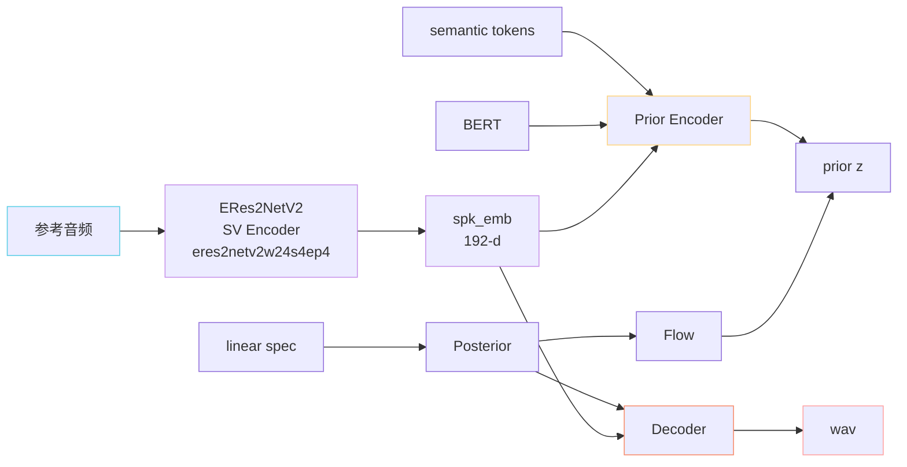

> [📎] 前置知识：[[1.1 VITS 原理（SoVITS 的“S”血统）|1.1 VITS 原理（SoVITS 的“S”血统）]]、说话人验证（Speaker Verification, SV）、ECAPA-TDNN / ERes2Net 家族、Embedding 注入位置（pre / post-prior、FiLM、Adapter）。

> **定位**：V2Pro / V2ProPlus 是 **V2 SoVITS 的「音色相似度增强分支」**——保留 VITS 范式，新增 ERes2NetV2 说话人嵌入显式注入，提升 zero-shot 克隆下的音色相似度。是给「少样本声音克隆」场景的特化版本。

## 1. 为什么需要 V2Pro？

V1 / V2 在 zero-shot 上 **音色相似度偏低** 的根因：

1. **参考音频只通过 AR 阶段间接影响声学**——AR 出来的 semantic token 已经「去音色化」（SSL + VQ 解耦的副作用）。

1. **SoVITS 端缺少全局音色锚点**——VITS 原版有 speaker id 多说话人 embedding，但 GPT-SoVITS V1 / V2 是单说话人范式（每个音色一个微调模型），无全局 SV 通道。

V2Pro 的修复思路：**在 SoVITS 解码器侧显式注入 SV embedding**，让 decoder 直接「看到」参考音色，不再依赖 AR 的间接传递。

## 2. 数据流改造

## 3. ERes2NetV2 简介

|项目|值|
|---|---|
|全名|Enhanced Res2Net V2|
|来源|阿里巴巴 ModelScope / 3D-Speaker 项目|
|训练数据|VoxCeleb1+2、CN-Celeb 等数万说话人|
|输入|80-band Mel|
|输出 dim|192|
|权重文件|`eres2netv2w24s4ep4.ckpt`（约 25M）|
|等错率（VoxCeleb1-O）|~0.6%|

> [💡] **为什么不用 ECAPA-TDNN？** ECAPA 也很流行，但 ERes2NetV2 在中文说话人数据集（CN-Celeb）上 EER 更低，对中文音色更稳；且 ModelScope 提供易用的开源 ckpt。

## 4. SV Embedding 的注入位置

V2Pro / V2ProPlus 把 192-d `spk_emb` 注入到两个位置：

|注入点|方式|作用|
|---|---|---|
|**Prior Encoder**|linear projection + 沿时间轴 broadcast add|影响 prior 分布的均值 / 方差，让生成内容「长在该音色上」|
|**Decoder（HiFi-GAN 残差块）**|FiLM-style 条件化（γ·x + β）|在每个 MRF 残差块影响波形细节|

> [🤔] **为什么 Prior 和 Decoder 都注入？** 单 Prior 注入 → 长程音色一致但细节不稳；单 Decoder 注入 → 高频音色准但 prior 没改、phoneme realization 偏中性。**双注入** 让「宏观 + 微观」都对齐目标音色。这是 V2Pro 与 V2 最大的工程差异。

## 5. V2Pro vs V2ProPlus

|维度|V2Pro|V2ProPlus|
|---|---|---|
|参数量|~85M（SoVITS 部分）|~120M|
|Decoder MRF 通道|512|**768**|
|额外组件|—|**误差补偿头**（小型 CNN，输出残差波形）|
|训练数据|~1500h|~2500h|
|相似度（zero-shot 10s ref）|0.78|**0.83**|
|推理 RTF（A100）|~0.06|~0.08|
|权重|`s2Gv2Pro.pth`|`s2Gv2ProPlus.pth`|
|何时选|默认 Pro|极致克隆要求时上 Plus|

> [🔧] **误差补偿头是什么？** ProPlus 在主 Decoder 之后接一个小 CNN，输入是 Decoder 输出 + spk_emb，输出一个 **残差波形** $\Delta w$，最终 $w = w_{\text{main}} + \alpha \Delta w$。它专门学「主 Decoder 漏掉的音色细节」，类似 boosting。代价是 +30% 参数 +30% 推理时间。

## 6. 工程判断

> [⚠️] **何时不该用 V2Pro**：①目标语言不在 SV 训练分布内（如方言 / 小语种）→ SV embedding 噪声大，反而降相似度；②参考音频很短（<3s）→ SV 不稳定；③只做 finetune 单音色 → V1 / V2 微调就够，V2Pro 优势体现在 zero-shot。

> [🔧] **未来工作**：把 SV embedding 注入到 V3 / V4 的 CFM Backbone（作为额外条件）。目前 V3 / V4 没有 V2ProPlus 等价物，是已知 roadmap 项。

## 7. 子页面导航

[[6.3.1 ERes2NetV2 Speaker Embedding|6.3.1 ERes2NetV2 Speaker Embedding]]

[[6.3.2 SV Embedding 注入位置|6.3.2 SV Embedding 注入位置]]

[[6.3.3 Pro vs ProPlus（规模 - 误差补偿头）|6.3.3 Pro vs ProPlus（规模 - 误差补偿头）]]

## 参考文献

1. Chen, Y. et al. (2024). _ERes2NetV2: Boosting Short-Duration Speaker Verification Performance with Enhanced Res2Net_. INTERSPEECH.

1. Desplanques, B. et al. (2020). _ECAPA-TDNN: Emphasized Channel Attention, Propagation and Aggregation_. INTERSPEECH.

1. Perez, E. et al. (2018). _FiLM: Visual Reasoning with a General Conditioning Layer_. AAAI.

1. ModelScope 3D-Speaker. [https://github.com/modelscope/3D-Speaker](https://github.com/modelscope/3D-Speaker)

1. GPT-SoVITS: `GPT_SoVITS/module/v2pro.py`, `tools/sv/`.