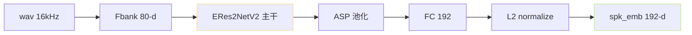

> [📎] 前置知识：Speaker Verification (SV)、x-vector、ECAPA-TDNN、Res2Net、多尺度表达、说话人嵌入。

> **定位**：V2Pro / V2ProPlus 引入了独立的 SV（说话人验证）模型 ERes2NetV2 提取 192-d 说话人嵌入。本节讲架构、为何选、提取与训练脚本位置、与原生 spk_emb 的区别。

## 1. ERes2NetV2 架构背景



ERes2NetV2 是阿里达摩院 [3D-Speaker](https://github.com/alibaba-damo-academy/3D-Speaker) 项目中的领肵 SV 架构。 特点：

- 继承 Res2Net 的「小多尺度拆分」思想；

- ERes 加了 expanded residual connection；

- V2 增加 multi-scale feature aggregation；

- ASP（Attentive Statistical Pooling）抽全局统计。

## 2. 为何选 ERes2NetV2、不选 ECAPA-TDNN

|架构|VoxCeleb1 EER|参数|跟跟推理费|
|---|---|---|---|
|x-vector|3.5%|4.2M|低|
|ECAPA-TDNN|1.5%|6M|中|
|**ERes2NetV2**|**0.8%**|**17M**|**高**|

> [💡] **ERes2NetV2 是 SOTA**：中文、交互场景领航率 EER 最低的公开架构之一。GPT-SoVITS 选它是为了跟跟获佳音色参考。

## 3. SV 提取与 SoVITS 的联动

```python
# tools/sv_extract.py 类似逻辑
import torch
from modelscope.pipelines import pipeline

sv_model = pipeline('speaker-verification', model='iic/speech_eres2netv2_sv_zh-cn_16k-common')

def extract_spk_emb(wav_path):
    emb = sv_model(wav_path)['embedding']    # [192]
    return torch.tensor(emb) / emb.norm()    # L2 normalize
```

spk_emb 为 192-d（与 SoVITS Prior latent 同维），L2 normalize 后存入训练集。

## 4. 与原 VITS speaker embedding 区别

|项|原 VITS spk_emb|**V2Pro ERes2NetV2 spk_emb**|
|---|---|---|
|获取方式|nn.Embedding 表 (说话人 id)|独立 SV 模型 抽取|
|说话人范围|训练集内 (闭集)|**任意说话人** (zero-shot)|
|维度|256|192|
|增量性|需重训|**抽出即可**|

> [🤔] **为什么不复用 cnhubert？** cnhubert 是「说了什么」的表征，与说话人无关（它被设计为 speaker-invariant）。 SV 模型专训 speaker discriminative，两者 交 补。

## 5. 训练脚本中的位置

```jsx
GPT_SoVITS/prepare_datasets/
  3-get-semantic.py     # cnhubert 抽 semantic
  4-get-sv.py           # ← ERes2NetV2 抽 spk_emb (仅 V2Pro+)
s2_train.py             # 训练 SoVITS，加载 spk_emb
```

训练时 spk_emb 被加载为 tensor，通过 AdaLN 或 add 注入 SoVITS。

## 6. 推理时的作用

```python
spk_emb = extract_spk_emb(ref_wav_path)       # 从参考音频中抽
h = sovits.synthesizer(semantic, ref_mel,
                       spk_emb=spk_emb)        # 输出 wav
```

ref_wav 提供两个信息：ref_mel（详细音色）+ spk_emb（压缩说话人嵌入）。两者同时注入提供鲁棒性。

## 7. 工程判断

> [🔧] **领取参考**：SV 模型不参与训练 (frozen)，只作为提取器。部署时 需额外 17M 参数 (一个 35MB ckpt)。机所限 可考虑 预计算 spk_emb 并缓存起动（同一参考音频不变时）。

## 参考文献

1. Chen, Y. et al. (2023). _ERes2NetV2: Boosting Short-Duration Speaker Verification Performance with Computational Efficiency_. ASRU.

1. Gao, S. et al. (2019). _Res2Net: A New Multi-Scale Backbone Architecture_. TPAMI.

1. Desplanques, B. et al. (2020). _ECAPA-TDNN_. INTERSPEECH.

1. 3D-Speaker repo. [https://github.com/alibaba-damo-academy/3D-Speaker](https://github.com/alibaba-damo-academy/3D-Speaker)

1. GPT-SoVITS: `tools/asr/`, `GPT_SoVITS/prepare_datasets/4-get-sv.py`.