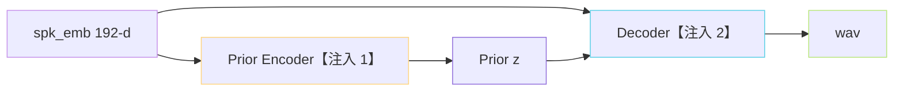
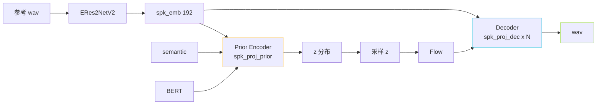

> [📎] 前置知识：AdaLN（DiT）、条件拼接、Prior Encoder 与 Decoder 的接口、Conditional Encoder。

> **定位**：ERes2NetV2 提取出的 192-d spk_emb 在 SoVITS 中不是「只注入一次」，而是两个位置：Prior Encoder 与 Decoder。本节讲为何需两点、如何同时体现音色与说话风格、AdaLN 与 add 选型。

## 1. 位置总览



## 2. 为何需两点

|注入点|控制什么|贴合 cnhubert 位置|
|---|---|---|
|**Prior Encoder**|**说话风格 / 韵律 / 情感**|在 z 分布中体现|
|**Decoder**|**音色 / 频谱肤色**|在 wav 重构中体现|

> [💡] **二分讲：「怎么说」与「听起来怎么样」**。Prior Encoder 注入 让 z 分布带上说话人特有的节奏 / 韵律; Decoder 注入 让 wav 听起来是那个人的肤色。双点联动 使 zero-shot 克隆接近原人。

## 3. Prior Encoder 中的注入

```python
# GPT_SoVITS/module/models.py::TextEncoder.forward (为 Prior Encoder)
x = self.ssl_proj(semantic) + self.bert_proj(bert)
# 加入 spk_emb (V2Pro+)
x = x + self.spk_proj_prior(spk_emb).unsqueeze(1)   # broadcast 到 T_s
# 后接 FFT blocks
x = self.fft_blocks(x)
```

**方式：add**。由于 spk_emb 是句级一个向量、x 是帧级序列，需 broadcast 到所有帧。

## 4. Decoder 中的注入

```python
# Generator forward (HiFi-GAN 体)
x = self.conv_pre(z) + self.spk_proj_dec(spk_emb).unsqueeze(-1)  # broadcast to time
for i, (up, mrf) in enumerate(zip(self.ups, self.mrfs)):
    x = up(x) + self.spk_proj_dec_per_block[i](spk_emb).unsqueeze(-1)
    x = mrf(x)
```

**方式：add at each upsample stage**。每个上采样阶段都附一个 spk projection，让不同频率层都考量说话人信息。

## 5. AdaLN vs add

|方式|公式|表达能|推理费|SoVITS 选|
|---|---|---|---|---|
|**add**|$h = h + W \text{spk}$|中|低|**是**|
|AdaLN|$h = \gamma(\text{spk}) \cdot \text{LN}(h) + \beta(\text{spk})$|强|中|V3/V4 CFM|
|concat|$h = [h; \text{spk}]$|强|高|否|

> [🤔] **为何 V1/V2 体选 add 而不选 AdaLN?** 体系上 HiFi-GAN 为纯卷积 架构、使用 LayerNorm 不多，AdaLN 需重写卷积 间欧的 normalization，不划算。CFM V3/V4 是 Transformer，AdaLN 周由。

## 6. 与 Conditional Decoder 的联动



## 7. 训练时是否 dropout spk_emb

V2Pro 训练调参：

```python
if training and torch.rand(1) < 0.10:
    spk_emb = torch.zeros_like(spk_emb)
```

随机丢 10% 为 CFG 服务。推理时可启 CFG 加强音色贴合度。

## 8. 与原 VITS multi-speaker 架构的区别

原 VITS 多说话人仅在 Decoder 注入 nn.Embedding spk_id。SoVITS V2Pro 二部分同时注入、且使用独立 SV 提取器不限定说话人。这是 V2Pro 「zero-shot 克隆」能力提升的架构原因。

## 9. 工程判断

> [🔧] **Decoder 多点注入是必要的**：如果仅在 conv_pre 后注一次，高频肤色会被上采样“冲淡”。社区实验表明每个上采样阶段加一 add 对 SECS（speaker similarity）提升 5–10%。

## 参考文献

1. Peebles, W. & Xie, S. (2023). _DiT_. ICCV. (AdaLN)

1. Kim, J., Kong, J., & Son, J. (2021). _VITS multi-speaker_. ICML.

1. GPT-SoVITS: `GPT_SoVITS/module/models.py::Generator`, `TextEncoder`.