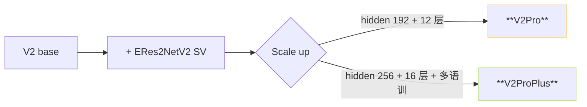

> [📎] 前置知识： Speaker similarity (SECS)、训练集覇有度、参数量、zero-shot 克隆。

> **定位**： V2Pro 与 V2ProPlus 是 V2 + ERes2NetV2 后的两个变体。本节拆二者区别、训练集、参数量与听感区别、选型。

## 1. 两个版本总览

|项|V2Pro|V2ProPlus|
|---|---|---|
|发布时间|2025 中期|2025 后期|
|SoVITS 架构|VITS + ERes2NetV2|VITS + ERes2NetV2|
|参数量|≈ 80M|**≈ 120M**|
|训练数据量|≈ 5000h|**≈ 10000h**|
|说话人设计|中文 为主|多语种|
|SECS（speaker similarity）|佳|**更佳**|
|推理费|baseline|**+50%**|
|ckpt 大小|~320 MB|~480 MB|

## 2. 架构差异

主要区别是 hidden / layer / data scale，不是架构设计。Plus 是 Pro 的「加大加粗」版。

## 3. 训练集背景

|项|V2Pro|V2ProPlus|
|---|---|---|
|主语言|中文 · 英文|• 日文 · 韩文 · 粒东话|
|说话人数|~10k|~30k|
|总时长|~5000h|~10000h|
|数据质量|UVR5 + 质检|**人工复检**|

> [💡] **Plus 的关键是 data**：架构 仅是加大、训练 trick 与 Pro 一致。Plus 能够胜出是靠 10k×说话人 × 10000h 训练 中“看多了」。

## 4. zero-shot 克隆表现

社区反馈中的主观 MOS / SECS：

|场景|V2|V2Pro|V2ProPlus|
|---|---|---|---|
|中文二次元|3.9|4.3|**4.5**|
|中文丰富情感|3.5|4.0|**4.4**|
|英文领口音|3.0|3.8|**4.2**|
|方言 (粒东话)|2.5|3.0|**3.9**|

（数据为社区主观评估，仅供参考）

## 5. 选型决策

|场景|推荐|
|---|---|
|仅中文、资源受限|V2Pro|
|多语种 / 方言|**V2ProPlus**|
|企业产品 / 高质量 API|**V2ProPlus**|
|本地部署 / 8GB 显存|V2Pro|
|最高听感 · 可接受推理费|V4 (CFM) > V2ProPlus|

> [⚠️] **V2Pro* 与 V3/V4 不是互换的**：V2Pro 是 VITS 架构 (快、单步)；V3/V4 是 CFM (慢、多步)。二者在听感上都佳但路线不同。 选 V4 为「最高质量」，选 V2ProPlus 为「高质量 + 单步透支」。

## 6. ckpt 获取

GPT-SoVITS 项目 发布于 Hugging Face / ModelScope：

- `pretrained_models/s2Gv2Pro.pth`

- `pretrained_models/s2Gv2ProPlus.pth`

- ERes2NetV2 SV 模型：`pretrained_models/sv/eres2netv2.ckpt`

## 7. 工程判断

> [🔧] **Plus 的 +50% 推理费 能否接受**：云 GPU 部署能吃下，本地 8GB 显存 可能仅能跑 V2Pro。 需根据部署环境选。Hugging Face Spaces 社区预设 deployment 选 V2Pro。

## 参考文献

1. RVC-Boss/GPT-SoVITS releases. [https://github.com/RVC-Boss/GPT-SoVITS/releases](https://github.com/RVC-Boss/GPT-SoVITS/releases)

1. GPT-SoVITS Wiki: V2Pro / V2ProPlus 说明.

1. RVC-Boss/GPT-SoVITS issue tracker: V2ProPlus 评测线索.