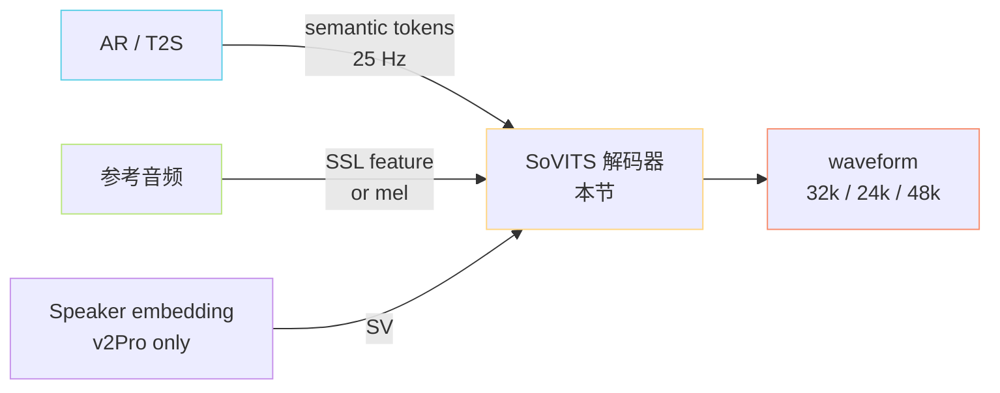
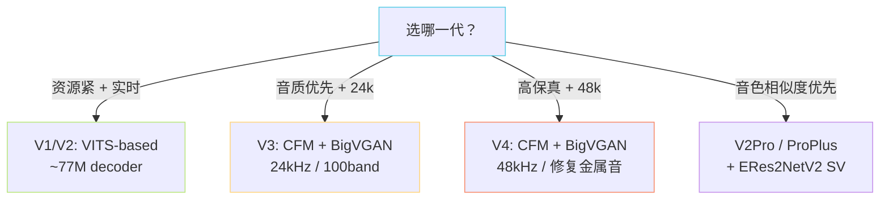

> [📎] 前置知识：[[1.1 VITS 原理（SoVITS 的“S”血统）|1.1 VITS 原理（SoVITS 的“S”血统）]]、[[1.4 向量量化（VQ）与离散语义 Token|1.4 向量量化（VQ）与离散语义 Token]]、[[1.5 Flow Matching - CFM（v3-v4 的核心范式）|1.5 Flow Matching - CFM（v3-v4 的核心范式）]]、[[1.6 BigVGAN（仅提一嘴）]]、Mel-spectrogram、Speaker Verification embedding。

> **定位**：SoVITS 解码器是 GPT-SoVITS 的「**S 侧**」——把上游 AR 给出的「语义 token 序列」翻译成最终的「**声学波形**」。三个代次三种范式：V1/V2 用 VITS，V3/V4 用 CFM + BigVGAN，V2Pro / Plus 在 V2 上叠 SV embedding 强化音色相似度。

## 1. 在全栈中的位置

## 2. 三代决策树

## 3. 三代对比总表

|维度|V1 / V2|V3|V4|V2Pro / ProPlus|
|---|---|---|---|---|
|生成范式|VITS（CVAE + Flow + GAN）|CFM + BigVGAN|CFM + BigVGAN|VITS + SV embedding|
|采样率|32k|24k|**48k**|32k|
|训练数据|~1000h|~7000h|~7000h|~1500–2500h|
|解码 RTF（A100）|~0.05|~0.15|~0.20|~0.06|
|一步式 / 多步式|一步|多步（ODE 5–20）|多步（ODE 5–20）|一步|
|音色相似度|中|中–高|高|**最高**|
|金属音瑕疵|无|有（高频）|**修复**|无|
|主要瓶颈|上限低|24k 限制|推理慢|仍依赖 VITS 上限|
|配置文件|`s2.json`|`s2v3.json`|`s2v4.json`|`s2Pro.json`|
|权重|`s2G.pth`|`s2Gv3.pth` • `vocoder.pth`|`s2v4.pth` • `vocoder.pth`|`s2Gv2Pro.pth`|

## 4. 工程判断（怎么选）

> [🔧] **生产配音 / 数据标注**：默认 **V4**——48k 直出，金属音修复，音质最优；若实时性敏感（< 0.1 RTF）退回 V2Pro。

> [🔧] **直播 / 实时交互**：V1/V2 或 V2Pro，一步生成 RTF < 0.1；CFM 多步在 A100 上能压到 0.15，但 4090 难以做到。

> [🔧] **声音克隆（少样本）**：**V2ProPlus**——ERes2NetV2 SV 显式注入，10 秒参考音频也能保持较好相似度；纯 V3 / V4 在 zero-shot 上不如。

## 5. 为什么三代不合并？

> [🤔] V3 / V4 的 CFM 是新范式，需要重新预训练 7000h 数据；V1 / V2 的 VITS 范式在小数据集上 finetune 更快、推理更稳。两条线 **并行存在** 而非「V4 完全取代 V1」，是因为：①社区基于 V1 / V2 训出的自定义音色无法平滑迁移到 CFM（特征空间不同）；②V2Pro 的 SV embedding 注入是对 VITS 的改造，CFM 上需另起炉灶（未来工作）。

> [⚠️] **官方建议**：新项目从 **V4** 起步；老项目（已有 V1 / V2 微调权重）维持原代次或迁移到 V2Pro。**不要混用** V3 AR + V4 SoVITS——semantic token 的 codebook 一致但 mel 上采样配置不同，会导致维度对不上。

## 6. 子页面导航

[[6.1 V1 - V2 SoVITS（VITS-based）|6.1 V1 - V2 SoVITS（VITS-based）]]

[[6.2 V3 - V4 SoVITS（CFM + BigVGAN）|6.2 V3 - V4 SoVITS（CFM + BigVGAN）]]

[[6.3 V2Pro - V2ProPlus（音色相似度增强分支）|6.3 V2Pro - V2ProPlus（音色相似度增强分支）]]

## 参考文献

1. Kim, J., Kong, J., & Son, J. (2021). _Conditional Variational Autoencoder with Adversarial Learning for End-to-End Text-to-Speech_ (VITS). ICML.

1. Lipman, Y. et al. (2023). _Flow Matching for Generative Modeling_. ICLR.

1. Lee, S. et al. (2023). _BigVGAN: A Universal Neural Vocoder with Large-Scale Training_. ICLR.

1. Chen, Y. et al. (2024). _ERes2NetV2 for Speaker Verification_. INTERSPEECH.

1. GPT-SoVITS Repository. [https://github.com/RVC-Boss/GPT-SoVITS](https://github.com/RVC-Boss/GPT-SoVITS)

1. GPT-SoVITS Wiki: Version comparison. [https://github.com/RVC-Boss/GPT-SoVITS/wiki](https://github.com/RVC-Boss/GPT-SoVITS/wiki)