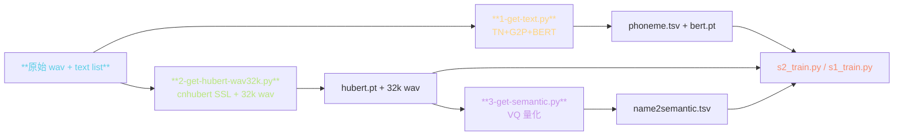
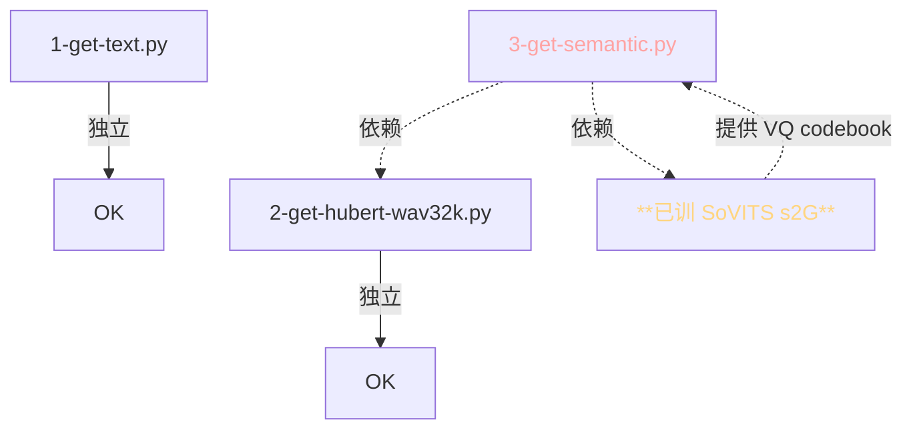

> 📎 **前置**：UVR5 / Slicer / ASR；cnhubert + VQ 概念；phoneme / BERT / SSL / semantic token 四件套。

## 0. 定位

> 「原始 wav + text → 可直喂训练的四件套」：phoneme.tsv / [bert.pt](http://bert.pt) / [hubert.pt](http://hubert.pt) / name2semantic.tsv。本节拆解三个预处理脚本的职责、顺序依赖、多卡并行机制与常见坎。

## 1. 三步预处理管线



## 2. 三脚本详表

|脚本|输入|产出|依赖|耗时（1k 句）|
|---|---|---|---|---|
|`1-get-text.py`|wav list + text|`phoneme.tsv`, `bert.pt`|TN/G2P + BERT|~5 min|
|`2-get-hubert-wav32k.py`|wav|`hubert.pt`, `32k wav`|cnhubert|**~15 min**|
|`3-get-semantic.py`|[hubert.pt](http://hubert.pt) • 已训 SoVITS|`name2semantic.tsv`|s2G.pth|~3 min|

## 3. 产出文件格式

|文件|格式|示例|
|---|---|---|
|phoneme.tsv|TAB 分隔|`utt001\t/path/wav\t你 好 世 界\tn i3 h ao3 sh i4 j ie4`|
|[bert.pt](http://bert.pt)|[torch.save](http://torch.save) dict|`{utt001: tensor[T, 1024]}` Chinese RoBERTa hidden state|
|[hubert.pt](http://hubert.pt)|[torch.save](http://torch.save) dict|`{utt001: tensor[T, 768]}` cnhubert L9 hidden|
|name2semantic.tsv|TAB 分隔|`utt001\t1 4 7 2 9 ...` 离散 token ID|

## 4. 三脚本间依赖



> [⚠️] **脚本 3 依赖已训 SoVITS**：新数据集需要「先跑 1 + 2 → 训 s2 → 跑 3 → 训 s1」。社区 fine-tune 场景下复用预训 SoVITS 的 codebook，三个脚本可一次跑完。

## 5. 多 GPU 并行机制

```python
# 脚本接受 --i_part / --all_parts 切片参数
python prepare_datasets/2-get-hubert-wav32k.py \
  --i_part 0 --all_parts 4   # GPU 0
python prepare_datasets/2-get-hubert-wav32k.py \
  --i_part 1 --all_parts 4   # GPU 1
# ...同时 4 个进程，按 hash 分配样本
```

- 按 `hash(filename) % all_parts == i_part` 分配

- 产物为分片文件 `name2semantic-0-of-4.tsv` 等，后期拼接

- 4× A100 线性加速 3.8×（IO 略有损）

## 6. 预处理质量检查点

|检查项|产出|阈值|
|---|---|---|
|**文本长度**|退还7/保留 ratio|10–60 字|
|**phoneme 数**|1 脚本产出|4–200 个|
|**HuBERT 帧数**|2 脚本产出|对应 1–10 s 音频|
|**SNR**|0a UVR5 后调用|≥20 dB|
|**丢弃率**|预处理总体|< 5%|

## 7. 常见坎

> [⚠️] **跑脚本 3 时报 "VQ codebook not found"**：选错 SoVITS ckpt。脚本 3 默认读 `s2G488k.pth`，训了新 SoVITS 后需指定 `--sovits_path` 参数。

> [⚠️] **HuBERT 帧数 ≠ semantic 帧数**：HuBERT 输出 50 Hz，VQ 量化后降采样到 25 Hz。脚本 3 中有隐式 stride=2 子采样。手动检查时要除 2。

> [💡] **重跑脚本 3 后务必重训 AR**：VQ codebook 变了则 semantic token vocab 变了，AR 是购事不能复用。但重跑脚本 1 / 2 不影响 AR。

## 8. 工程判断

> 🔧 **顺序固定：1 → 2 → 训 s2 → 3 → 训 s1**。新数据集要先训 SoVITS 才能跑脚本 3。

> ⚠️ **重跑 3 不要忘了同步更新 AR vocab**，否则 token ID 不对齐。

> 💡 **大数据集下脚本 2 是瓶颈**（cnhubert 单卡 ~3× 实时），多卡并行可线性加速。

> 🤔 **未来：脚本融合为一次扫描**：脚本 1 + 2 可合为一步 read once，节省 disk IO。社区 PR `unified-prepare.py` 实验中。

## 9. 子页面

[[7.1.1 1-get-text.py（文本→音素 + BERT）|7.1.1 1-get-text.py（文本→音素 + BERT）]]

[[7.1.2 2-get-hubert-wav32k.py（SSL 特征抽取）|7.1.2 2-get-hubert-wav32k.py（SSL 特征抽取）]]

[[7.1.3 3-get-semantic.py（VQ 量化 + name2semantic）|7.1.3 3-get-semantic.py（VQ 量化 + name2semantic）]]

[[7.1.4 多 GPU 切片并行机制|7.1.4 多 GPU 切片并行机制]]

## 参考文献

1. 仓库 `GPT_SoVITS/prepare_datasets/`

1. Hsu, W.-N. et al. (2021). _HuBERT_. arXiv:2106.07447.

1. Cui, Y. et al. (2019). _Chinese-BERT-WWM_. arXiv:1906.08101.