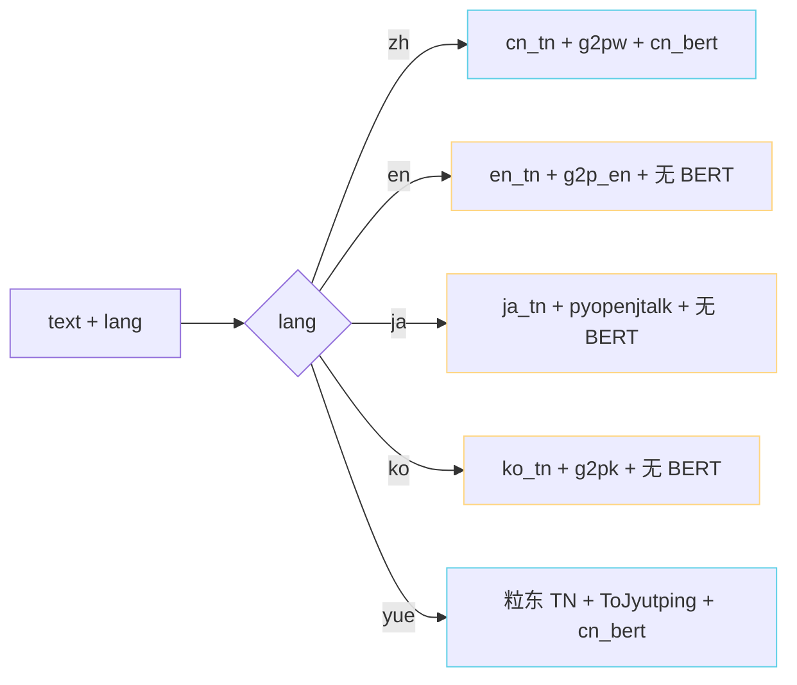

> [📎] 前置知识：Text Normalization、G2P、cn_g2pw 与 pyopenjtalk、chinese-roberta-wwm-ext-large、phoneme 体系。

> **定位**：`1-get-text.py` 是训练数据准备的第一站。本节拆脚本逻辑、输出格式、多语言逻辑分支、BERT 提取位置。

## 1. 脚本输入 / 输出

|项|输入|输出|
|---|---|---|
|主输入|`list_file` (wav 路径 + 语言代码 + 文本)|—|
|phoneme 产出|—|`name2text-{rank}.txt` （name TAB phoneme TAB word2ph TAB norm_text）|
|BERT 产出|—|`{rank}/{name}.pt`（char-level BERT 隐藏状态）|

## 2. 核心逻辑伪代码

```python
for wav_name, lang, text in lines:
    # TN 文本规范化
    text_norm = clean_text(text, lang)
    # G2P 音素化
    phones, word2ph = g2p(text_norm, lang)
    # BERT 谐音 (仅 lang in {'zh', 'yue'}) 
    if lang in ('zh', 'yue'):
        bert = bert_model.encode(text_norm)            # [T_char, 1024]
        torch.save(bert, f'{out_dir}/{rank}/{wav_name}.pt')
    else:
        # 非中文语言 BERT 使用零填充 (推理时同)
        pass
    out_f.write(f'{wav_name}\t{phones}\t{word2ph}\t{text_norm}\n')
```

## 3. 语言分支控制



## 4. word2ph 是什么

`word2ph` 是每个「字」对应多少个 phoneme 的计数表，例：

```jsx
text      = "你好"
phones    = ['n', 'i3', 'h', 'ao3']
word2ph   = [2, 2]
```

作用是「在 SoVITS 中拉伸 char-level BERT 到 phoneme-level」：

```python
bert_phone = repeat_interleave(bert_char, word2ph)   # [T_char, 1024] → [T_ph, 1024]
```

> [💡] **word2ph 是 BERT 与 phoneme 对齐的桥**。没它 BERT 只能句级 mean pooling，丢了全部位置信息。这是 GPT-SoVITS 能加 BERT 并获 SECS 提升的架构原因。

## 5. BERT 提取细节

```python
from transformers import AutoTokenizer, AutoModelForMaskedLM
bert_model = AutoModelForMaskedLM.from_pretrained('hfl/chinese-roberta-wwm-ext-large')
tokenizer  = AutoTokenizer.from_pretrained('hfl/chinese-roberta-wwm-ext-large')
# 中间层抽取
with torch.no_grad():
    out = bert_model(**tokenizer(text, return_tensors='pt'),
                      output_hidden_states=True)
    hidden = torch.cat(out.hidden_states[-3:-2], dim=-1).squeeze(0)  # 倒数第 3 层
# [T_char, 1024]
```

为什么取「倒数第 3 层」而不是最后一层？

> [💡] **中间层含语义 + 句法**。最后层偏向「mask token 预测」任务，语义信息不够纯。中间层是所有下游任务的最佳表征（BERT 论文 + 社区共识）。

## 6. 多 GPU 切片

```bash
# rank 0 / total 4
python 1-get-text.py --i_part 0 --all_parts 4 --gpu_id 0
python 1-get-text.py --i_part 1 --all_parts 4 --gpu_id 1
python 1-get-text.py --i_part 2 --all_parts 4 --gpu_id 2
python 1-get-text.py --i_part 3 --all_parts 4 --gpu_id 3
```

采用 `hash(wav_name) % all_parts == i_part` 分配样本。 后期 `cat name2text-*.txt > name2text.txt` 拼接。

## 7. 常见报错

|错误|原因|修复|
|---|---|---|
|`g2pW model not found`|软件未装|`pip install g2pw`|
|BERT OOM|长句|加句别处理 + truncation=512|
|phoneme 不出|未知字符|加入 zh_dict.txt|
|日文未拼音|pyopenjtalk 未装|`pip install pyopenjtalk-prebuilt`|

## 8. 工程判断

> [🔧] **不要同时跑 g2p 与 BERT**：g2p 仅 CPU 多进程足够、BERT 需 GPU。社区需「[1-get-text.py](http://1-get-text.py) 在 4 卡上 30 分钟跑完 5000h」是可达指标。避免「单卡 CPU 跑一夜」。

## 参考文献

1. Devlin, J. et al. (2019). _BERT_. NAACL.

1. Cui, Y. et al. (2020). _chinese-roberta-wwm-ext_. arXiv:2004.13922.

1. g2pW: [https://github.com/GitYCC/g2pW](https://github.com/GitYCC/g2pW)

1. pyopenjtalk: [https://github.com/r9y9/pyopenjtalk](https://github.com/r9y9/pyopenjtalk)

1. GPT-SoVITS: `GPT_SoVITS/prepare_datasets/1-get-text.py`.