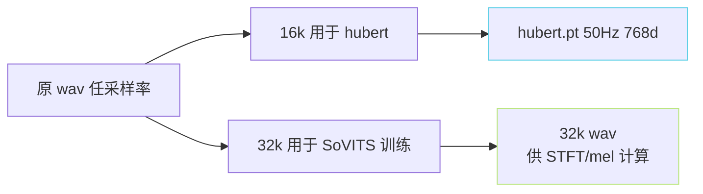

> [📎] 前置知识：cnhubert (chinese-hubert-base)、SSL Feature、16k→32k 重采样、GPU 推理 batch、bf16 加速。

> **定位**：`2-get-hubert-wav32k.py` 是训练数据准备的「SSL 抽特征 + 重采样」阶段。本节拆输入输出、hubert 加载、 为何要同时出 32k wav、与 [[4.1 重采样策略（16k - 24k - 32k - 48k）]] 的关系。

## 1. 输入 / 输出

|项|输入|输出|
|---|---|---|
|wav|任意采样率|**32 kHz** mono PCM|
|[hubert.pt](http://hubert.pt)|—|[T_s, 768]，50Hz 帧率|

## 2. 核心代码逻辑

```python
for wav_path in wav_list:
    audio, sr = librosa.load(wav_path, sr=None)
    if sr != 16000:
        audio_16k = librosa.resample(audio, orig_sr=sr, target_sr=16000)
    else:
        audio_16k = audio
    if sr != 32000:
        audio_32k = librosa.resample(audio, orig_sr=sr, target_sr=32000)
    else:
        audio_32k = audio

    # SSL 抽特征
    with torch.no_grad(), torch.cuda.amp.autocast(dtype=torch.bfloat16):
        feats = hubert(torch.tensor(audio_16k).cuda().unsqueeze(0))   # [1, T_s, 768]
    torch.save(feats.squeeze(0).half(), f'{out_dir}/{rank}/{name}.pt')

    # 32k wav 下一脚本 与 SoVITS 训练需
    soundfile.write(f'{out_wav_dir}/{name}.wav', audio_32k, 32000, subtype='PCM_16')
```

## 3. 为什么同时出 32k wav



- cnhubert 原始训练 16k 采样率。输入必须 16k、否则特征偏走。

- SoVITS V1/V2 输出 32 kHz 音频，训练 STFT FFT=2048, hop=480 都是 32k 调过的。为节反复重采样费，脚本一次出二。

## 4. hubert 加载

```python
from transformers import HubertModel
hubert = HubertModel.from_pretrained('TencentGameMate/chinese-hubert-base')
hubert = hubert.cuda().eval()
```

仅使用决策性层，dropout 关闭。详见 [[4.1.1 librosa - torchaudio Resample 实现差异]]。

## 5. bf16 推理

```python
with torch.cuda.amp.autocast(dtype=torch.bfloat16):
    feats = hubert(audio_16k)
```

bf16 推理加速 1.5–2×。 cnhubert base (95M) 在 RTX 4090 上 bf16 可达到 7× 实时、fp32 仅 3×。

> [⚠️] **不要在 fp16 抽取**：fp16 动态范围小，hubert 中间层可能出现 inf 丢失信息。bf16 范围大稳定。

## 6. half() 存到磁盘

```python
torch.save(feats.squeeze(0).half(), path)
```

fp16 存储「未量化的 SSL 特征」能节太 50% 磁盘，听感几乎无损。 后续 [[7.1.3 3-get-semantic.py（VQ 量化 + name2semantic）]] 读取后走 VQ 量化 不受影响。

## 7. 多 GPU 切片

同 [[7.1.1 1-get-text.py（文本→音素 + BERT）]] 一样使用 `--i_part / --all_parts`。 可以与之同跑（互不依赖）。

## 8. 磁盘占用

|项|占用|
|---|---|
|1h wav (32k)|≈ 230 MB|
|1h [hubert.pt](http://hubert.pt) (fp16)|≈ 540 MB|
|5000h 总|**≈ 3.7 TB**|

> [🔧] **磁盘是隐藏限制**：5000h 数据准备后需 ~3 TB SSD。训练期间需随机 IO，机械盘会冲突。推荐 NVMe 或高速 网存储。

## 9. 工程判断

> [🔧] **脚本 2 是瓶颈**：hubert 抽 5000h 需 4×A100 打个眼谁（一晩上）。不要「一手能跑」。市场上多会只丝 4 卡、多会 8 卡。

## 参考文献

1. Hsu, W.-N. et al. (2021). _HuBERT_. arXiv:2106.07447.

1. TencentGameMate chinese-hubert-base. [https://huggingface.co/TencentGameMate/chinese-hubert-base](https://huggingface.co/TencentGameMate/chinese-hubert-base)

1. GPT-SoVITS: `GPT_SoVITS/prepare_datasets/2-get-hubert-wav32k.py`.