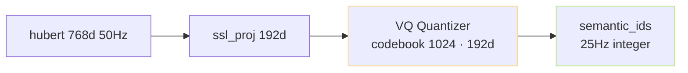
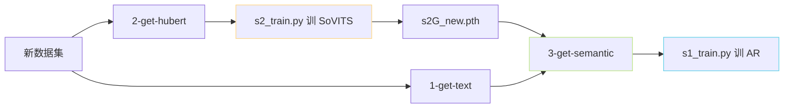

> [📎] 前置知识：VQ-VAE 量化、SSL 特征、s2G ckpt、量化器 codebook、AR vocab。

> **定位**：`3-get-semantic.py` 是准备流水线的 最后一环——使用已训 SoVITS 中的 VQ 量化器把 768d SSL 特征量化为 integer token。本节拆 脚本依赖 / 输出 / AR 训练接口 。

## 1. 输入 / 输出

|项|输入|输出|
|---|---|---|
|依赖 ckpt|`s2G*.pth`（已训 SoVITS Generator）|—|
|SSL 特征|`hubert.pt` (脚本 2 产出)|—|
|产出|—|`name2semantic-{rank}.tsv`（name TAB semantic_ids）|

## 2. 核心逻辑

```python
# 加载已训 SoVITS Generator你需要的是 VQ 部分
ckpt = torch.load(args.s2G_path, map_location='cpu')
vq_model = SynthesizerTrn(**hp)
vq_model.load_state_dict(ckpt['weight'])
vq_model = vq_model.cuda().eval()

for name in name_list:
    ssl = torch.load(f'{hubert_dir}/{name}.pt').float().cuda()    # [T_s, 768]
    # VQ 量化
    ssl = ssl.transpose(0, 1).unsqueeze(0)                         # [1, 768, T_s]
    semantic_ids = vq_model.extract_latent(ssl)                    # [1, T/2]
    semantic_str = ' '.join(map(str, semantic_ids[0].tolist()))
    out_f.write(f'{name}\t{semantic_str}\n')
```

## 3. extract_latent 实现详节

```python
# GPT_SoVITS/module/models.py::SynthesizerTrn::extract_latent
def extract_latent(self, ssl):
    ssl = self.ssl_proj(ssl)                          # 768 → 192
    quantized, codes, commit_loss, quantized_list = \
        self.quantizer(ssl)                            # codes: [1, T/2]
    return codes
```

量化器 输出 codes 是 integer index (0 ≤ c ≤ 1023)。下采样 2× 令 50Hz → 25Hz。



## 4. 与 AR vocab 的关系

|项|值|
|---|---|
|codebook 大小|1024|
|AR vocab|**1025** (1024 codes + 1 EOS)|
|EOS id|1024|

> [💡] **AR 词表 = VQ codebook + EOS**。s1 训练只需「读 name2semantic.tsv」。 codebook 推理不参与 AR 训练 (仅存 token id)。

## 5. 为何需「已训 SoVITS」才能跑



VQ 码本在 SoVITS 训练中「欲决定」，不能预先 抽 token。这也是为何 GPT-SoVITS 采「二阶段训练」的原因。

## 6. 与预训 ckpt 的互换性

如果使用社区预训 s2G 麺不重训 SoVITS 而仅训 AR：

```bash
# 使用预训 ckpt 抽 new 数据集的 semantic
python 3-get-semantic.py --s2G_path pretrained_models/s2Gv2.pth --hubert_dir new_hubert --out_dir new_semantic
```

随后用 new_semantic + 预训 s1 ckpt LoRA 或 SFT 训 AR。 不变 VQ 、仅微调 AR 是社区倍受推崇的「低成本克隆」路线。

## 7. 常见报错

|现象|原因|修复|
|---|---|---|
|semantic 全 0|s2G 未加载成功|检查 ckpt path|
|OOM|长 wav|加块处理|
|token 重复过多|VQ codebook 崩 (代 mode collapse)|重训 SoVITS|

## 8. 工程判断

> [🔧] **这个脚本是跳不过的**：AR 依赖 semantic，semantic 依赖已训 VQ。跳过这一步会使 AR 状一个「untethered codebook」问题 ，推理时 SoVITS 不认识 AR 产出的 token。

## 参考文献

1. van den Oord, A. et al. (2017). _Neural Discrete Representation Learning_ (VQ-VAE). arXiv:1711.00937.

1. GPT-SoVITS: `GPT_SoVITS/prepare_datasets/3-get-semantic.py`, `GPT_SoVITS/module/models.py::extract_latent`.