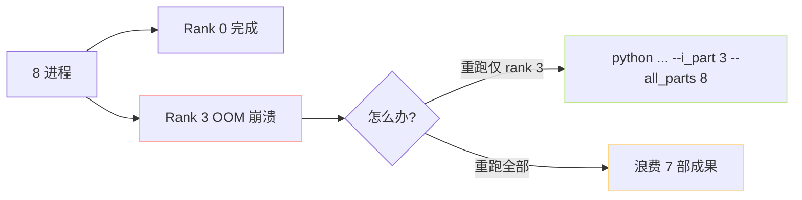

> [📎] 前置知识：Data Parallel 与数据切片 (sharding)、 hash-based sample distribution、 NCCL、 多进程 vs DDP。

> **定位**：数据预处理 1–3 脚本都接受 `--i_part` / `--all_parts` 参数实现多进程并行。本节拆切片逻辑、与 DDP 区别、拼接产物、错误恢复。

## 1. 启动脚本

WebUI 会生成类似下列命令：

```bash
for i in $(seq 0 $((N-1))); do
    CUDA_VISIBLE_DEVICES=$i \
      python prepare_datasets/1-get-text.py \
          --i_part $i --all_parts $N \
          --exp_name MyVoice &
done
wait
cat name2text-*.txt > name2text.txt
```

进程间 不用 NCCL、不同步，仅在 OS 层并行。拼接是 shell `cat`。

## 2. 样本分配

```python
for idx, wav_name in enumerate(all_samples):
    if hash(wav_name) % all_parts == i_part:        # 或 idx % all_parts == i_part
        process(wav_name)
```

两个分配策略：

|策略|优点|缺点|
|---|---|---|
|**hash(wav_name)**|同 name 需重跑时 走同 rank|hash 不均匀 可能偏斜|
|**idx mod**|完全均匀|重跑时 顺序变 → 丢 cache|

GPT-SoVITS 选 hash 策略。

## 3. 与 DDP 训练的区别

|项|数据预处理 切片|DDP 训练|
|---|---|---|
|同步方式|不同步|NCCL all_reduce|
|起动方式|`python ... &`|`torchrun` 或 `mp.spawn`|
|失败恢复|隐重跑该 part|需重启 all ranks|
|不均负载|负载高那个 wait|状况同|

## 4. 拼接产物

```bash
cat output/name2text-*.txt > output/name2text.txt
cat output/name2semantic-*.tsv > output/name2semantic.tsv
```

BERT 与 [hubert.pt](http://hubert.pt) 不需拼接——脚本中是以「{rank}/{name}.pt」的路径体现、Dataloader 能从任何 rank 子目录读取。

## 5. 错误恢复



> [💡] **选 hash 是为了重跑友好**：hash(wav_name) % 8 == 3 。 后期重跑 rank 3 能 出完全同一集合，不会透支重跑 / 漏处理。

## 6. 不要二联级并行

社区有人试过「1-get-text 未完、同时跑 2-get-hubert」：

> [⚠️] **顺序必须完全 1 → 2 → 3**：3-get-semantic 依赖已训 SoVITS，但 SoVITS 依赖 1、2 产物。 同时跑 2 与 3 可能 读取未准备好的文件 → 错误。

## 7. 推荐资源配置

|脚本|主资源|推荐并行度|
|---|---|---|
|1-get-text|CPU + 1 GPU (BERT)|4–8 进程|
|2-get-hubert|**GPU (hubert)**|= 卡数|
|3-get-semantic|GPU (s2G)|= 卡数|

## 8. 多机近期不支持

GPT-SoVITS 预处理 仅支持单机多卡，多机需手动部署（hash 可跨机一致 仅需 NFS / S3 共享路径）。社区 hack：

```bash
# 机 A
python 1-get-text.py --i_part 0 --all_parts 16 ...   # i_part 0–7
# 机 B
python 1-get-text.py --i_part 8 --all_parts 16 ...   # i_part 8–15
```

## 9. 工程判断

> [🔧] **预处理占总训练 < 5%**：训练主体是 s1/s2 几十个 GPU · 天。预处理仅需 几个小时。全套设计重点应放在训练上，不要 over-engineer 预处理。

## 参考文献

1. GPT-SoVITS: `webui.py` 中 preprocess command 生成逻辑。

1. GPT-SoVITS: `GPT_SoVITS/prepare_datasets/*.py`.