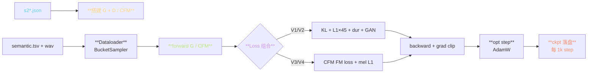
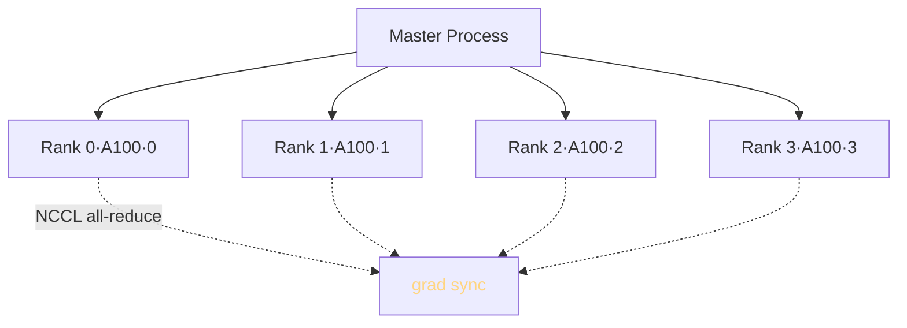

> 📎 **前置**：[[6. SoVITS 解码器（声学生成阶段）]]；PyTorch DDP；NCCL；VITS / CFM 训练损失；grad checkpoint。

## 0. 定位

> 「Stage 1 主训阶段。」把 `(semantic, mel, spk)` 的数据三元组训成可生成 wav 的 Generator + Discriminator（V1/V2）或 CFM Decoder（V3/V4）。所有版本都走同一个入口 `s2_train.py`，仅靠不同的 JSON 配置文件切换架构。本节系统拆解训练循环、损失函数组成、资源约束、调参要点。

## 1. 训练循环详图



## 2. 配置文件差异

|配置|用途|Decoder|sr|特点|训练资源|
|---|---|---|---|---|---|
|`s2.json`|V1/V2|VITS + HiFiGAN|32k|默认|4×A100·5 天|
|`s2Pro.json`|V2Pro/Plus|VITS + SV 双注入|32k|ERes2NetV2|4×A100·7 天|
|`s2v3.json`|V3|**CFM + BigVGAN-24k**|24k|24 层 AR|**4×A100·10 天**|
|`s2v4.json`|V4|**CFM + BigVGAN-48k**|48k|原生 48k|**4×A100·8 天**|

## 3. Loss 组成

### V1 / V2（VITS 路线）

$$\mathcal{L}_{\text{V1/V2}} = \mathcal{L}_{\text{KL}} + 45 \cdot \mathcal{L}_{\text{mel}}^{L_1} + \mathcal{L}_{\text{dur}} + \mathcal{L}_{\text{adv}}^{G} + \mathcal{L}_{\text{fm}}$$

|项|权重|作用|
|---|---|---|
|KL|1.0|posterior 逼近 prior|
|mel L1|**45**|**重建高质量**|
|duration|1.0|MAS 对齐项|
|adv (GAN)|1.0|判别器对抗|
|feature matching|2.0|D 中间层特征逆向|

### V3 / V4（CFM 路线）

$$\mathcal{L}_{\text{V3/V4}} = \mathcal{L}_{\text{FM}} + 0.1 \cdot \mathcal{L}_{\text{mel}}^{L_1}$$

其中 Flow Matching loss：

$$\mathcal{L}_{\text{FM}} = \mathbb{E}_{t, x_0, x_1} \| v_\theta(x_t, t, c) - (x_1 - x_0) \|^2$$

> [💡] **CFM Loss 比 VITS 简洁得多**：只需拟合线性插值的透项，无需 KL、无需 GAN 联训，训练稳定性远优于 V1/V2。

## 4. LR schedule

V1/V2 用指数衰减：

$$\text{lr}_t = \text{lr}_0 \cdot \gamma^t, \quad \gamma \approx 0.999875$$

默认每 epoch 下降 ~0.99×。V3/V4 同机制但初始学习率调到 2e-4（V1/V2 为 1e-4）。

## 5. 多卡 DDP



- `torch.distributed` + NCCL backend

- batch 维水平拆分，loss reduce mean

- 4×A100 训 ~7000h 数据约 **5–7 天**走完一 epoch

- V4 需多 30% 时间（8–9 天）因 BigVGAN-48k mel 多 2×

## 6. 显存估算

|架构|batch=4 显存|batch=8 显存|grad checkpoint 后|
|---|---|---|---|
|V1/V2 (s2)|~14 GB|~24 GB|~9 GB|
|V2Pro|~16 GB|~28 GB|~11 GB|
|V3 (s2v3)|~22 GB|**~38 GB**|~14 GB|
|V4 (s2v4)|**~34 GB**|OOM @ 4090|**~22 GB**|

> [⚠️] **V4 训练门槛高**：需 A100 80GB·batch=8；4090 24GB 仅能 batch=2 + grad checkpoint。社区 fine-tune 多选 V2/V2Pro。

## 7. 梯度裁剪与混精度

```python
# 仓库 s2_train.py 简化
for batch in dataloader:
    with autocast(dtype=bf16):
        loss = model(batch)
    scaler.scale(loss).backward()
    scaler.unscale_(optimizer)
    torch.nn.utils.clip_grad_norm_(model.parameters(), max_norm=1.0)
    scaler.step(optimizer); scaler.update()
```

- BF16 混精度（不需 loss scaling，但需 PyTorch ≥1.10）

- grad clip max_norm=1.0（V1/V2） / 5.0（V3/V4 CFM 梯度偏大）

## 8. 常见问题

> [⚠️] **V3/V4 训练 CFM 收敛慢**：前 50k step loss 可能不降，是 CFM 的正常现象（模型在学「从噪声到 mel 的全路径」，初期 loss 高且震荡）。需耐心，不要调参。

> [⚠️] **GAN 判别器崩溃**：V1/V2 训练中如果 D 过强（D loss 接近 0）会出现模式坍塌。解决方法：D 的 LR 设为 G 的 0.5×、或隔 5 step 才更新 D。

> [💡] **改采样率 / Decoder 类型只动 JSON 不动代码**：仓库设计上 `s2_train.py` 根据 config 中 `model_version` 字段动态加载不同架构。这是多版本共存的工程设计中枢。

## 9. 工程判断

> 🔧 **从零训练 V4 需资源明显**：4×A100×10 天 ≈ 4 万云 GPU 费。社区选 fine-tune（1–5 min）低个数量级。

> ⚠️ **V3/V4 CFM 劣于前期 loss 不钉**：不要调参，耐心等到 80k step 后 loss 会始下降。V1/V2 训练表现更「友好」。

> 💡 **GAN 判别器 LR 应略低于 G**：默认 D LR = G LR × 0.5，避免 D 推得 G 走错路线。

> 🤔 **未来的 V5 训练路线**：Consistency Model 蒸馏 CFM 需要额外一阶段训练（teacher→student），社区 PR 中已有原型。参 [[13.5 与端到端 Flow - Diffusion TTS 的未来融合]]。

## 10. 子页面

[[7.2.1 配置文件差异（s2 - s2Pro - s2v3 - s2v4.json）]]

[[7.2.2 Mel - Linear Spectrogram 计算]]

1. Lipman, Y. et al. (2023). _Flow Matching for Generative Modeling_. ICLR.

[[7.2.3 学习率 schedule（exp decay）]]

1. NCCL: [https://developer.nvidia.com/nccl](https://developer.nvidia.com/nccl)

[[7.2.4 多卡 DDP 训练]]

## 参考文献

1. 仓库 `s2_train.py`、`module/models.py` / `models_v3.py`

1. Kim, J. et al. (2021). _VITS_. ICML.