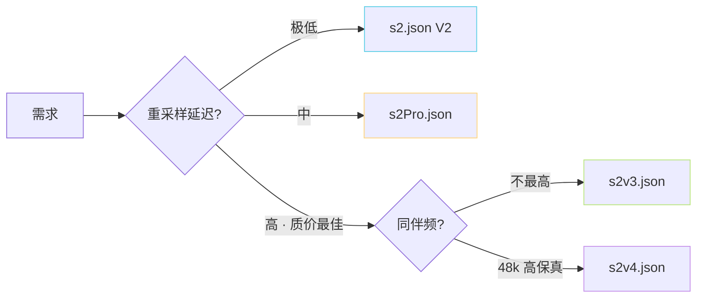

> [📎] 前置知识：SoVITS 架构版本、JSON 配置驱动 训练、model registry、YAML/JSON 互补。

> **定位**：s2_[train.py](http://train.py) 使用 JSON 配置选择架构、sampling rate、loss 权重。本节拆 4 个 JSON 的差异、字段含义、怎么选、怎么魔改。

## 1. 4 个配置总览

|JSON|架构|SR|Decoder|训练 loss|
|---|---|---|---|---|
|**s2.json**|VITS v1/v2|32k|HiFi-GAN|mel×45 + KL + GAN + FM|
|**s2Pro.json**|VITS + SV|32k|HiFi-GAN + ERes2NetV2|同 + spk_emb|
|**s2v3.json**|CFM|24k|BigVGAN-24k|**CFM L2**|
|**s2v4.json**|CFM|48k|BigVGAN-48k|**CFM L2**|

## 2. 关键字段详拆

```json
{
  "train": {
    "learning_rate": 1e-4,
    "betas": [0.8, 0.99],
    "eps": 1e-9,
    "batch_size": 12,
    "fp16_run": false,
    "lr_decay": 0.999875,
    "c_mel": 45,
    "c_kl": 1.0
  },
  "data": {
    "sampling_rate": 32000,        // 24000 / 48000 for v3/v4
    "filter_length": 2048,         // FFT
    "hop_length": 480,             // 32k×0.015
    "win_length": 2048,
    "n_mel_channels": 100,
    "mel_fmin": 0.0,
    "mel_fmax": null
  },
  "model": {
    "inter_channels": 192,
    "hidden_channels": 192,
    "filter_channels": 768,
    "n_heads": 2,
    "n_layers": 6,
    "kernel_size": 3,
    "upsample_rates": [10, 8, 2, 2],   // s2.json default
    "upsample_kernel_sizes": [16, 16, 4, 4],
    "upsample_initial_channel": 512,
    "gin_channels": 0                   // 256 in s2Pro for SV emb
  }
}
```

## 3. s2 与 s2Pro 区别

```diff
  "model": {
    "inter_channels": 192,
    "hidden_channels": 192,
-    "gin_channels": 0,
+    "gin_channels": 256,
+    "sv_emb_dim": 192,
+    "sv_inject_layers": ["prior", "decoder"]
  }
```

spk_emb 维度与注入位置都靠 JSON 控。详见 [[6.3.2 SV Embedding 注入位置|6.3.2 SV Embedding 注入位置]]。

## 4. s2v3 / s2v4 区别

```diff
# s2v3
  "data": {
    "sampling_rate": 24000,
    "filter_length": 1024,
    "hop_length": 256,
    "win_length": 1024,
    "mel_fmax": 12000
  },
  "model": {
    "type": "cfm",
    "n_layers": 24,
    "hidden": 768,
    "cfm_steps": 8,
    "cfg_scale": 2.0,
    "vocoder": "bigvgan_24khz_100band_256x"
  }

# s2v4 (diff)
-    "sampling_rate": 24000,
-    "filter_length": 1024,
-    "hop_length": 256,
-    "win_length": 1024,
-    "mel_fmax": 12000
+    "sampling_rate": 48000,
+    "filter_length": 2048,
+    "hop_length": 512,
+    "win_length": 2048,
+    "mel_fmax": 24000
+    "vocoder": "bigvgan_48khz_100band_512x"
```

## 5. 推荐选择门表



## 6. 魔改字段推荐

|需求|魔改字段|
|---|---|
|增大 batch|`train.batch_size` （同时增显存）|
|减少 mel 损失|`train.c_mel`（45 → 30）以让 GAN 占主|
|调重采样率|`data.sampling_rate` • hop 必须同步|
|加 CFM step|`model.cfm_steps`（8 → 12）|

> [⚠️] **不要乱改 hop_length**：hop 与 SoVITS Posterior 、Decoder 上采样率、Prior frame 率都耦合。 改 hop 需重训、且总上采样率也要同步。

## 7. 同件项迭代兴是

v2 后 社区 逐渐 趋 向 yaml + JSON 双轨：s1_train 训 AR 是 yaml，s2_train 仍是 JSON 以保兼容原 VITS。未来可能统一为 YAML。

## 8. 工程判断

> [🔧] **仅改 JSON 不改代码 是原则**：架构、采样率、loss 权重都以 JSON 控。在 [webui.py](http://webui.py) 择「架构」 后自动跳转正确 JSON。魔改转 json 是社区护肤的 best practice。

## 参考文献

1. GPT-SoVITS: `config/s2.json`, `s2Pro.json`, `s2v3.json`, `s2v4.json`.

1. GPT-SoVITS: `webui.py::open_s2_train` 生成 JSON 逻辑.