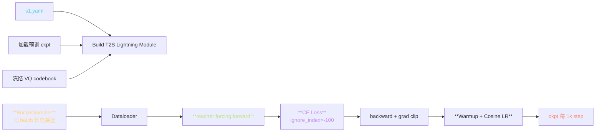
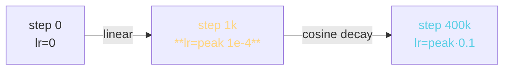
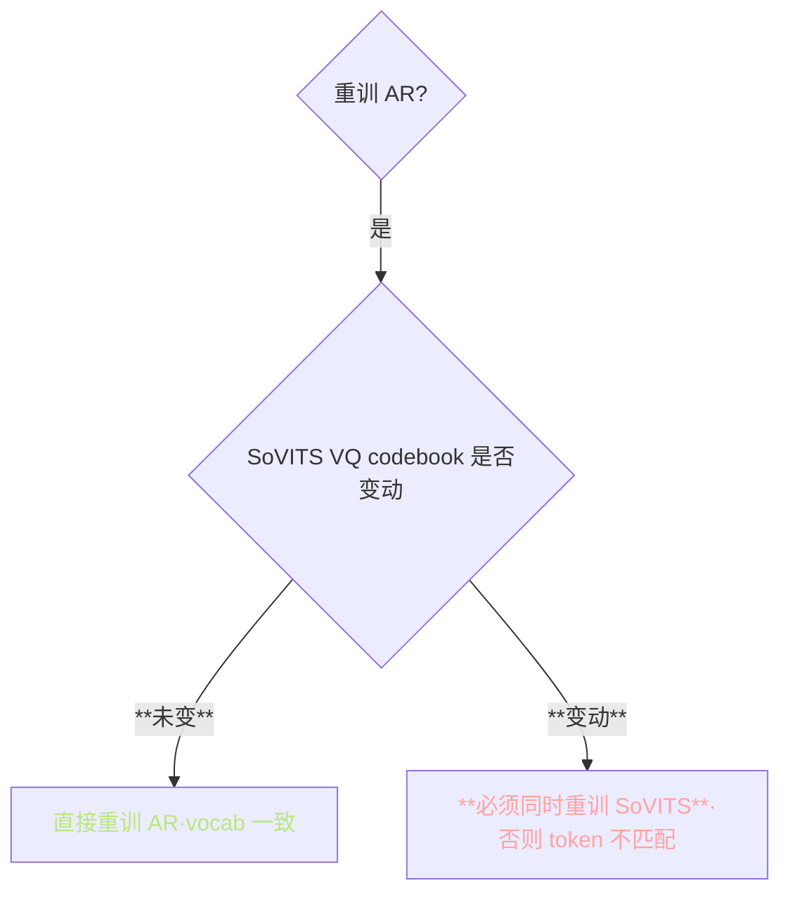

> 📎 **前置**：[[私人与共享/GPT-SoVITS 系列全栈总纲/5. AR - T2S 模型（GPT 语义建模阶段）|5. AR - T2S 模型（GPT 语义建模阶段）]]；PyTorch Lightning；Warmup+Cosine LR；BucketSampler；teacher forcing。

## 0. 定位

> 「Stage 2 AR 训练。」在 SoVITS 的 VQ codebook 冻结后，训 GPT-style 自回归预测 semantic token。`s1_train.py` 是唯一入口，基于 PyTorch Lightning 实现。本节系统拆解训练机制、梯度管理、资源估算、重训约束。

## 1. 训练流程



## 2. s1.yaml 关键配置

```yaml
train:
  optimizer: AdamW
    lr: 1e-4              # V1/V2; V3/V4 为 5e-5
    weight_decay: 0.01
    betas: [0.9, 0.95]
  scheduler: WarmupCosine
    warmup_steps: 1000    # V2+ 增加的关键补丁
    max_steps: 400000     # 总训步数
  precision: bf16-mixed   # V3/V4 推荐
  gradient_clip_val: 1.0
  batch_size: 8           # per GPU @ 24GB
model:
  n_layer: 24             # V3/V4 是 24；V1/V2 是 12
  n_embd: 768             # V3/V4；V1/V2 是 512
  n_head: 12
  vocab_size: 1025        # 1024 + EOS
  block_size: 2048        # V3/V4；V1/V2 是 1024
```

总训步数 400k step 约对应 1 个全数据集 epoch（V4 7000h）。

## 3. BucketSampler 原理


> [💡] **BucketSampler 为何重要**：AR 的训练中序列长度从 25 到 2048 token 不等。随机 batch 会让短序列被 pad 到最长的长度，浪费 60–80% 计算。BucketSampler 让同 batch 长度接近，pad 浪费降到 5–10%。

## 4. teacher forcing 训练与 CE Loss

```python
# 输入：[BOS, x_1, x_2, ..., x_{T-1}]
# 目标：[x_1,   x_2, x_3, ..., x_T]
# 损失：CE(logits[i], target[i])

logits = model(input_ids)  # [B, T, vocab]
loss = F.cross_entropy(
    logits.view(-1, vocab),
    target.view(-1),
    ignore_index=-100,  # pad 不计损失
)
```

> [⚠️] **teacher forcing 训练与推理不一致**：训练时每个位置看到的是真实前缀，推理时看到的是自己产生的前缀。这个“exposure bias”是 AR 口吞字的根源之一，社区用 scheduled sampling 缓解（训练后期随机用模型预测代替真实前缀）。

## 5. Warmup + Cosine LR



Warmup：

KaTeX parse error: Got function '\max' with no arguments as subscript at position 26: …t) = \text{lr}_\̲m̲a̲x̲ ̲\cdot \min\!\le…

Cosine decay（warmup 后）：

KaTeX parse error: Got function '\max' with no arguments as subscript at position 26: …t) = \text{lr}_\̲m̲a̲x̲ ̲\cdot \left[0.1…

> [💡] **V2 为何加 Warmup**：V1 直接跳 peak LR 有 ~15% 概率 grad explode（前 500 step loss 炸）。 1000 step linear warmup 之后 grad explode 几乎消失。

## 6. 显存估算

|架构|batch=4|batch=8|batch=16|bf16-mixed batch=8|
|---|---|---|---|---|
|V1/V2 (12L·512)|~5 GB|~8 GB|~14 GB|~5 GB|
|V3/V4 (24L·768)|~14 GB|~24 GB|OOM|**~14 GB**|

> [⚠️] **4090 (24GB) 训 V3/V4 AR 上限 batch=8 bf16**：超过会 OOM。社区推荐 batch=8 + bf16 + 4 梯度累积 = 等效 batch=32。

## 7. 重训约束



> [⚠️] **VQ codebook 冻结是走「两阶段」的根源**：SoVITS Stage 1 训练产出的 codebook 是 AR 预测的 vocab。Stage 2 重训 AR 时必须复用同一个 codebook，否则 semantic token 含义飘移，生成乱序。

## 8. 调参经验

|训步数|状态|听感|
|---|---|---|
|0 – 10k|需 warmup|乱序噪声|
|10k – 50k|loss 快速下降|模糊口型出现|
|**50k – 100k**|**可生成可懂语音**|词可懂·韵律不稳|
|100k – 200k|韵律成型|接近可用|
|**200k – 400k**|**稳定 SOTA**|最佳质量|
|> 400k|边际收益递减|过拟合风险|

## 9. 工程判断

> 🔧 **重训 AR 时务必复用 SoVITS VQ codebook**：否则 token 字典飘移，推理时根本不能合作。

> ⚠️ **不加 warmup 极易发散**：初期 loss 炸 → grad explode → 网络坏。 1000 step warmup 是 V2+ 重要补丁。

> 💡 **训 100k step（约 1/4 epoch）已可生成可懂语音**：full 400k 才到稳定 SOTA。资源受限可选择提前停。

> 🤔 **bf16 下 grad_norm 偏小**：clip 阈值可放宽到 2.0（fp32 下 1.0）。grad explode 防御仍须保留。

## 10. 子页面

[[7.3.1 BucketSampler（长度分桶）|7.3.1 BucketSampler（长度分桶）]]

[[7.3.2 学习率 Warmup（v2 外挂补丁）|7.3.2 学习率 Warmup（v2 外挂补丁）]]

[[7.3.3 半精度训练（precision- 16-mixed）|7.3.3 半精度训练（precision- 16-mixed）]]

## 参考文献

1. 仓库 `s1_train.py`、`AR/data/dataset.py`

1. PyTorch Lightning: [https://lightning.ai/docs/pytorch/stable/](https://lightning.ai/docs/pytorch/stable/)

1. Bengio, S. et al. (2015). _Scheduled Sampling for Sequence Prediction with Recurrent Neural Networks_. NeurIPS.

1. Loshchilov, I. & Hutter, F. (2017). _SGDR: Stochastic Gradient Descent with Warm Restarts_. ICLR.