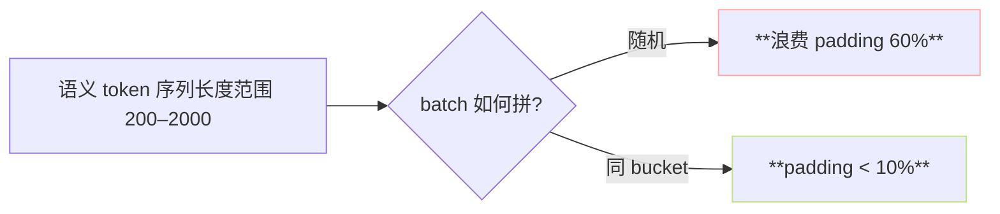

> [📎] 前置知识：PyTorch Sampler、padding 浪费、length-balanced batching、bucket。

> **定位**：AR 训练对序列长度敏感、batch 内 padding 浪费 会减速。 BucketSampler 把同 bucket 内样本拼 batch 以减 padding。 本节拆实现、与 DDP 配合、调调。

## 1. 为何需 bucket



同 batch 中最长序列带上所有短序列 pad 到它。 随机 batch 后长短差距大、padding 浪费多。 bucket 后同长度拼、浪费少。

## 2. AR/data/[dataset.py](http://dataset.py) 中的 实现

```python
class DistributedBucketSampler(Sampler):
    def __init__(self, dataset, batch_size, boundaries,
                 num_replicas=1, rank=0, shuffle=True):
        self.lengths = dataset.lengths
        self.boundaries = boundaries        # e.g., [200, 400, 600, 800, 1000, 1200, 1500, 2000]
        self.buckets = self._create_buckets()
        ...

    def _create_buckets(self):
        buckets = [[] for _ in range(len(self.boundaries) - 1)]
        for i, length in enumerate(self.lengths):
            idx = self._bisect(length)        # bucket index
            if idx != -1:
                buckets[idx].append(i)
        return buckets
```

## 3. boundaries 选择

AR 默认使用 以下 boundaries（以 semantic token 帧数计数，25 Hz）：

```python
boundaries = [32, 64, 96, 128, 160, 192, 224, 256, 320, 400, 480, 560, 640, 720, 800, 880, 960, 1024, 1200, 1400, 1600]
```

完完覆盖 0.3s 到 65s 内 的训练样本。

## 4. 与 SoVITS BucketSampler 区别

|项|AR (s1)|SoVITS (s2)|
|---|---|---|
|长度单位|semantic token (25Hz)|**音频帧 (32k hop 480)**|
|bucket 边界|上表|以音频帧数为准|
|启用|默认|默认|

## 5. 与 DDP 配合

```python
sampler = DistributedBucketSampler(
    dataset, batch_size=batch_size, boundaries=boundaries,
    num_replicas=world_size, rank=rank, shuffle=True)
loader = DataLoader(dataset, batch_sampler=sampler, num_workers=4, ...)
```

每个 rank 只看自己 share 的那部分 bucket。`set_epoch(epoch)` 重新洗牌保证 shuffle 不同。

## 6. 浪费计算

```jsx
padding_ratio = 1 - (实际帧数总和) / (batch_size × 最长长)
```

社区实验记录：

|策略|平均 padding_ratio|
|---|---|
|随机|62%|
|BucketSampler (上表)|**≈ 8%**|

> [💡] **8× 有效 batch 提升**：BucketSampler 在同显存下使 effective batch 变大、训练加速。

## 7. 常见调参

- `boundaries` 仅包到训练 set 中最长样本 范围。超出 boundaries[-1] 的样本会被丢弃。

- `batch_size` 都需是 bucket-bucket 统一，不能随 bucket 变化。

- `shuffle=True` 不会打乱 bucket 内 顺序，仅打乱 bucket 之间。

## 8. 工程判断

> [🔧] **必启 BucketSampler**：不开会让训练 慢 2×、且 batch 中长序列那个样本 gradient 会需要额外 attention compute。 GPT-SoVITS default 开，不要关。

## 参考文献

1. PyTorch Sampler doc. [https://pytorch.org/docs/stable/data.html#torch.utils.data.Sampler](https://pytorch.org/docs/stable/data.html#torch.utils.data.Sampler)

1. Devlin, J. et al. (2019). _BERT_ 中提及 length-bucketing.

1. GPT-SoVITS: `AR/data/data_module.py::DistributedBucketSampler`.