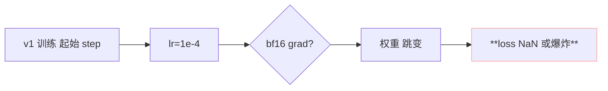
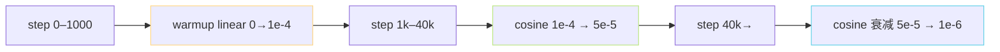

> [📎] 前置知识：Linear Warmup、Cosine Annealing、LR 炸友、v1 训不稳、bf16 梯度。

> **定位**：AR 训练 v1 未加 warmup 常发生 loss spike 与炸友。v2 添加 1000 step linear warmup 后训练稳定。本节拆 v1 v2 区别、warmup 机制、v2 「外挂补丁」 是什么。

## 1. v1 不加 warmup 的问题



原因：初始权重 random Gaussian、gradient 在前 1–2 step 极大，一上手 全 lr 会把权重推出训练区。

## 2. v2 加 1000-step linear warmup

```python
# v2 中新增逻辑
def _warmup(step, warmup_steps=1000):
    return min(step / warmup_steps, 1.0)

lr = base_lr * _warmup(step) * cosine(step)
```

|step|调度因子|lr|
|---|---|---|
|0|0.000|0|
|100|0.100|1e-5|
|500|0.500|5e-5|
|1000|1.000|1e-4 (peak)|
|40000|cos(0.5π)·⋯|5e-5|
|400000|≈ 0.001|1e-7|

## 3. PyTorch Lightning 实现

```python
from torch.optim.lr_scheduler import LambdaLR

def get_warmup_cosine(optimizer, warmup, max_steps, lr_end_factor=0.01):
    def fn(step):
        if step < warmup:
            return step / warmup
        progress = (step - warmup) / max(1, max_steps - warmup)
        return max(lr_end_factor,
                   0.5 * (1.0 + math.cos(math.pi * progress)))
    return LambdaLR(optimizer, fn)
```

Lightning Module 中配合：

```python
def configure_optimizers(self):
    opt = AdamW(self.parameters(), lr=1e-4, weight_decay=0.01)
    sch = get_warmup_cosine(opt, warmup=1000, max_steps=400000)
    return [opt], [{'scheduler': sch, 'interval': 'step'}]
```

## 4. 「外挂补丁」是什么

社区提到 v2 加 warmup 是「外挂补丁」是因为：

```python
# AR/utils.py
import AR.modules.lr_schedulers as lr_sch_mod    # 原 v1 为 empty
```

v1 训练该模块为空。v2 增加了 `WarmupCosineLR` class、与 Lightning trainer 接口 拼在一起。不动主体代码 仅以依赖 LR scheduler 补补丁式 接接。

## 5. 变体： Cosine 以 step 上 · 衰减



max_steps=400000 是社区调过的 总训点。 后期 强 起 一 个 「冷却」 阶 段、 使 loss spike 不会 大 。

## 6. 与 GPT-2 / GPT-3 的对比

|项|GPT-2|GPT-3|**AR (GPT-SoVITS)**|
|---|---|---|---|
|warmup steps|2000|375M tokens|**1000 steps**|
|peak lr|2.5e-4|0.6e-4|1e-4|
|schedule|linear decay|cosine|**linear+cosine**|

## 7. 常见报错

|现象|原因|修复|
|---|---|---|
|起始 loss NaN|warmup 未加|检查 scheduler|
|loss 一直不降|warmup 过长|减到 500 step|
|resume 后 lr 错误|step 未传 scheduler|检查 last_step|

## 8. 工程判断

> [🔧] **不要在 v2 路线 关 warmup**：no warmup 训需送 lr 降低到 1e-5 才能 训练， 总 training step 需加倍。社区选「warmup + peak 1e-4」 是「最快高点」路线。

## 参考文献

1. Vaswani, A. et al. (2017). _Attention Is All You Need_. NeurIPS. (原设计 warmup)

1. Loshchilov, I. & Hutter, F. (2017). _SGDR: Stochastic Gradient Descent with Warm Restarts_. ICLR. (Cosine)

1. GPT-SoVITS: `AR/modules/lr_schedulers.py::WarmupCosineLR`.