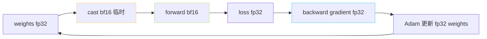

> [📎] 前置知识：fp32 / fp16 / bf16 动态范围、GradScaler、AMP、precision='16-mixed' vs 'bf16-mixed'、Lightning Trainer precision 参数。

> **定位**：AR 训练默认使用 PyTorch Lightning `precision='bf16-mixed'`。 本节拆 fp16 vs bf16 选型、Lightning AMP 机制、 显存节省、 训练稳定性、V100 不支持 bf16 之后的选择。

## 1. fp16 vs bf16

|项|fp16|**bf16**|
|---|---|---|
|位宽|16|16|
|指数 bits|5|**8**|
|尾数 bits|10|7|
|动态范围|±6×10⁴|**±3.4×10³⁸**|
|需 GradScaler|是|**否**|
|支持 GPU|V100+|A100/H100/4090|
|AR 训练选|fallback|**default**|

> [💡] **bf16 是 LLM 训练的场面选择**：fp16 动态范围 太紧张、AR Transformer 中 gradient 偏差变化大、容易 overflow 变 NaN。bf16 与 fp32 同指数 位， 动态范围 与 fp32 相当， 稳定。

## 2. Lightning Trainer 配置

```python
from pytorch_lightning import Trainer

trainer = Trainer(
    accelerator='gpu',
    devices=4,
    strategy='ddp_find_unused_parameters_true',
    precision='bf16-mixed',         # ← 重点
    max_steps=400000,
    gradient_clip_val=1.0,
    accumulate_grad_batches=1,
)
```

## 3. AMP 自动转换

Lightning `precision='bf16-mixed'` 下：

```python
# 自动 wrap 训练 forward
with torch.autocast(device_type='cuda', dtype=torch.bfloat16):
    output = model(x)
    loss = criterion(output, y)
# 返 fp32 计算 backward
loss.backward()
```

weights / optimizer state 仍 fp32、 activation / forward 为 bf16、gradient 累加为 fp32。



## 4. 显存节省

|部分|fp32|bf16-mixed|节省|
|---|---|---|---|
|weights|2.0 GB|2.0 GB (不变)|0|
|activations|3.0 GB|1.5 GB|**-50%**|
|gradients|2.0 GB|1.0 GB|-50%|
|optimizer state|4.0 GB|4.0 GB (不变)|0|
|**总**|11.0 GB|**8.5 GB**|-23%|

> [💡] **bf16 主要节 activation**：optimizer state、weights 仍 fp32。 总体显存节省 ≈ 25%。batch 可 可以加倍 · 提高 throughput。

## 5. V100 / 1080Ti 状况

V100 不支持 bf16，需退到 fp16：

```python
trainer = Trainer(precision='16-mixed', ...)    # fp16 + GradScaler
```

fp16 需 PyTorch Lightning 自动加 GradScaler：

```python
scaler = GradScaler()
with autocast(dtype=torch.float16):
    loss = model(x)
scaler.scale(loss).backward()
scaler.step(optimizer)
scaler.update()
```

> [⚠️] **V100 + fp16 会发生 loss spike**：GradScaler 会 反复 unscale / rescale、 lr peak 1e-4 可能训不稳。社区推荐 V100 用 fp32 训练 (费 1×、 稳定)。

## 6. 8GB 显存 4090 例子

AR 训练 (十 应 参数) 在 RTX 4090 24GB:

- bf16-mixed: batch=8, 显存 ≈ 16 GB 。 batch 某些长序列可以能 12 GB.

- fp32: batch=4, 显存 ≈ 14 GB 。 batch 变小、费 增加.

bf16 让 batch 可以加倍。 训练 throughput 提升 1.5×。

## 7. 调参推荐

|GPU|推荐 precision|batch_size|
|---|---|---|
|H100|bf16-mixed|大|
|A100 80GB|bf16-mixed|24|
|A100 40GB|bf16-mixed|12|
|4090 24GB|bf16-mixed|8|
|3090 24GB|bf16-mixed|8|
|V100 32GB|fp32 (或 fp16+GS)|4|
|2080Ti 11GB|fp32|2|

## 8. 常见报错

|现象|原因|修复|
|---|---|---|
|fp16 loss NaN|GradScaler 未加|跳为 bf16 或 加上|
|bf16 训练报 不支持|V100|退为 fp32|
|OOM 不足|fp32 路线|启 bf16-mixed|

## 9. 工程判断

> [🔧] **bf16-mixed 是默认**：GPT-SoVITS s1.yaml default `precision: bf16-mixed`。 如果训练发生 loss spike 先 检查 GPU 架构、 不是 bf16 本身问题。 V100 场景 跳到 fp32 是最稳 选择。

## 参考文献

1. NVIDIA bfloat16. [https://developer.nvidia.com/blog/efficient-bfloat16-arithmetic-on-amd-cpus/](https://developer.nvidia.com/blog/efficient-bfloat16-arithmetic-on-amd-cpus/)

1. PyTorch AMP doc. [https://pytorch.org/docs/stable/amp.html](https://pytorch.org/docs/stable/amp.html)

1. PyTorch Lightning Trainer precision. [https://lightning.ai/docs/pytorch/stable/common/precision.html](https://lightning.ai/docs/pytorch/stable/common/precision.html)

1. GPT-SoVITS: `AR/configs/s1.yaml`.