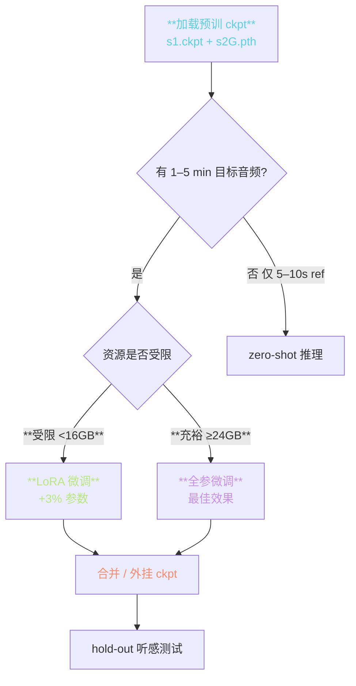
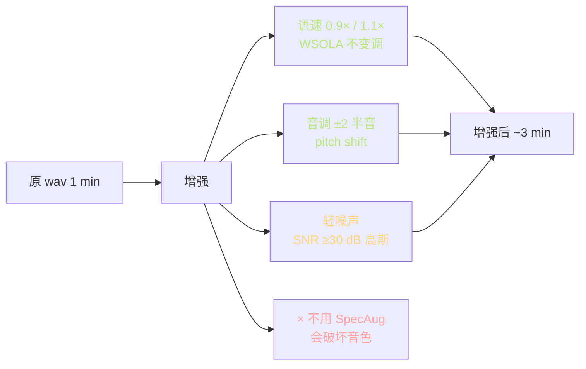
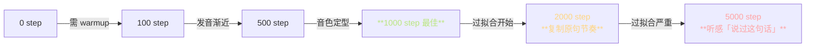

> 📎 **前置**：SFT (Supervised Fine-Tuning)；LoRA (Low-Rank Adaptation)；catastrophic forgetting；zero-shot 与少样本区别；数据增强。

## 0. 定位

> 「1–5 分钟音频 → 专属音色。」在预训模型基础上微调，效果远胜 zero-shot 且成本远低于从零训。SFT 是社区「说话人克隆」场景的主工作流。本节系统拆解微调路径、全参 vs LoRA、数据要求、步数与防过拟合、预训权重。

## 1. 微调全路径

## 2. 全参 vs LoRA 详表

|维度|全参 SFT|LoRA r=8|LoRA r=16|
|---|---|---|---|
|**训练参数量**|全部 ~330M|**~3% ≈10M**|~6% ≈20M|
|**显存**|~16 GB|**~9 GB**|~10 GB|
|**训练速度**|1× baseline|**~3×**|~2.5×|
|**ckpt 体积**|~400 MB|**~12 MB**|~25 MB|
|**SECS（1 min 数据）**|**0.88**|0.86|0.87|
|**SECS（5 min）**|**0.91**|0.89|0.90|
|**多语种保留**|易遗忘|**优 原能力未被覆盖**|优|
|**多音色动态切换**|难|**adapter 热拔**|adapter 热拔|
|**适用场景**|顶质量商用克隆|**海量多音色**|中量多音色|

## 3. LoRA 原理与注入位置

LoRA 在 frozen 权重 $W \in \mathbb{R}^{d \times d}$ 上叠加低秩更新：

$$W' = W + \Delta W = W + B A, \quad B \in \mathbb{R}^{d \times r}, A \in \mathbb{R}^{r \times d}$$

仓库默认注入点：

|模块|是否注入|原因|
|---|---|---|
|AR Q/K/V 投影|✅|**调说话人特征**|
|AR FFN|✅|调发音习惯|
|BERT proj|✅ 可选|调韵律|
|VQ codebook|❌|**冻结 保证 token 一致**|
|SoVITS Decoder|✅ 可选|调音色细节|

## 4. 数据要求

|总时长|SECS|推荐步数|风险|
|---|---|---|---|
|< 30 s|0.78 (不稳)|200|**不推荐**|
|**30 s – 1 min**|0.85|300–500|中·过拟合边缘|
|**1 min – 5 min**|**0.88–0.91**|**500–1000**|**低·推荐**|
|5 min – 30 min|0.92|2000–5000|低|
|> 30 min|0.93–0.94|> 5000|边际递减|

> [⚠️] **30 s 下限**：少于 30s 的数据使模型「背诵」训练音频，推理时节奏复制原句。推荐至少 1 min。

## 5. 数据增强

> [⚠️] **不要用 SpecAug**：ASR 中流行的 frequency masking / time masking 会遮蔽说话人特征 → 损害音色信息。TTS SFT 仅适合语速 / 音调 / 轻噪三种增强。

## 6. 防过拟合与 early stop

> [💡] **hold-out 听感测试 > val loss**：val loss 可能随训练一直下降，但听感上 1000–2000 step 后已开始过拟合。每 500 step 抽 3–5 句人耳评估，看是否出现「复制原句」现象。

## 7. catastrophic forgetting

全参 SFT 的常见问题：微调后原有多语种能力退化（如训中文后英文发音变中式）。

|缓解方法|说明|效果|
|---|---|---|
|LoRA|原权重冻结|**最佳·原能力未动**|
|低 LR（1e-5）|减少偏离|中|
|混合预训数据|训练集加入原多语种样本|中|
|早停 (300–500 step)|不给遗忘机会|中|

## 8. 预训权重下载

- HF Repo: `lj1995/GPT-SoVITS` · [https://huggingface.co/lj1995/GPT-SoVITS](https://huggingface.co/lj1995/GPT-SoVITS)

- V2 ckpt：`s1bert25hz-2kh-longer-epoch=68e-step=50232.ckpt` + `s2G488k.pth`

- V3 ckpt：`s1v3.ckpt` + `s2Gv3.pth`

- V4 ckpt：`s1v3.ckpt` + `s2Gv4.pth` + `vocoder.pth`

## 9. 工程判断

> 🔧 **数据 ≥1 min 即可；<30s 效果差且不稳**：质量 < 数量，1 min 顶质量 > 10 min 中质量。SNR ≥3 dB、采样率 ≥32k。

> ⚠️ **全参 SFT 容易破坏多语种能力**：LoRA 更安全。商用多音色场景首选 LoRA + adapter 动态加载。

> 💡 **ckpt 检测顺序：epoch / step / sample wav 三件套**：不要只看 loss，val loss 下降 ≠ 听感提升。每 500 step 抽 3–5 句人耳评估。

> 🤔 **未来：TTS 专属 LoRA Hub**：社区已出现共享多音色 LoRA 集合（始于 RVC 生态）。未来 SoVITS LoRA Hub 是可预期方向。

## 10. 子页面

[[7.4.1 数据增强（语速 - 音调 - 噪声注入）|7.4.1 数据增强（语速 - 音调 - 噪声注入）]]

[[7.4.2 全参微调 vs LoRA|7.4.2 全参微调 vs LoRA]]

[[7.4.3 防过拟合（步数 - 数据量底线）|7.4.3 防过拟合（步数 - 数据量底线）]]

[[7.4.4 预训练权重列表|7.4.4 预训练权重列表]]

1. `lj1995/GPT-SoVITS` HuggingFace repo.

## 参考文献

1. Hu, E. J. et al. (2021). _LoRA: Low-Rank Adaptation of LLMs_. arXiv:2106.09685.

1. Kirkpatrick, J. et al. (2017). _Overcoming Catastrophic Forgetting in Neural Networks_. PNAS.

1. 仓库 release 页预训 ckpt。