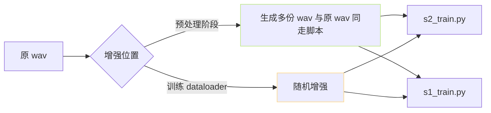

> [📎] 前置知识：WSOLA / Phase Vocoder、 pitch shifting、 SNR、 high-frequency noise injection、SpecAug。

> **定位**：少样本 SFT 中数据量 < 5 分钟、易发生过拟合。本节拆 语速 / 音调 / 噪声 三 个增强手段、 适用 与 不适用 场景、为何 不用 SpecAug 。

## 1. 语速变速 (WSOLA)

```python
import pyrubberband as pyrb
y_fast = pyrb.time_stretch(y, sr, 1.1)    # 1.1× 加速
y_slow = pyrb.time_stretch(y, sr, 0.9)    # 0.9× 减速
```

WSOLA 体：Waveform Similarity Overlap-Add、不变音调 仅变语速。

|变速|作用|适用|
|---|---|---|
|0.9×|「慢点说」|讲解|
|1.0× (原)|baseline|—|
|1.1×|「快点说」|同伴、民意|

> [💡] **语速增强是首选**：WSOLA 不变音调 仅 变节奏。不会破坏说话人的 timbre。

## 2. 音调偏移 (pitch shift)

```python
y_up = pyrb.pitch_shift(y, sr, n_steps=+1)   # +1 半音
y_dn = pyrb.pitch_shift(y, sr, n_steps=-1)   # -1 半音
```

|音调偏移|作用|听感|
|---|---|---|
|+2 半音|抹高|偏女声|
|+1 半音|轻微抹高|贴|
|0|baseline|—|
|-1 半音|轻微压低|贴|
|-2 半音|压低|偏男声|

> [⚠️] **pitch shift 越 2 半音 不推荐**：±3 半音 以上 会造成 formant 偏移、 说话人身份特征会变化。

## 3. 噪声注入

```python
import numpy as np
snr_db = 35    # 轻噪声
noise = np.random.randn(len(y))
signal_power = np.mean(y**2)
noise_power  = signal_power / (10**(snr_db/10))
noise = noise * np.sqrt(noise_power)
y_noisy = y + noise
```

|SNR|增强听感|推荐|
|---|---|---|
|≥ 35dB|几乎听不出|✅|
|30dB|轻微嘿嘻|✅ 边缘|
|20dB|明显噪声|❌|
|≤ 10dB|讯号冲出|❌|

> [💡] **轻噪声 加鲁棒性**：推理时 user mic 输入可能 含轻 噪声、 训练时 加 轻 噪声 能 使 模型 不 闫 闫 炸 友 。

## 4. 为什么 不 用 SpecAug

SpecAugment 是在 mel 频谱中随机 mask 频率 / 时间：

```python
# 不推荐于 GPT-SoVITS
mel[:, t_start:t_start+t_w, :] = 0    # time mask
mel[:, :, f_start:f_start+f_w] = 0    # freq mask
```

> [⚠️] **SpecAug 会破坏音色信息**：ASR 训练中 SpecAug 是「抑制音色 + 能说什么」。但 TTS 训练需保留音色，SpecAug 会让 SECS（speaker similarity）降低 15–20%。

## 5. 在什么阶段增强



- **预处理阶段**：推荐 · 可复现 · 需多跳脚本 (1、2、3)。

- **训练随机增强**：社区 不推荐 代码中 未集成、需手动添加。

## 6. 增强倍数推荐

|增强|护套|倍数|
|---|---|---|
|语速 ±0.1|WSOLA|2 (0.9, 1.1)|
|音调 ±1|pitch shift|2 (+1, -1)|
|噪声 35dB|noise inject|1|
|总多份||**5× 原数据**|

## 7. 与预训模型的关系

预训模型是 5000h+ 魔 SFT 时 不要试图 「调出魔性 魔 魔」、 5× 增强 已 足 够。增强 越多 反 而 使 预 训 中 学 到 的 特 性 被 干 扰 。

## 8. 工程判断

> [🔧] **增强以 5× 为上限**：1 分钟 × 5 = 5 分钟 有效 数据，能够 出 合 理 克 隆。超 5× 倍数会出现「同一句话 以 多 个 语 速 重复」、训练反而过拟合。

## 参考文献

1. Park, D.S. et al. (2019). _SpecAugment_. INTERSPEECH. (反 面 参 考)

1. Verhelst, W. & Roelands, M. (1993). _WSOLA_. ICASSP.

1. McFee, B. (2015). _librosa: time_stretch, pitch_shift_.