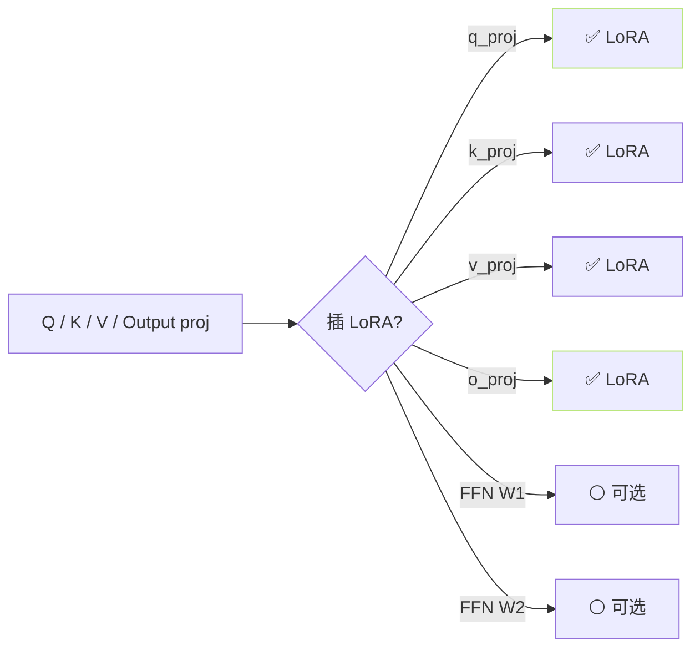
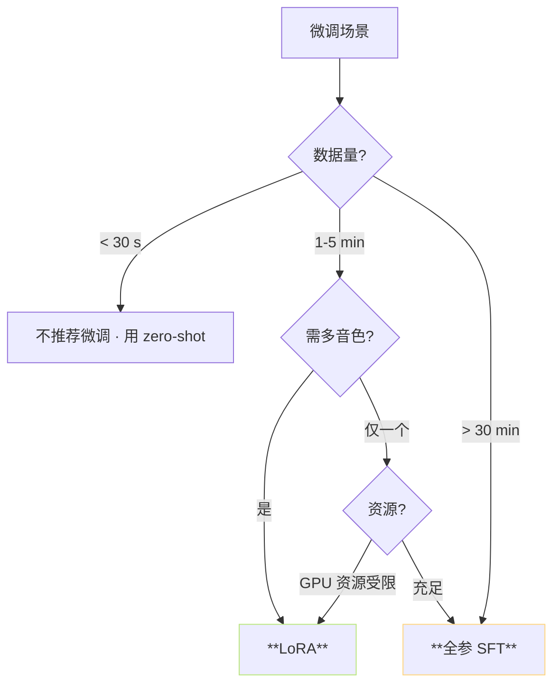

> [📎] 前置知识：LoRA 低秩适配、PEFT、full SFT、adapter 可插拔、双阶段模型的微调点。

> **定位**：少样本 SFT 可选「全参 SFT」或「LoRA 微调」。本节拆二者差别、使用选型、 LoRA 插入位置、多适配 切换。

## 1. 总览

|维度|全参 SFT|**LoRA**|
|---|---|---|
|可训参数|全部 (≈ 200M)|**rank 8 · ≈ 6M (3%)**|
|显存|原模型 100%|需 × 1.5|
|训练速度|baseline|**×3 快**|
|效果|⭐⭐⭐⭐⭐|⭐⭐⭐⭐|
|ckpt 大小|≈ 400 MB|**≈ 10 MB**|
|多音色切换|难 (多个 ckpt)|**易 (adapter swap)**|
|过拟合风险|高|**低**|

## 2. LoRA 原理回顾

$$W = W_0 + \Delta W, \quad \Delta W = B A, \quad A \in \mathbb{R}^{r \times d}, B \in \mathbb{R}^{d \times r}$$

- $r ll d$（默认 r=8）

- A 初始化为 Kaiming，B 初始为 0

- 训练后：$W_0$ 冻结，A, B 可训

## 3. LoRA 在 AR 中的插入位置



社区默认仅 attention 4 个 proj 插 LoRA、FFN 不插。 该选择 与 LLaMA-Adapter / PEFT 社区一致。

## 4. LoRA 在 SoVITS 中的插入

SoVITS 为 CNN/Transformer 混合，LoRA 可插：

- TextEncoder 的 self-attention

- Decoder 的 spk_proj_dec (仅 V2Pro+)

- CFM Transformer 的 attention (仅 V3/V4)

不插 HiFi-GAN 的卷积层、不插 VQ codebook。

## 5. 训练调参推荐

```yaml
# AR LoRA SFT 调参
lora:
  enable: true
  r: 8                    # rank
  alpha: 16               # scaling = alpha / r = 2
  dropout: 0.05
  target_modules: ['q_proj', 'k_proj', 'v_proj', 'o_proj']
base_lr: 1e-4              # 与全参同
warmup_steps: 100          # 减少不需 1000
total_steps: 500           # 1 min 数据
grad_clip_val: 1.0
```

## 6. 选型决策树



## 7. multi-adapter 切换

LoRA 主要优势之一是「多音色 可插拔」：

```python
# 推理时动态加载不同音色
model.load_adapter('voice_A.bin')
output_a = model(...)
model.load_adapter('voice_B.bin')
output_b = model(...)
```

一个预训 ckpt + N 个 10MB LoRA adapter 即实现 N 个音色 product。

## 8. 常见错误

|现象|原因|修复|
|---|---|---|
|LoRA 不生效|alpha 为 0|alpha=16|
|训练 loss 不降|target_modules 错|检查 attn proj|
|加载 adapter 报错|与 base ckpt 不匹配|同架构重训|
|SECS 低|VQ 未冻|选 LoRA · 不 SFT|

## 9. 工程判断

> [🔧] **LoRA 是社区默认推荐**：除非有 30 分钟 以上 数据 且 资源充足、否则 LoRA 是 首选。全参 SFT 在 1–5 分钟 数据 上容易过拟合、 且 会破坏预训多语种能力。

## 参考文献

1. Hu, E.J. et al. (2021). _LoRA: Low-Rank Adaptation of Large Language Models_. arXiv:2106.09685.

1. HuggingFace PEFT. [https://github.com/huggingface/peft](https://github.com/huggingface/peft)

1. GPT-SoVITS: `AR/modules/lora.py` (社区补丁).