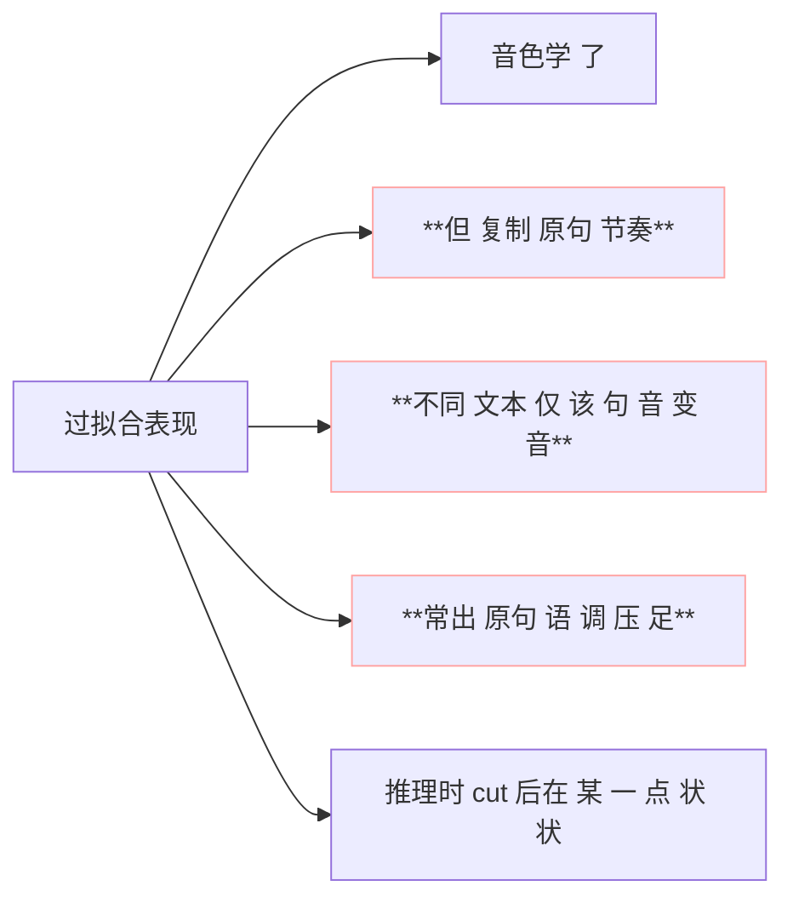
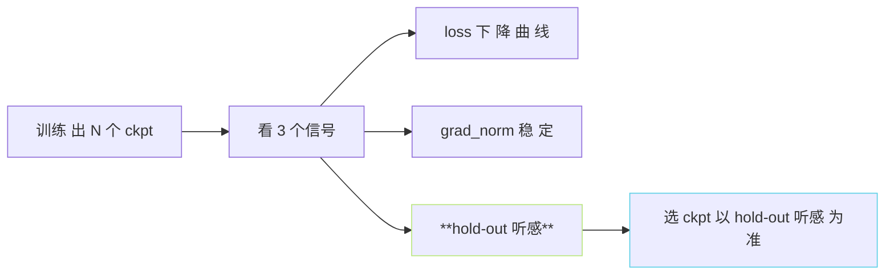

> [📎] 前置知识：过拟合、 early stopping、 val loss vs hold-out 听感、训练数据量底线。

> **定位**：少样本 SFT 中过拟合是主要错误来源。本节拆 过拟合现象、 检测机制、 数据量底线、 防护策略。

## 1. 过拟合的表现



> [⚠️] **val loss 不足以检测**：val loss 同一数据集抽 hold-out 10%、会 同倍 下 降。过拟合 仅能 以 「 记 说 不 在 训 集 中 的 文本 」 才 能 听 。

## 2. 数据量底线

|数据量|推荐训练 step|过拟合临界|
|---|---|---|
|< 30 s|**不适宜 SFT**|—|
|30 s–1 min|100–300 step|500|
|**1–5 min**|**200–1000 step**|**1500**|
|5–10 min|500–2000 step|3000|
|10–30 min|1000–5000 step|10000|
|30+ min|5000+ step|30000|

> [💡] **1 分钟 是 下 限**：低于 30 s 训练 快过拟合、 不 能 学 到 “音 色 该 怎 么 说 不 同 语 境”。 这 是 社 区 推 荐 的 下线。

## 3. 检测机制

```python
# 伪代码 hold-out 听感 检测
hold_out_text = [
    '这是不在训练集中的句子',
    '三多别的文本、以查看表现',
    '随便一句用以听 听 说到 哪',
]
for t in hold_out_text:
    audio = infer(model, t, ref_wav)
    play(audio)
```

人工 听 是 唯一 不 会 误 判 的 评 估 。

## 4. 防护策略

|策略|作用|
|---|---|
|数据增强 5×|限制 学 节奏 能 力|
|**LoRA 不 SFT**|**丢 全参 训 练**|
|warmup + low max_steps|1000 step 封顶|
|weight decay · 0.01|不 走 太 远|
|dropout 0.1 · 加|随 机 浮 出 带|
|ckpt 频繁 · 选点|不 需 取 final|

## 5. 怎样 选 ckpt



社区 训 练 出 多 个 ckpt 例: 100 / 200 / 500 / 800 / 1000 step 都存、 都听一发，选 hold-out 上 听 感 最 佳 的。

## 6. 快识 过 拟 合 的 多 个 信 号

- val loss 在 200 step 后 不 再 降；

- hold-out 听感 变 坏（黑压 · 闷）；

- 生成 出 原句 节奏 在 不 同 文 本 上 也 出；

- AR 生成 EOS 越 后（句 间 间 隔 变 短）。

## 7. 不 同 场 景 推 荐 step 数

|场景|推 荐 step|
|---|---|
|人 物 克 隆 · 中文|200–500|
|人物 · 多语种|500–1000|
|动漫 · 二次元|300–800|
|方言|1000–2000|
|老人 · 小孩|500–1500|

## 8. 工程判断

> [🔧] **不 要 只 看 loss**：社区 报错主要是「SFT 后反而听感 不 如 zero-shot」。 90% 是 过 拟 合。 使用 hold-out 听感 为主、 val loss 仅辅。选 ckpt 以 hold-out 为主。

## 参考文献

1. Hu, E.J. et al. (2021). _LoRA_ 中提 及 防过拟合机制.

1. Caruana, R. et al. (2000). _Overfitting in Neural Nets_. NeurIPS.

1. GPT-SoVITS: `AR/configs/s1.yaml`.