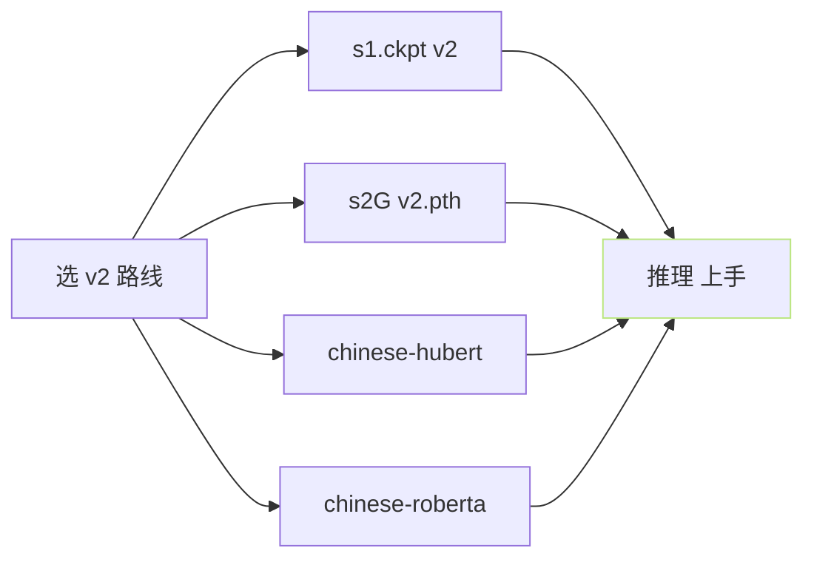

> [📎] 前置知识：GPT-SoVITS 版本演进、Hugging Face / ModelScope 发布、版本间互换性、预训权重许可证。

> **定位**：所有微调都需预训权重为起点。本节列出社区发布 的 预训 ckpt 、他们的 会 三 能 · 仅 能 · 需 重 训 」 、 下 载 位 置 、 许 可 证 。

## 1. 预训 ckpt 总览

|名称|阶段|架构|数据量|发布|
|---|---|---|---|---|
|**chinese-hubert-base**|SSL|HuBERT base|10kh 中文|TencentGameMate|
|**chinese-roberta-wwm-ext-large**|BERT|RoBERTa large|中文 wiki+文本|hfl|
|**s1.ckpt** v1/v2|AR Stage 2|GPT 12 层 d=512|5000h|RVC-Boss|
|**s1v3.ckpt**|AR Stage 2|GPT 24 层 d=768|7000h|RVC-Boss|
|**s2G.pth** v1/v2|SoVITS Stage 1|VITS 32k|5000h|RVC-Boss|
|**s2Gv3.pth**|SoVITS Stage 1|CFM 24k|7000h|RVC-Boss|
|**s2Gv4.pth**|SoVITS Stage 1|CFM 48k|10000h|RVC-Boss|
|**s2Gv2Pro.pth**|SoVITS Stage 1|VITS+SV 32k|5000h|RVC-Boss|
|**s2Gv2ProPlus.pth**|SoVITS Stage 1|VITS+SV 32k|10000h|RVC-Boss|
|**ERes2NetV2 SV**|SV|—|VoxCeleb+中文|3D-Speaker|
|**BigVGAN-24k-256x**|Vocoder|BigVGAN|NVIDIA|NVIDIA|
|**BigVGAN-48k-512x**|Vocoder|BigVGAN|NVIDIA|NVIDIA|

## 2. 下载位置

- **主** Hugging Face： [https://huggingface.co/lj1995/GPT-SoVITS](https://huggingface.co/lj1995/GPT-SoVITS)

- **镜 像** ModelScope： `iic/GPT-SoVITS`

- **GitHub Release**： [https://github.com/RVC-Boss/GPT-SoVITS/releases](https://github.com/RVC-Boss/GPT-SoVITS/releases)

- **WebUI 一键 下载**： `python tools/download_pretrained.py`

## 3. 同版本下的 ckpt 拼 接



代入同版本。跨版本 互 接是需 重 训 设 计。 v3 + v4 不 能 互 接 （详见 [[6.2.3 V3 vs V4（24k vs 48k - 上采样修复）|6.2.3 V3 vs V4（24k vs 48k - 上采样修复）]]）。

## 4. 各 ckpt 大小 与 显存需求

|ckpt|大小|推理显存|训练显存|
|---|---|---|---|
|chinese-hubert-base|≈ 360 MB|1.5 GB|—|
|chinese-roberta-wwm-large|≈ 1.3 GB|3.5 GB|—|
|s1 v1/v2|≈ 150 MB|1 GB|4 GB|
|s1 v3|≈ 600 MB|3 GB|16 GB|
|s2G v1/v2|≈ 80 MB|1 GB|8 GB|
|s2G v3|≈ 320 MB|4 GB|24 GB|
|s2G v4|≈ 480 MB|6 GB|40 GB|
|s2G v2Pro|≈ 320 MB|3 GB|16 GB|
|s2G v2ProPlus|≈ 480 MB|5 GB|32 GB|
|ERes2NetV2 SV|≈ 70 MB|500 MB|—|
|BigVGAN-24k|≈ 110 MB|1 GB|—|
|BigVGAN-48k|≈ 180 MB|2 GB|—|

## 5. 许可证

|项|许可证|商业可用?|
|---|---|---|
|GPT-SoVITS 代码|MIT|✅|
|s1/s2 预训 ckpt|**社区赢 · 未明确**|⚠️ 需 法务|
|chinese-hubert|Tencent 社区|⚠️|
|chinese-roberta|Apache-2.0|✅|
|ERes2NetV2|Apache-2.0|✅|
|BigVGAN|NVIDIA Non-Commercial|**❌ 仅研究**|

> [⚠️] **BigVGAN 是 非商用**：V3/V4 产品化需考虑以同架构重训 BigVGAN、或用商用可 代 vocoder (HiFi-GAN MIT)。

## 6. 预训 ckpt 生 成 准备脚本

```bash
# 下载 位置
mkdir -p pretrained_models/chinese-hubert-base
mkdir -p pretrained_models/chinese-roberta-wwm-ext-large
mkdir -p pretrained_models/gsv-v2final-pretrained
mkdir -p pretrained_models/s2Gv3
mkdir -p pretrained_models/s2Gv4
mkdir -p pretrained_models/sv/eres2netv2

python tools/download_models.py --target all
```

## 7. 场景推荐 ckpt 集

|场景|推荐 ckpt 集|
|---|---|
|仅中文 · 快|v2 (s1 + s2G v2 + hubert + roberta)|
|多语种|v2 或 v2ProPlus|
|高质量 顶尖|**v4 (s1v3 + s2Gv4 + bigvgan-48k)**|
|zero-shot克隆|**v2Pro / v2ProPlus**|
|低延迟流式|v2 + chunk inference|

## 8. 工程判断

> [🔧] **未下载预训 ckpt 不要启动训练**：从零训 GPT-SoVITS 需 5000h+ 数据 · 4×A100 · 7 天。社区 预训 ckpt 上手 是 唯一 可 行 选 择。企业 场景 需 及 时 联 系 作 者 获 取 商用许可。

## 参考文献

1. RVC-Boss/GPT-SoVITS releases. [https://github.com/RVC-Boss/GPT-SoVITS/releases](https://github.com/RVC-Boss/GPT-SoVITS/releases)

1. Hugging Face Model Hub `lj1995/GPT-SoVITS`. [https://huggingface.co/lj1995/GPT-SoVITS](https://huggingface.co/lj1995/GPT-SoVITS)

1. ModelScope `iic/GPT-SoVITS`. [https://modelscope.cn/models/iic/GPT-SoVITS](https://modelscope.cn/models/iic/GPT-SoVITS)

1. BigVGAN license. [https://github.com/NVIDIA/BigVGAN](https://github.com/NVIDIA/BigVGAN)