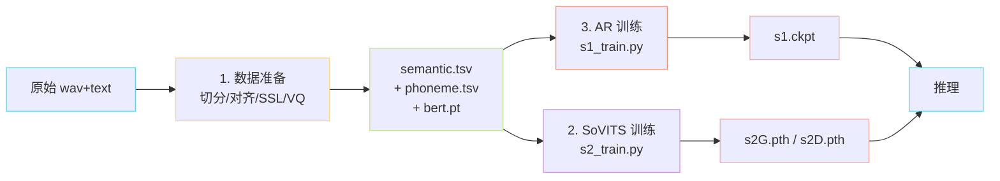

[[7.2 Stage 1：SoVITS 训练（s2_train.py）|7.2 Stage 1：SoVITS 训练（s2_train.py）]]

> 📎 **前置知识**：熟悉 [[私人与共享/GPT-SoVITS 系列全栈总纲/5. AR - T2S 模型（GPT 语义建模阶段）|5. AR - T2S 模型（GPT 语义建模阶段）]] 与 [[私人与共享/GPT-SoVITS 系列全栈总纲/6. SoVITS 解码器（声学生成阶段）|6. SoVITS 解码器（声学生成阶段）]]；理解 PyTorch Lightning Trainer；了解少样本微调（SFT / LoRA）概念。

## 0. 定位

> 「数据 → 两段式两次训练 → 可发布的 ckpt。」GPT-SoVITS 训练分两阶段：**先训 SoVITS（s2），再训 AR（s1）**，二者通过 SoVITS 内置 VQ 编码出来的 semantic token 串联。

## 1. 端到端工作流

## 2. 两阶段对比

|阶段|入口脚本|配置|主任务|损失项|备注|
|---|---|---|---|---|---|
|Stage 1 SoVITS|`s2_train.py`|`s2.json` / `s2v3.json` / `s2v4.json` / `s2Pro.json`|(semantic, mel, spk) → wav|KL + L1 mel ×45 + dur + GAN（v1/v2）/ CFM L2（v3/v4）|重头训，~7,000h 主数据|
|Stage 2 GPT/AR|`s1_train.py`|`s1.yaml` (Lightning)|(phoneme, BERT, prompt) → semantic|CE + ignore_index=-100|需 SoVITS VQ codebook 先固定|

## 3. 数据准备四步

1. **语音切分**：UVR5 去伴奏 + slicer 静音切片（典型片段 3–10s）

1. **ASR 对齐**：Faster-Whisper / FunASR 转写产生 (path, spk, lang, text) 四元组

1. **SSL 抽特征**：cnhubert 抽 1024-d → `.pt` 缓存

1. **VQ 编码**：通过已训 SoVITS encoder 把 SSL → semantic token 序列 → `semantic.tsv`

## 4. 工程判断

> 🔧 **必须先 s2 再 s1**：AR 的 token 字典 = SoVITS VQ codebook。若顺序反了，AR 学到的 token 没有 Decoder 能解码。从零训新数据集时，可先用预训 SoVITS（冻结 VQ）跑 s2 微调 → 解冻 VQ 再大规模训 → s1。

> 💡 **少样本 SFT 为何只需 1–5 分钟？** —— zero-shot 已具备语音克隆能力，SFT 只需对齐音色细节而非重学语音生成范式。微调 30–60 分钟即可达到「专属音色」级别。

> ⚠️ **bf16 + grad clip 联用注意**：详见 [[5.4 PyTorch Lightning 训练壳|5.4 PyTorch Lightning 训练壳]]，bf16 下 grad_norm 会偏小，clip 阈值需相应放宽。

## 5. 子页面导航

[[7.1 数据准备流水线|7.1 数据准备流水线]]

[[7.3 Stage 2：GPT - AR 训练（s1_train.py）|7.3 Stage 2：GPT - AR 训练（s1_train.py）]]

[[7.4 少样本微调（Few-shot SFT）|7.4 少样本微调（Few-shot SFT）]]

## 参考文献

- 仓库 `GPT_SoVITS/s1_train.py` / `s2_train.py`

- WebUI 训练流程: `webui.py`

- Faster-Whisper: [https://github.com/SYSTRAN/faster-whisper](https://github.com/SYSTRAN/faster-whisper)

- FunASR: [https://github.com/modelscope/FunASR](https://github.com/modelscope/FunASR)