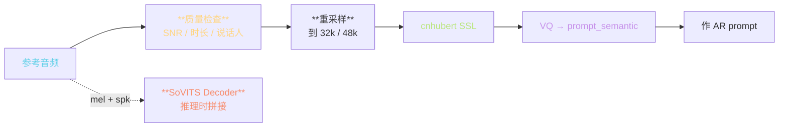
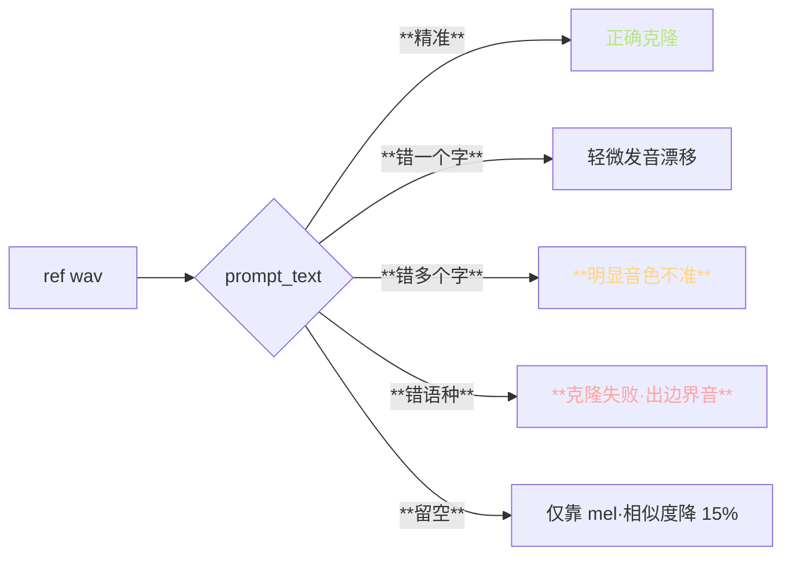
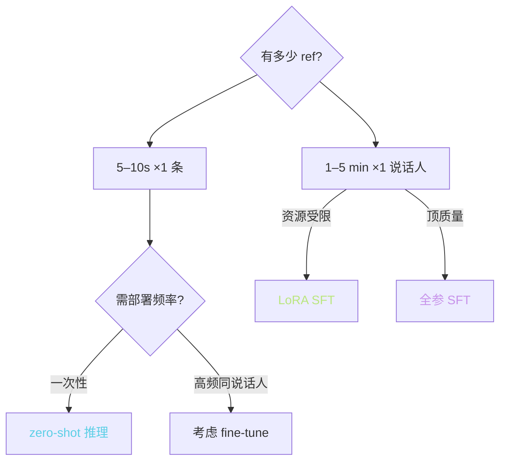

> 📎 **前置**：[[4.4 prompt_semantic（参考音频→AR prompt）]]；zero-shot ICL；VALL-E prompt 范式；SNR / LUFS 度量。

## 0. 定位

> 「ref 是音色的全部信号源。」参考音频的质量直接决定输出音色相似度，其他参数（top_k、cfg）都不能补偿 ref 质量。本节系统拆解 ref 加工流、质量门槛、prompt_text 作用、zero-shot / few-shot 取舍。

## 1. ref 加工流水



## 2. 质量门槛详表

|维度|下限|推荐|顶配|超阈后果|
|---|---|---|---|---|
|**时长**|3 s|**5–7 s**|7 s|>10s 挤占 AR ctx|
|**SNR**|20 dB|30 dB|**≥35 dB**|<20 dB 噪声会被克隆|
|**采样率**|16k|32k|**48k**|8k 需先走超分|
|**说话人**|唯一|唯一|**唯一·无背景人声**|多人 → 音色融合|
|**语调**|任意|中性|**中性·无情绪**|过激情感会传染|
|**LUFS**|—|-23 ~ -16|-20 ~ -18|过响裁剪损耳|
|**静音占比**|< 30%|< 15%|**< 10%**|过多静音让模型「凯」|

## 3. SNR 检查公式

$$\text{SNR}_\text{dB} = 10 \log_{10}\!\left(\frac{P_\text{signal}}{P_\text{noise}}\right)$$

仓库默认不检查，推荐手动评估：

```python
import librosa, numpy as np
wav, sr = librosa.load('ref.wav', sr=None)
# 简化估算：语音活动检测分割信号 / 噪声
vad = librosa.effects.split(wav, top_db=20)
signal = np.concatenate([wav[s:e] for s,e in vad])
noise = np.delete(wav, np.r_[*[np.arange(s,e) for s,e in vad]])
snr_db = 10 * np.log10(np.mean(signal**2) / np.mean(noise**2))
print(f'SNR: {snr_db:.1f} dB')
```

> [💡] **SNR < 25 dB 的 ref 该怎么办**：走 0a UVR5 + DeEcho-Aggressive + onnx_dereverb 三道。社区调出的公式可把 18 dB 交谈录音提升到 32 dB。

## 4. prompt_text 必要性与错误代价



|场景|SECS|人耳听感|
|---|---|---|
|**prompt_text 精准**|0.83|近 ref|
|**错 1 字**|0.81|轻微不准|
|**错 ≥3 字**|0.74|明显偏离|
|**错语种**|0.62|「不是同一个人」|
|**留空**|0.71|仅靠声学信息|

> [⚠️] **prompt_text 必须与 ref 严格匹配**：GPT-SoVITS 拿 prompt_text 的 phoneme 序列作为 AR prompt 的 token 条件。错字会让 AR 「拿错的 phoneme 去拟合该 mel」，学出错误对应。多语种场景下 prompt_text 不能错语种。

## 5. zero-shot vs few-shot 决策



|模式|数据|音色相似度|情感表达|部署|适用|
|---|---|---|---|---|---|
|zero-shot|1 条 ref|⭐⭐⭐⭐|取决于 ref|**即开即用**|一次性 / 多说话人|
|few-shot SFT|1–5 min|⭐⭐⭐⭐⭐|可携带|微调 30–60 min|高频同说话人|

## 6. ref 选取黑名单

> [⚠️] **不要使用以下 ref**：

|场景|问题|后果|
|---|---|---|
|**带背景音乐**|背景会被克隆|输出总有背景音|
|**多人对话**|音色融合|「中间人」|
|**超过 10 s**|超出 AR ctx|prompt 被截断|
|**后期压缩（mp3 < 64kbps）**|高频损失|「闷」|
|**有明显混响 / 回声**|间接信号注入|「在浴室说话」|
|**说话人在叫喊 / 唤黄**|声学状态偏离中性|输出总是叫喊|

## 7. 工程判断

> 🔧 **zero-shot：1 条 5–7 s ref 即可；few-shot：1–5 min 多句微调**。选择依据是部署频率而非质量需求。

> ⚠️ **多条 ref 拼接 = 不同说话人混淆**：避免。需多情感选用 V2Pro+ 的多参考槽位机制（见 [[9.2 推理 WebUI（inference_webui.py）]]）。

> 💡 **ref 是推理时唯一的「音色绳子」**：所有其他参数都不会替代 ref 质量。99% 的「克隆不街」问题是 ref 问题。

> 🤔 **V3/V4 对 ref 更敏感**：因 CFM 重建受 ref mel 直接驱动。V1/V2 走 spk embedding 对 ref 质量鲁棒些。高 SNR ref 是 V3/V4 发挥优势的前提。

## 8. 子页面

[[8.1.1 参考音频质量门槛（信噪比 - 时长）]]

[[8.1.2 prompt_text 必要性与错误代价]]

## 参考文献

1. 仓库 `inference_webui.py` `get_first` 等函数

1. Wang, C. et al. (2023). _VALL-E_. arXiv:2301.02111.

1. ITU-R BS.1770-4. _Loudness measurement_.

1. librosa effects.split: [https://librosa.org/](https://librosa.org/)