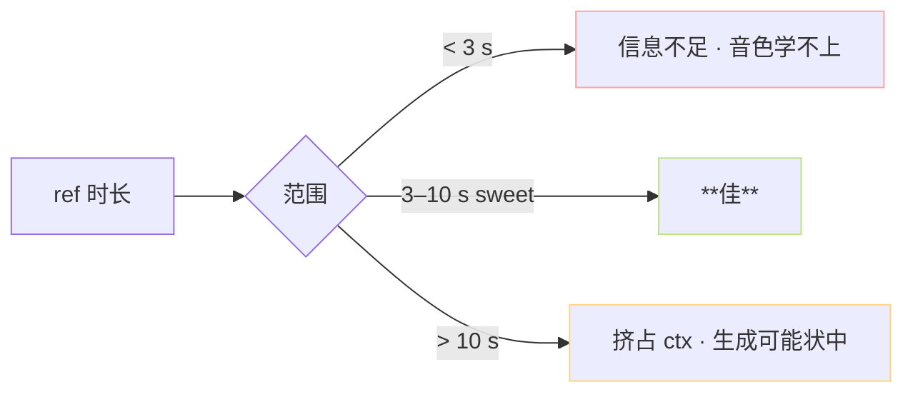

> [📎] 前置知识：SNR、zero-shot ICL prompt、VAD、反馆设计、cnhubert 输入正则。

> **定位**：ref 是推理时唯一的「音色绳」。本节拆 时长 / SNR / 动态 / 反馆 / VAD 五个质量门槛、各 门下限 · 原因 · 修复 。

## 1. 五个质量维度总览

|维度|推荐值|下限|上限|
|---|---|---|---|
|时长|**5–7 s**|3 s|10 s|
|SNR|**≥ 30 dB**|20 dB|—|
|动态范围|**≥ 12 dB**|6 dB|—|
|反馆 RT60|**< 0.3 s**|0.6 s|—|
|VAD silence|**< 100 ms**|300 ms|—|

## 2. 时长为何 5–7 s



- v1/v2 ctx=1024 token = ♉4·5 s wav (25 Hz semantic、prompt 占 1/4 ctx)。

- v3/v4 ctx=2048 可接受 到8–10 s，但越 10 s 会占 1/2 ctx、 生成文本空间 不 够。

## 3. SNR计算 与 检查

```python
import numpy as np
import librosa

y, sr = librosa.load('ref.wav', sr=16000)
signal = y - np.mean(y)
rms_signal = np.sqrt(np.mean(signal ** 2))
# 以「静音段」估计 noise floor
intervals = librosa.effects.split(signal, top_db=30)
if len(intervals) > 0:
    noise = np.concatenate([signal[max(0, i[0]-1600):i[0]] for i in intervals if i[0] > 1600])
    rms_noise = np.sqrt(np.mean(noise ** 2)) if len(noise) > 0 else 1e-6
else:
    rms_noise = 1e-6
snr_db = 20 * np.log10(rms_signal / rms_noise)
```

|SNR|听感|推理听感|
|---|---|---|
|≥ 40 dB|棚录|佳|
|30 dB|丝轻背|佳|
|20 dB|明显背景|背景跨到输出|
|< 15 dB|咣|**音色伴 咣**|

> [⚠️] **低 SNR 背景会跨到输出**：GPT-SoVITS 不能 区分 说话人与背景噪声、背景 会 被 当 作 音 色 一 部 分 复 制。 需 先 UVR5 / Demucs 除 背景。

## 4. 动态范围

```jsx
Dynamic Range = 20*log10(max(|y|) / RMS(|y|))
```

|动态范围|听感|
|---|---|
|> 18 dB|动态充足 佳|
|12–18 dB|正常|
|6–12 dB|压缩过|
|< 6 dB|**重压缩 · 音色压坏**|

> [💡] **过压缩是隐形杀手**：镜头、报道人面 · 有热门 · 电影 · 个人鲁棒处理 多走重压缩、动态 < 6 dB。这些 ref 压坏音色 · 输出会平。需 原 扣 带 压缩 。

## 5. 反馆

反馆 (RT60) 是声音衰减到 -60 dB 的时间。

|RT60|听感 · 场景|
|---|---|
|< 0.2 s|**棚录 · 门闭房**|
|0.2–0.4 s|录音底 · 佳|
|0.4–0.8 s|客厅|
|> 0.8 s|**浴室 · 大场馆 · 反馆过**|

> [⚠️] **反馆会伴随输出**：GPT-SoVITS 会认为「该说话人 是 在 这 种 环境 说话」，输出都会带同一 反 馆。 需 除 反馆 (Demucs / FullSubNet · 反馆除) 。

## 6. VAD 与 silence 检查

```python
import torch
import torchaudio.transforms as T
# 使用 silero-vad 检静音
model = torch.hub.load('snakers4/silero-vad', 'silero_vad', force_reload=False)
speech_intervals = model.get_speech_timestamps(y, sample_rate=16000)
total_speech = sum(i['end'] - i['start'] for i in speech_intervals)
ratio = total_speech / len(y)
if ratio < 0.7:
    print('ref 静音过多，考虑除静音 · 切。')
```

> [💡] **静音会跨到出口**：ref 中超 30% 静音 · 输出会带「静默后接」。需 先 trim 静音 。

## 7. 一键质检脚本

```python
def check_ref(path):
    y, sr = librosa.load(path, sr=None)
    duration = len(y) / sr
    snr = compute_snr(y)
    dr = compute_dynamic_range(y)
    rt60 = estimate_rt60(y, sr)
    silence_ratio = compute_silence_ratio(y, sr)
    issues = []
    if not 3 <= duration <= 10: issues.append(f'时长 {duration:.1f}s')
    if snr < 30: issues.append(f'SNR {snr:.0f}dB')
    if dr < 12: issues.append(f'DR {dr:.0f}dB')
    if rt60 > 0.3: issues.append(f'RT60 {rt60:.2f}s')
    if silence_ratio > 0.3: issues.append(f'silence {silence_ratio:.0%}')
    return issues
```

## 8. 工程判断

> [🔧] **ref 质量是不可补偿的**：ref 坏 · 你 cfg=3.0、 temperature=0.5 、 调什么都救不了。社区 报错中 70% 「生成坏」是 ref 问题。先质检 ref、后调参。

## 参考文献

1. Wang, C. et al. (2023). _VALL-E_. arXiv:2301.02111. (ref prompt 体制)

1. Silero VAD. [https://github.com/snakers4/silero-vad](https://github.com/snakers4/silero-vad)

1. ITU-T Rec. P.862 (PESQ) 估计 SNR 体系.

1. GPT-SoVITS: `inference_webui.py::change_sovits_weights`.