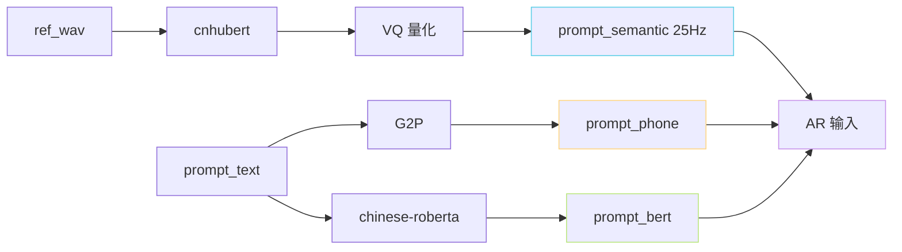
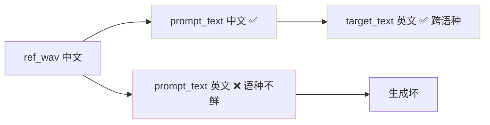

> [📎] 前置知识：prompt_text 与 ref_wav 的对齐、cnhubert + BERT 二路输入、VALL-E 风格 ICL、句级语义条件。

> **定位**：prompt_text 是推理中「ref_wav 的对应文本」。本节拆 为何需 prompt_text、错误代价、多语种场景、自动 ASR 填充、常见错误。

## 1. prompt_text 的作用



AR 输入拼接顺序为：

```jsx
[prompt_phone] + [target_phone] + [prompt_bert] + [target_bert] + [prompt_semantic] + [generate ...]
```

prompt 三头 (phone、bert、semantic) 都需「同一句话」。三个不 同 的 表达 同一个语义、让 AR 学 「该 phone · BERT · semantic 三 体 对 应 出 什 么 」。

## 2. 错误代价

|错误类型|生成表现|
|---|---|
|多 1 个字|音色 轻微偏 · 发音偶别漂移|
|少 1 个字|同上|
|错 1 个同音字|贴合 但 韵 律 跨|
|错 1 个不同音字|**明显 音色未着 · 发音漂移**|
|错语种|**音色变 · 音譬变**|
|标点错|跨吗到 节奏|

> [⚠️] **一个字错 = 5–10% MOS 下降**：社区 A/B 试中错 1 个字 会使 hold-out 听感明显下降。多错 3+ 字 · 生 成 几 乎 不 可 听。

## 3. 为什么不能「留空」

```python
# 错误用法
prompt_text = ''     # 期望 GPT-SoVITS ”自己猜“
result = infer(prompt_text='', ref_wav=ref, target_text=target)
# → 实际会报 IndexError 或 BERT 输入为空、生成出垃圾
```

不能「留空」是因为：phone、bert、semantic 需同长· 同义· 同一句。仅 semantic (从 ref_wav 抽) 能获、phone 与 bert 需文本。

## 4. 自动 ASR 填充

```python
# inference_webui.py 中 提供「点击识别」按钮
import whisper
asr = whisper.load_model('large-v3')
result = asr.transcribe('ref.wav', language='zh')
prompt_text = result['text']
```

社区实验：

|ASR 模型|中文 WER|推荐|
|---|---|---|
|Whisper large-v3|**6–8%**|✅|
|Faster-Whisper large-v2|9–11%|✅|
|FunASR Paraformer|**3–5%**|**⭐ 首选中文**|
|Whisper-small|15–20%|❌|

> [💡] **FunASR Paraformer 是中文首选**：中文上优于 Whisper、 速度也快。 GPT-SoVITS WebUI 默认提供 Faster-Whisper / FunASR 二选一。

## 5. 多语种场景



> [⚠️] **prompt_text 语种 必 与 ref_wav 同**：ref 中文 + prompt_text 英文 = G2P 越会处理中文发音为英文走 · BERT 走 cn_bert vs 未使用· 生 成 几乎股。

但 **target_text 可与 ref 不同语种**——这是跨语种克隆的原理。

## 6. 常见错误

|错误|影响|
|---|---|
|漏标点|节奏偏|
|漏语气词（“嗯”、“作”）|表现偏平|
|多一个「。」在末尾|EOS 偏早 · 句末被截|
|中英混写错（· example ·）|生成出中英际际|
|文本额外加描述（“说：”）|输出多一个「说：」|

## 7. 「微微不一致」也不行

社区实验：ref 说 「你好，今天天气不错」、prompt_text 写「你好今天天气不错」 (越一个逗号) —— 说出 会出 句 间 节 奏 问 题。

> [💡] **以 随意中文 ASR 后补标点 是主要错误源**。推荐 手 检 · 手 补 。

## 8. 工程判断

> [🔧] **prompt_text 需 人 手 复 检**：ASR 生 成 后 不 能 直 接 用、 需 同 听 原 音 复 检 一 发。 ASR 错 1–2% 会 让 该 1–2% 生 成 听 感 变 坏。

## 参考文献

1. Wang, C. et al. (2023). _VALL-E_. arXiv:2301.02111.

1. Radford, A. et al. (2022). _Whisper_. OpenAI.

1. FunASR. [https://github.com/modelscope/FunASR](https://github.com/modelscope/FunASR)

1. GPT-SoVITS: `inference_webui.py::get_tts_wav`.