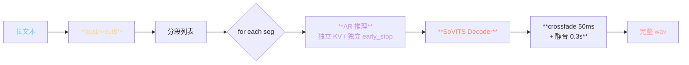
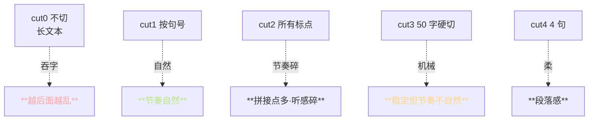
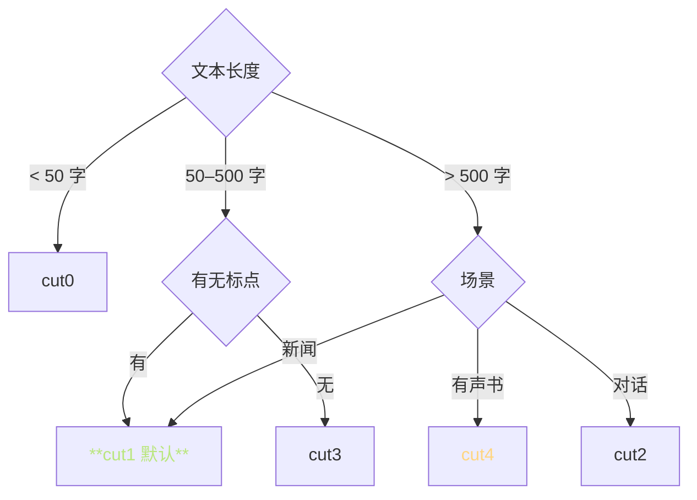

> 📎 **前置**：AR ctx 限制（V1/V2: 1024；V3/V4: 2048）；KV Cache 显存约束；exposure bias；采样不确定性累积。

## 0. 定位

> 「长文本必须切。」AR 序列 >2048 时 KV Cache 爆显存且容易吞字。`cut0`–`cut5` 是 6 种切分策略。本节拆解每种策略的适用场景、为何切能治吞字、拼接后的补偿。

## 1. cut 策略全表

|枚举|规则|适合场景|平均段长|拼接点密度|
|---|---|---|---|---|
|**cut0**|不切|< 50 字|—|0|
|**cut1**|按中文句号 。|标准书面文本|15–40 字|中|
|**cut2**|按所有标点|对话 / 口语|5–20 字|高|
|**cut3**|按 50 字硬切|**无标点纯文本·默认**|50 字|低|
|**cut4**|按 4 句切|段落式|60–120 字|低|
|**cut5**|按 30 字硬切|严格控长|30 字|高|

## 2. 切分流程

## 3. 为什么切能治吞字？

AR 采样错误以指数率传染：设每 token 采样出错概率 $p$，则长度 $T$ 序列出现 ≥1 个错误的概率：

$$P_\text{err}(T) = 1 - (1-p)^T$$

|T (tokens)|p=0.01 出错概率|p=0.005 出错概率|
|---|---|---|
|50|**39%**|**22%**|
|100|63%|39%|
|200|**87%**|63%|
|500|**99%**|92%|
|1000|**>99.99%**|**99.3%**|

> [💡] **切成块后互不传染**：每块独立采样·独立 early_stop，即使某块偶发吞字也不影响后面。500 token 全贯穿出错率 99%，切成6×80 后单块出错率降到 50%。

## 4. cut 策略对听感的影响

## 5. 选择决策树

## 6. 拼接补偿

切分后拼接会出现三个问题与对应补偿：

|问题|补偿|详见|
|---|---|---|
|**段尾咔哒**|crossfade 50 ms|[[8.5 拼接 - 静音 - 语速控制\|8.5 拼接 - 静音 - 语速控制]]|
|**段间无呼吸**|静音插入 0.3 s|[[8.5 拼接 - 静音 - 语速控制\|8.5 拼接 - 静音 - 语速控制]]|
|**音色漂移**|每段复用同一 ref|本节|

> [💡] **复用同一 ref 防音色漂移**：每个 seg 独立调用 AR + Decoder，但全部复用同一个 ref 的 prompt_semantic + mel。不同 ref 会让说话人「被换」。

## 7. 常见误区

> [⚠️] **cut0 + 长文本 = 100% 吞字**：每个人都希望模型「一口气说完」，但 AR 是随机采样的。超过 500 token 永远请切。

> [⚠️] **cut5 30 字硬切会导致节奏碎片**：拼接点过密，听感「一顿一顿」。除非需严格控长，不推荐。

> [💡] **cut1（按中文句号）是听感与稳定性的最佳平衡**：启发式默认。 英文场景需选 cut2 或后处理加上 `.` 识别。

## 8. 工程判断

> 🔧 **默认推荐 cut1 或 cut3**：中文 cut1 自然·无标点 cut3 稳定。二者是听感 / 稳定性的最佳权衡。

> ⚠️ **cut0 + 长文本 = 100% 吞字**。cut5 硬切 = 节奏碎片。二者都需避免。

> 💡 **切分后段间用 0.3 s 静音 + 50 ms crossfade 拼接最自然**。详见 [[8.5 拼接 - 静音 - 语速控制|8.5 拼接 - 静音 - 语速控制]]。

> 🤔 **未来：智能切分**：用 BERT 语义划分句阅边界 + 节奏预测，能比机械的 cut1–5 更自然。社区 `smart-cut` PR 实验中。

## 9. 子页面

[[8.2.1 cut 策略（按句 - 按标点 - 字数）|8.2.1 cut 策略（按句 - 按标点 - 字数）]]

## 参考文献

1. 仓库 `inference_webui.py` 中 `cut1`–`cut5` 函数

1. Holtzman, A. et al. (2019). _The Curious Case of Neural Text Degeneration_. ICLR.