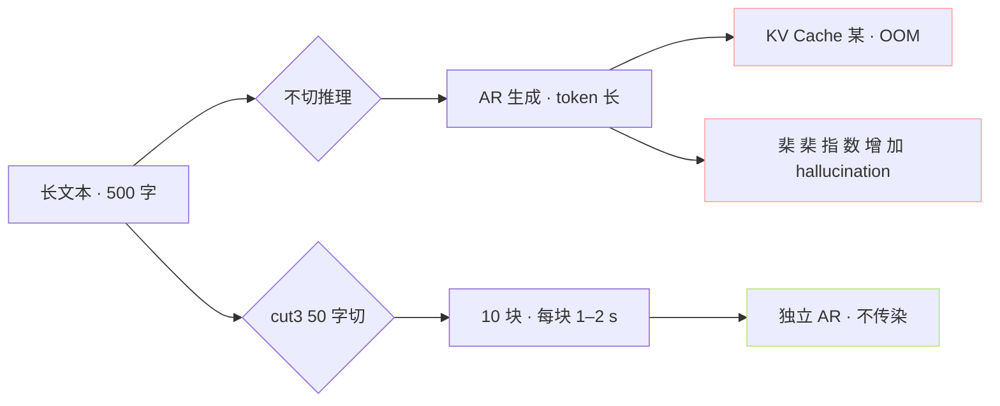
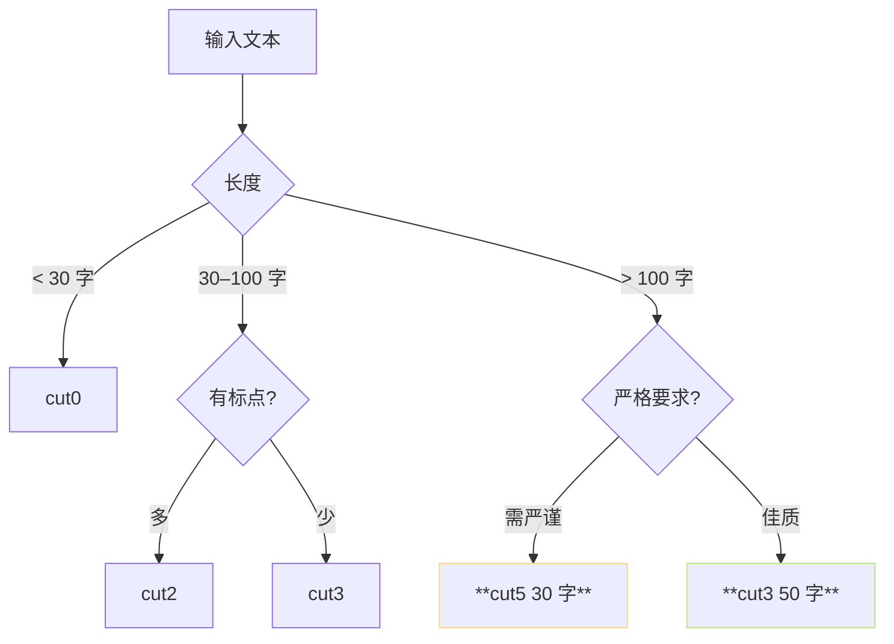
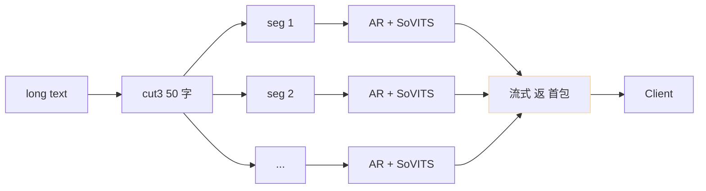

> [📎] 前置知识：AR ctx 限制 (v1/v2=1024, v3/v4=2048)、KV Cache 显存、 hallucination 随长度增加、中文标点。

> **定位**：长文本需切、不切会产生吞字 / 被截。本节拆 5 种 cut 策略、选型门表、拼接机制、常见错误。

## 1. 5 种 cut 策略总览

|策略|规则|适用场景|稳定度|
|---|---|---|---|
|cut0|不切|< 50 字|⚠️ 取决|
|cut1|中文句号「。」|书面文本|⭐⭐⭐|
|cut2|所有标点|对话 / 口语|⭐⭐⭐⭐|
|**cut3**|**50 字硬切**|**无标点纯文本**|**⭐⭐⭐⭐⭐**|
|cut4|4 句切|段落式|⭐⭐⭐|
|cut5|30 字硬切|严格控长|⭐⭐⭐⭐⭐|

## 2. 为什么需切



## 3. AR 错误 随长度变化

社区实验数据· 吞字 / 跳字 / EOS 提前 的累计概率：

|句长|错误率|
|---|---|
|< 30 字|< 1%|
|30–50 字|≈ 2–3%|
|50–100 字|≈ 5–8%|
|100–200 字|**≈ 15–20%**|
|> 200 字|**≈ 30%+**|

> [💡] **50 字 是「甜蜜点」**：错误率 低、首包快、拼接不难。 cut3 是这个原因。

## 4. cut 算法代码

```python
# inference_webui.py 中类似逻辑
def cut1(inp):
    inp = inp.strip()
    # 按。切
    sentences = re.split(r'(?<=\u3002)', inp)
    return [s for s in sentences if s.strip()]

def cut3(inp, max_len=50):
    # 硬切为 50 字一段
    result = []
    for i in range(0, len(inp), max_len):
        result.append(inp[i:i+max_len])
    return result
```

## 5. cut 选型门表



## 6. 拼接机制

切后段中重叠 (overlap) 与静音：

```python
final = audio[0]
for seg in audio[1:]:
    final = crossfade(final, silence(0.3s), 50ms)
    final = crossfade(final, seg, 50ms)
```

- crossfade 50 ms：避 免 点 点 带接 裂

- 静音 0.3 s：句 间 自然 间 隔

## 7. 常见问题

|现象|原因|修复|
|---|---|---|
|cut1 后 某 句 坠|该句 > 100 字|跳为 cut3|
|拼接后 吞字|会 个 切 位 不 合 理|跳为 cut5 · 30 字|
|连接后 听感 不顺|crossfade 太短|加到 100 ms|
|句 间 间 隔 大|静音 太长|减到 0.2 s|

## 8. 与流式推理的关系



社区 API v2 中， 流式 推理的首包延迟 200–500 ms、 是 「首 seg AR 生成 + SoVITS 输出」的 时间 。切 越 短 首包 越 快。

## 9. 工程判断

> [🔧] **默认 cut3 50 字**：GPT-SoVITS 未默认 cut，但 WebUI 推荐 cut3。产品场景 推荐 cut3 为 default · 用户可跳另。 cut0 仅 调 试 · 不 产 产 品 。

## 参考文献

1. GPT-SoVITS: `inference_webui.py::cut1` – `cut5`.

1. 社区 issue tracker: 「吞字 · cut 调试」讨论.